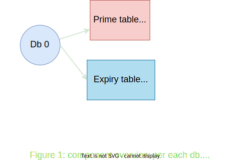

# Dashtable in Dragonfly

Dashtable is very important data structure in Dragonfly. This document explain
how it fits inside the engine.

Each selectable database holds a primary dashtable that contains all its entries. Another instance of Dashtable holds an optional expiry information, for keys that have TTL expiry on them. Dashtable is equivalent to Redis dictionary but have some wonderful properties that make Dragonfly memory efficient in various situations.

## Redis dictionary

*“All problems in computer science can be solved by another level of indirection”*

This section is a brief refresher of how redis dictionary (RD) is implemented.
We shamelessly "borrowed" a diagram from [this blogpost](https://codeburst.io/a-closer-look-at-redis-dictionary-implementation-internals-3fd815aae535), so if you want a deep-dive, you can read the original article.

Each `RD` is in fact two hash-tables (see `ht` field in the diagram below). The second instance is used for incremental resizes of the dictionary.
Each hash-table `dictht` is implemented as a [classic hashtable with separate chaining](https://en.wikipedia.org/wiki/Hash_table#Separate_chaining). `dictEntry` is the link-list entry that wraps each key/value pair inside the table. Each dictEntry has three pointers and takes up 24 bytes of space. The bucket array of `dictht` is resized at powers of two, so usually its utilization is in [50, 100] range.

 
Lets estimate the overhead of `dictht` table inside RD. 

*Case 1*: it has `N` items at 100% load factor, in other words, buckets count equals to number of items. Each bucket holds a pointer to dictEntry, i.e. it's 8 bytes. In total we need: $N*8 + N*24 = 32N$ bytes overhead per each item.  
*Case 2*: `N` items at 75% load factor, in other words, the number of buckets is 1.33 higher than number of items. In total we need: $N*1.33*8 + N*24 ~ 34N$ bytes overhead per each item.  
*Case 3*: `N` items at 50% load factor, say right after table growth. We will need $N*2*8 + N*24 = 40$ bytes per item.

As you can see, a `dictht` table requires 32-40 bytes per item inserted.

Now lets take incremental growth into account. When `ht[0]` is full (i.e. RD needs to migrate data to a bigger table), it will instantiate a second temporary instance `ht[1]` that will hold additional 2*N buckets. Both instances will live in parallel until all data is migrated to `ht[1]` and then `ht[0]` bucket array will be deleted. All this complexity is hidden from a user by well engineered API of RD. Lets combine case 3 and case 1 to analyze memory spike at this point: `ht[0]` holds `N` items and it is fully utilized. `ht[1]` is allocated with `2N` buckets. Overall, the overhead is $32*N + 2N*8=48N$ bytes or temporary spike of $16N$ bytes.

To summarize, RD requires between 32 and 40 bytes per item with occasional spike of another 16 bytes per item.

## Dash table
[Dashtable](https://arxiv.org/abs/2003.07302) is an evolution of an algorithm from 1979 called [extendible hashing](https://en.wikipedia.org/wiki/Extendible_hashing).

Similarly to a classic hashtable, dashtable (DT) also holds an array of pointers at front. However, unlike with classic tables, it points to `segments` and not to linked lists of items. Each `segment` is, in fact, a mini-hashtable of constant size. The front array of pointers to segments is called `directory`. Similarly to a classic table, when an item is inserted into a DT, it first determines based on items hashvalue the segment to which the item must enter. Then it tries to insert the item into that segment. The segment is implemented as a hashtable with open-addresed hashing scheme and as I said - constant in size. If an item was successfully inserted we finished, otherwise, the segment is "full" and needs splitting. The DT splits the full segment in 2, and the additional segment is added to the directory. Then it tries to reinsert the item again. To summarize, the classic chaining hash-table is built upon a dynamic array of linked-lists while dashtable is more like a dynamic array of flat hash-tables of constant size.

In the diagram above you can see how dashtable looks like. Each segment is comprised of `N` buckets. For example, in our implementation a dashtable has 60 buckets per segment (it's a compile-time parameter that can be configured).

### Segment zoom-in

Below you can see the diagram of a segment. It comprised of regular buckets and stash buckets. Each bucket has `k` slots and each slot can host a key-value entry.

In our implementation, each segment has 56 regular buckets, 4 stash buckets and each bucket contains 14 slots. Overall, each dashtable segment has capacity to host 840 entries. When an item is inserted into a segment, DT first determines its home bucket based on item's hash value. The home bucket is one of 56 regular buckets that reside in the table. Each bucket has 14 available slots and the item can reside in any other in any order. If the home bucket is full, then DT tries to insert to the regular bucket on the right. And if that bucket is also full, it tries to insert into one of 4 stash buckets. These are kept deliberately aside to gather spillovers from the regular buckets. The segment is "full" when the insertion fails, i.e. the home bucket and the neighbour bucket and all 4 stash buckets are full. Please note that segment is not necessary at full capacity, it can be that other buckets are not yet full, but unfortunately, that item can go only into these 6 buckets so the segment contents must be split. In case of split event, DT creates a new segment, adds it to the directory and the items from the old segment partly moved to the new one and partly rebalanced within the old one. Only two segments are touched during the split event.

Now we can explain why seemingly similar data-structure has an advantage over a classic hashtable in terms of memory and cpu.
 1. Memory: we need `~N/840` entries or `8N/840` bytes in dashtable directory to host N items on average. Basically, the overhead of directory almost disappears in DT. Say for 1M items we will need ~1200 segments or 9600 bytes for the main array. That's in contrast to RD where we will need a solid `8*N` bucket array overhead - no matter what. For 1M items, it will obviously be 8MB. In addition, dash segments use open addressing collision scheme with probing, that means that they do not need anything like `dictEntry`. Dashtable uses lots of tricks to make its own metadata small. In our implementation, the average `tax` per entry is short of 20 bits compared to 64 bits in RD (dictEntry.next). And finally, DT incremental resize is done when a single segment is full. It adds a constant space per split event. Assuming that key/pair entry is two 8 byte pointers like in RD, we can say that DT requires $16*N + (8N/840) + 2.5N + O(1) ~ 19N$ bytes even during resizes. `16N` bytes is the minimum requirement since we to host key/value pair somehow. We are very close to optimum and have smaller metadata overhead by 2.5 times than RD.
 2. Speed: RD requires an allocation for dictEntry per each insertion and deallocation per deletion. In addition, RD uses chaining, which is cache unfriendly on modern hardware. There is a consensus in engineering and research communities that classic chaining schemes are much slower tha open addressing alternatives. Having said that, DT needs to go through one level of indirection in order to go through directory into a segment of interest. However, its directory size is relatively small. Say, in the example above, all 9K could resize in L1 cache. Once the segment is determined, the rest of the insertion, however, is very fast an mostly operates on 1-3 memory cache lines. Finally, during resizes, RD requires to allocate a bucket array of size `2N`. That could be time consuming - imagine an allocation of 100M buckets for example. DT on the other hand requires an allocation of constant size per new segment and sometimes a directory resize that is 1000 times smaller.

## Comparison
There are many other improvements in dragonfly that save memory besides DT. I will not be able to cover them all here. The results below show the final result as of May 2022.

To compare RD vs DT I use an internal debugging command "debug populate" that quickly fills both datastores with small data. It just saves time and gives more consistent results compared to memtier_benchmark. It also shows the raw speed at which each dictionary gets filled without intermediary factors like networking, parsing etc.
I deliberately fill datasets with a small data to show how overhead of metadata differs between two data structures.

I run "debug populate 20000000" (20M) on both engines on my home machine "AMD Ryzen 5 3400G with 8 cores".

### Single-threaded scenario

|             | Dragonfly | Redis 6 |
|-------------|-----------|---------|
| Time        |   10.8s   |  16.0s  |
| Memory used |    1GB    |  1.73G  |

When looking at Redis6 "info memory" stats, you can see from `used_memory_overhead` field that out of 1.73GB bytes used for the dataset, a whooping 1.0GB is used for
the metadata. In fact, for small strings use-cases the cost of metadata is larger than the data itself.

### Multi-threaded scenario

Now I run Dragonfly on all 8 cores.
|             | Dragonfly | Redis 6 |
|-------------|-----------|---------|
| Time        |   2.43s   |  16.0s  |
| Memory used |    896MB  |  1.73G  |

Due to shared-nothing architecture, dragonfly maintains dashtable per each thread with its own slice of data. Each thread fills 1/8th of 20M range it owns - and it much faster, almost 8 times faster. You can see that the total usage is even smaller, because now we maintain smaller tables in each thread (it's not always the case though - we could get slightly worse memory usage than with single-threaded case ,depends where we stand compared to hash tables load).

*TODO - more benchmarks.*
 
<em> All diagrams in this doc are created in [drawio app](https://app.diagrams.net/) <em>