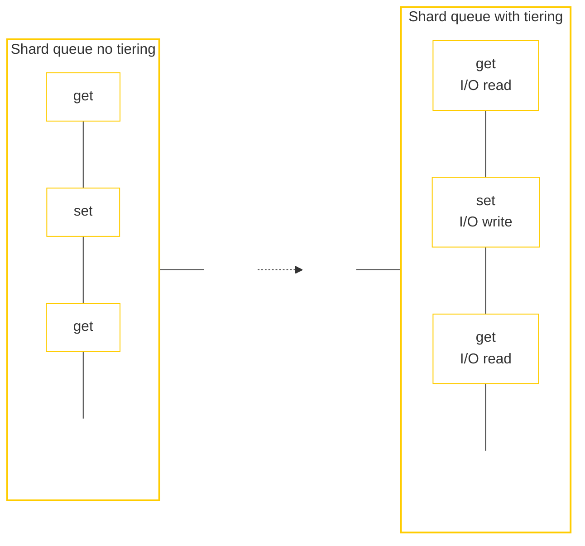
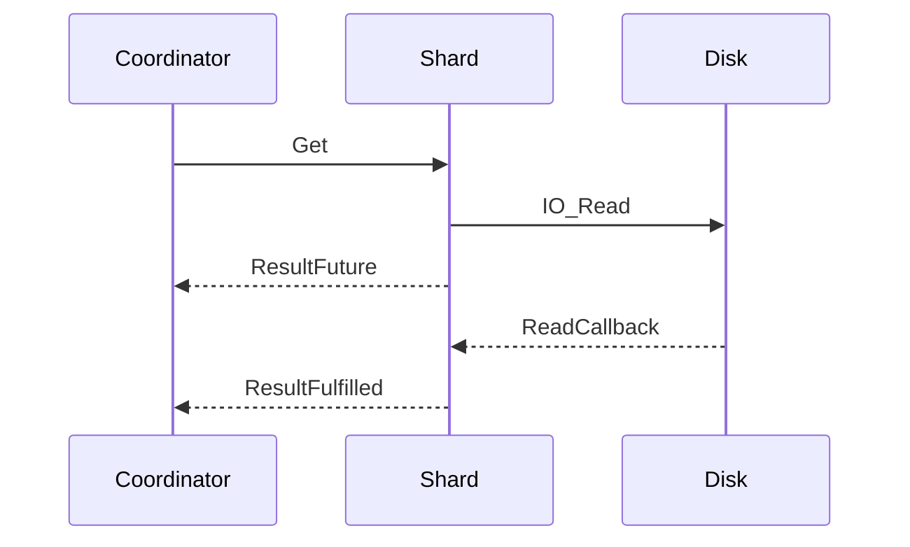
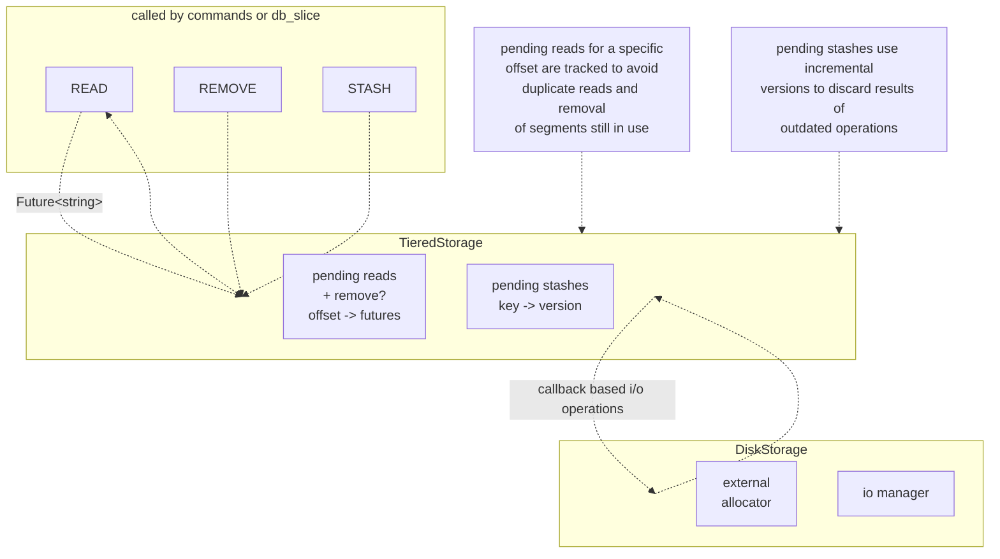

# Async Tiering Design Document

## Background

Our current tiered storage component performs disk operations inline as part of executing shard-local operations. This approach introduces latency when processing commands, impacting both the system's throughput and overall command latency. The following document discusses a potential redesign that addresses this issue and enables the execution of operations without I/O blocking.

## High level design

The core goal is to perform tiered I/O operations concurrently while maintaining transparency for the transaction framework designed for instant RAM operations.

Transactions issue asynchronous requests to the tiered storage, returning futures that the coordinating fiber awaits. Operations on the same key execute strictly in order, relying on the transactional framework for correctness, while operations on different keys can be interleaved for efficiency.

### The following diagram depicts a simplified flow for a GET operation:

The coordinator fiber schedules a command on a shard thread. The command performs initial work, issues an asynchronous read, and returns a `ResultFuture` to the coordinator. The coordinator waits for fulfillment before replying. This parallelism hides most I/O latency (assuming non-saturated SSDs).

For complex operations like `APPEND`, a post-read handler runs on the shard thread. Since in-place disk modification isn't supported, `APPEND` becomes an IO-READ followed by a handler that modifies the value in memory. The updated value is then returned to the coordinator.

Unlike the previous design where `DbSlice::Find(...)` handled tiering transparently, command implementations handling offloaded values must now use callbacks or futures (e.g., via `TieredStorage::Read` or `Modify`).

### Tiered Storage Component

The `TieredStorage` component manages the lifecycle of offloaded items. Externalized blobs are immutable on disk; operations involve stashing new blobs, reading existing ones, or marking them for deletion.

#### Upstream API (TieredStorage)

The primary interface used by commands includes:

1.  `Read(DbIndex, Key, Value) -> Future<string>`: Asynchronously fetch an offloaded value.
2.  `Modify(DbIndex, Key, Value, ModFunc) -> Future<Result>`: Fetch, modify in memory (via callback), and update.
3.  `TryStash(DbIndex, Key, Value) -> Future<bool>`: Schedule a value for offloading.
4.  `Delete(DbIndex, Value)`: Remove offloaded value.
5.  `CancelStash(DbIndex, Key, Value)`: Start cancelling a pending stash operation.

#### Downstream API (DiskStorage)

`DiskStorage` handles file management and async I/O:

1.  `Read(DiskSegment, ReadCb)`: Read a segment from the backing file.
2.  `PrepareStash(Length) -> Result<pair<Offset, UringBuf>>`: Allocate a segment and prepare a buffer.
3.  `Stash(DiskSegment, UringBuf, StashCb)`: Write the buffer to the allocated segment.
4.  `MarkAsFree(DiskSegment)`: Mark a segment for reuse.

`DiskStorage` manages the underlying file growth and page allocation via an `ExternalAllocator`.

Consider, for example, two high level `Read` operations for two different keys K1 and K2 residing on the same page.
For K1, we issue a page read from `DiskStorage` tracked by its offset. For K2, if we check and find an active operation fetching that offset, we link the K2 callback to the K1 completion, avoiding duplicate I/O.

Consider issuing a `Read` request for a key (e.g., during `GET`). This triggers a disk read for the corresponding page. If `Delete` is called for the same key (e.g., via `DEL` or `SET` overwriting the key) while the read is in progress, we must be careful. Immediately calling `DiskStorage::MarkAsFree` could allow a subsequent `Stash` to overwrite the page while it's being read. To prevent this race condition, `MarkAsFree` calls are queued until concurrent reads on the affected segment complete.

These problems do not exist for `Stash` operations because they write to newly allocated pages that no other actor references yet.

## API->Ops translation table

Those that require I/O are colored in **bold**.

| API Sequence | I/O Ops Sequence | Explanation |
|---|---|---|
| `SET` (overwrite) | `Delete` | We remove the reference to the blob stashed on disk. No overwrite of existing entry. |
| `GET` | **`Read`**, `Delete` (optional) | Reads the value. Depending on policy, we might then remove the blob from storage and keep it in RAM ("warm up"). |
| `DEL`, `GET` | `Delete` | `DEL` removes the entry. Subsequent `GET` won't find it in TieredStorage. |
| `APPEND` | **`Read`**, `Delete` | Modify not done in place. Read to memory, append, then remove old disk entry. |
| `GET`, `SET` | **`Read`**, `Delete` | `GET` triggers `Read`. `SET` triggers `Delete`. If `Read` is in-flight, `DiskStorage::MarkAsFree` is delayed until `Read` completes to avoid reusing the page prematurely. |
| `SET`, `DEL` | **`TryStash`**, `Delete` | `SET` may be followed by `TryStash` in case we decide to offload an in-memory entry. In case `DEL` is processed when stash is still in flight, `CancelStash()` will be called. Otherwise, `MarkAsFree` will be called to mark the page as available. |
