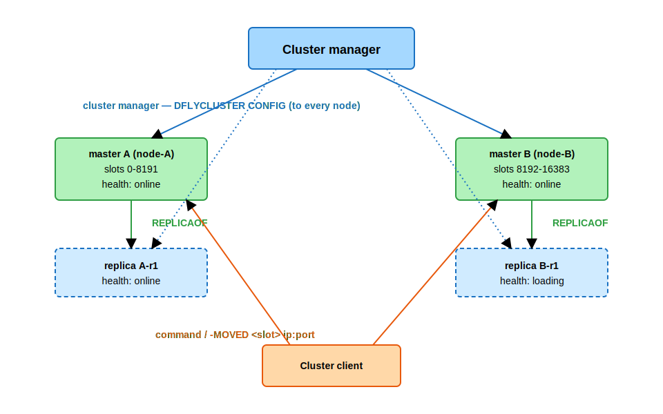
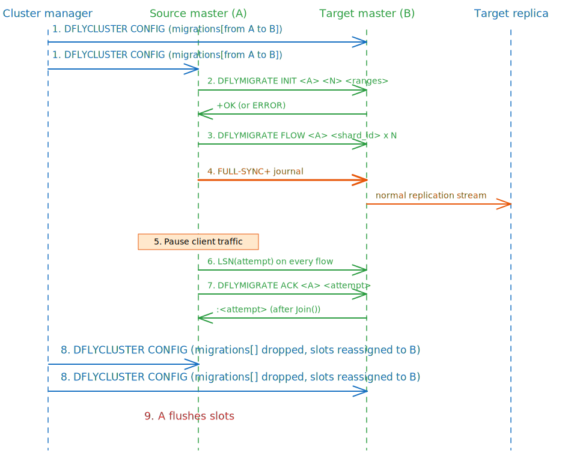

# Cluster Mode

## 1. Overview

A Dragonfly cluster is a set of Dragonfly nodes that collectively own the 16384-slot
hash space. Slot ownership is partitioned across master nodes, and each master may
have zero or more replicas.

Nodes do not gossip with each other and share no state. Topology is authored by an
external **cluster manager** and pushed to every node with a single command
(`DFLYCLUSTER CONFIG`); the cluster manager is the only source of truth for cluster
state. Each node accepts client requests only for keys whose slot it owns, and
redirects everything else with `-MOVED`.

In-progress slot transfers are part of cluster state. A migration is not a side
channel — it is a declarative field in the configuration JSON. A node starts,
continues, or cancels a migration solely as a consequence of receiving a config in
which the corresponding `migrations[]` entry has appeared, changed, or disappeared.

Each node is itself partitioned into thread-shards (one per core, shared-nothing).
Intra-node sharding is orthogonal to slot ownership: a node's owned slots are spread
across its thread-shards by a tag-derived hash — or, optionally, by slot id — so a
hot slot's load is distributed across cores regardless of cluster topology.

The rest of this document covers the cluster command surface, the configuration JSON,
the slot-routing rules, and the migration protocol, including the invariants that
keep the scheme safe under concurrent writes.

### 1.1 Terminology

- **Cluster manager** — the external operator that authors the topology, holds the only
  authoritative copy of cluster state, monitors node health, performs failovers, and
  pushes configuration to every node. Dragonfly ships only the data plane; the cluster
  manager is supplied separately (e.g. Dragonfly Swarm in Dragonfly Cloud, or a
  user-written orchestrator).
- **Slot** — one of the 16384 buckets `[0, 16383]` of the hash space.
- **Hash tag** — the substring of a key enclosed in `{}`. When present, only the tag is
  hashed; otherwise the whole key is hashed. Multi-key commands must resolve to a single
  slot, so applications use a shared tag (`user:{u42}:name`, `user:{u42}:cart`) to
  co-locate keys.
- **Thread-shard** — Dragonfly's intra-node partition. Each thread owns disjoint
  hash-table partitions and processes commands for them serially.
- **Source / target** — the master that currently owns a slot range being migrated, and
  the master that will own it after the migration finalizes.
- **Flow** — the per-thread-shard outbound migration stream. One flow per source shard.

## 2. Command Surface

Five top-level commands are registered. `CLUSTER` is exposed on every listener;
`DFLYCLUSTER` and `DFLYMIGRATE` are hidden and admin-only and must be reached through
the admin listener configured by `--admin_port`. `READONLY` and `READWRITE` are stubs
provided for client-library compatibility.

| Top-level | Subcommand | ACL flags | Scope |
|-----------|------------|-----------|-------|
| `CLUSTER` | `HELP`, `MYID`, `INFO`, `NODES`, `SHARDS`, `SLOTS`, `KEYSLOT <key>` | `SLOW` | Read-only introspection. Available on any listener. |
| `READONLY` | — | `FAST \| CONNECTION` | No-op stub (always replies `+OK`). Provided for client-library compatibility; no replica-read routing today. |
| `READWRITE` | — | `FAST \| CONNECTION` | No-op stub only in `emulated` mode. In real cluster mode (`--cluster_mode=yes`) it returns `-ERR Cluster is disabled. Use --cluster_mode=yes to enable.` |
| `DFLYCLUSTER` | `CONFIG <json>` | `ADMIN \| GLOBAL_TRANS \| HIDDEN`, ACL `ADMIN \| SLOW` | Installs new cluster state. Runs as a global transaction. |
| `DFLYCLUSTER` | `GETSLOTINFO SLOTS <id\|a-b>...` | as above | Per-slot stats: `key_count`, `total_reads`, `total_writes`, `memory_bytes`. |
| `DFLYCLUSTER` | `FLUSHSLOTS <start> <end> [...]` | as above | Deletes data in slot ranges. Journaled to replicas. |
| `DFLYCLUSTER` | `SLOT-MIGRATION-STATUS [<peer_id>]` | as above | Per-migration status: `[direction, peer_id, state, keys_migrated, error, slot_ranges]`. |
| `DFLYMIGRATE` | `INIT <source_id> <num_flows> [start end]...` | `ADMIN \| HIDDEN`, ACL `ADMIN \| SLOW \| DANGEROUS` | Source → target: announce migration. |
| `DFLYMIGRATE` | `FLOW <source_id> <shard_id>` | as above | Source → target: open one per-shard data stream. |
| `DFLYMIGRATE` | `ACK <source_id> <attempt>` | as above | Source → target: finalize attempt. |

A few invariants on the surface:

- **All `DFLYCLUSTER` commands require `--cluster_mode=yes`** and are rejected on every
  other mode (including `emulated`) with `-ERR Cluster is disabled. Use --cluster_mode=yes to enable.`
  They are the cluster manager's interface; clients should never call them.
- **`DFLYMIGRATE` is internal**, spoken only between Dragonfly masters during a
  migration. It is not part of the client-facing contract.
- **The cluster manager must push to every node** — masters and replicas — before
  authoring a successor config. There is no in-cluster gossip; a node that has not
  received the new config will reply with stale slot ownership.

### 2.1 Reply shapes that matter

- **`-MOVED <slot> <ip>:<port>`** — returned for any key whose slot this node does not
  own. The endpoint is the current owner per the local config, which during a migration
  may already be the target (§5).
- **`-CROSSSLOT Keys in request don't hash to the same slot`** — returned for any
  command, transaction, or Lua script whose keys span more than one slot.
- **`-ERR Invalid cluster configuration.`** — `DFLYCLUSTER CONFIG` rejection. The
  previous config is preserved untouched.
- **`-ERR Cluster is not yet configured`** — returned for any data-plane command in
  real-cluster mode before the first `DFLYCLUSTER CONFIG` has been installed.
- **`-ERR Cluster is disabled. Use --cluster_mode=yes to enable.`** — sent when
  `DFLYCLUSTER` is invoked on a node that is not in real-cluster mode.

### 2.2 Operational sequence for the cluster manager

A cluster manager typically:

1. Starts each node with `--cluster_mode=yes --admin_port=<p> [--cluster_node_id=<id>] [--cluster_announce_ip=<ip>]`.
2. Calls `CLUSTER MYID` on each node to discover its identity. `CLUSTER MYID` is
   available on every listener, not just the admin port.
3. Issues `REPLICAOF <master_ip> <master_port>` to each intended replica. Replication is
   set up out-of-band from cluster state: the `replicas[]` field of the cluster config
   is descriptive (used by `CLUSTER NODES/SHARDS/SLOTS` to advertise topology and by
   client-facing health filtering) and does **not** by itself cause any node to start
   replicating.
4. Pushes the cluster JSON to every node via `DFLYCLUSTER CONFIG <json>`.
5. To migrate slots, edits the source shard's `migrations[]`, pushes the new JSON to
   every node, polls `DFLYCLUSTER SLOT-MIGRATION-STATUS` until each migration reports
   `FINISHED`, and then pushes a successor JSON in which the migration entry is dropped
   and the slots are reassigned to the target.
6. On any node restart, re-pushes the current cluster JSON; a freshly started node owns
   no slots and rejects user traffic until a config arrives.

## 3. Data Model

### 3.1 Slot identifiers

A slot id is a 16-bit unsigned integer in the range `[0, 16383]` — the 14-bit space
produced by masking a CRC16 with `0x3FFF`. The mapping from key to slot is:

```
slot(key) = crc16(tag(key)) & 0x3FFF
```

`tag(key)` is the content of the first balanced `{...}` substring of the key when
both braces are present and the content is non-empty; otherwise it is the key itself.

A *slot range* is a closed interval `[start, end]` with `start <= end`. A node's
ownership is described as a sorted, disjoint list of such ranges. Internally each
node also keeps a 16384-bit bitset of its owned slots, so the ownership check on the
hot command path is a single bit lookup.

### 3.2 Hash tags and intra-node sharding

The key tag is consulted in two independent places:

1. **Cluster slot computation** — `slot(key)` always uses the tag, even when cluster
   mode is disabled.
2. **Thread-shard selection** — by default the owning thread-shard is derived from a
   fast non-cryptographic hash of the tag, modulo the node's shard count. Under
   `--experimental_cluster_shard_by_slot`, the slot id itself is used in place of the
   tag hash.

Default tag-hash mode spreads a single slot's keys across multiple thread-shards, so a
hot slot never collapses onto a single core. Slot-modulo mode pins each slot to a
single thread-shard; it is reserved for future migration optimizations that benefit
from contiguous-slot scans.

### 3.3 Cluster topology

A cluster's topology is a list of shards. Each shard has:

| Field | Meaning |
|-------|---------|
| slot ranges | The closed slot intervals owned by this shard's master, sorted and disjoint. |
| master | One node: id, ip, port, health. |
| replicas | Zero or more nodes with the same fields as master. |
| migrations | Zero or more outgoing slot migrations from this master to other masters. |

A node is identified by a string id; an endpoint is `(ip, port)`. A health field
attached to each node carries one of `online`, `loading`, `fail`, or `hidden`; it is
purely informational for clients and never changes a node's slot ownership.

Shards in the list are kept sorted by master id, so two configs that differ only in
shard order compare equal.

A migration entry lives only on the source shard. The target shard discovers an
incoming migration by scanning the migration entries of every other shard for one
whose target id matches its own. **Migration is part of cluster state, not a control
message**: adding, advancing, or removing a migration entry in a successor config is
what drives a source to start streaming or a finished migration to clean up.



## 4. Cluster Configuration

`DFLYCLUSTER CONFIG <json>` is the single mechanism by which a node learns the cluster
state. The same JSON is pushed to every node — masters and replicas alike. Replicas
need the state to redirect clients via `-MOVED` and to participate in migration cleanup.

### 4.1 JSON wire format

```jsonc
[
  {
    "slot_ranges": [ { "start": 0, "end": 8191 } ],
    "master": {
      "id":   "node-A",
      "ip":   "10.0.0.1",
      "port": 7000,
      "health": "online"           // optional, default "online"
    },
    "replicas": [
      { "id": "node-A-r1", "ip": "10.0.0.2", "port": 7000, "health": "loading" }
    ],
    "migrations": [                  // optional; presence drives the migration state machine
      {
        "node_id":     "node-B",
        "ip":          "10.0.0.3",
        "port":        7000,         // admin port of the target
        "slot_ranges": [ { "start": 4096, "end": 8191 } ]
      }
    ]
  },
  {
    "slot_ranges": [ { "start": 8192, "end": 16383 } ],
    "master":   { "id": "node-B", "ip": "10.0.0.3", "port": 7000 },
    "replicas": []
  }
]
```

| Field | Type | Required | Notes |
|-------|------|----------|-------|
| `slot_ranges[].start` / `.end` | uint16 | yes | Closed interval, `0..16383`, `start <= end`, ranges disjoint. |
| `master.id` | string | yes | Matches the target node's `CLUSTER MYID`. |
| `master.ip`, `.port` | string, uint16 | yes | Endpoint advertised to clients via `CLUSTER SLOTS/SHARDS/NODES` and embedded in MOVED replies. |
| `master.health` | enum string | no | `online` \| `loading` \| `fail` \| `hidden`; default `online`. See [cluster-node-health.md](cluster-node-health.md) for filtering rules. |
| `replicas[]` | array | yes (may be empty) | Descriptive only; replicas are wired up by `REPLICAOF` separately. |
| `migrations[]` | array | no | Outgoing slot migrations from this master. |
| `migrations[].node_id`, `.ip`, `.port` | | yes | The **target** master node. Port is the target's admin port. |
| `migrations[].slot_ranges` | | yes | Non-empty; must lie entirely inside this shard's `slot_ranges`. |

### 4.2 Validation

A config is rejected with `-ERR Invalid cluster configuration.` if any of the following
hold:

- A slot in `[0, 16383]` is owned by zero or by more than one shard.
- A node id appears twice as `master`, or twice as a replica of the same master.
- A `migrations[]` entry targets the migration's own source shard.
- A `migrations[]` target id is not a master in the same config.
- A source shard has two `migrations[]` entries with the same target id (the "one
  migration per node pair" invariant).
- A `migrations[]` slot range is empty, invalid, not contained in the source shard's
  ranges, or overlaps another `migrations[]` entry on the same source.

Validation runs before installation; on failure the node continues with its previous
config unchanged.

### 4.3 Installation and atomicity

A new config replaces the previous one atomically on each receiving node:

1. Parse the JSON and validate it; on failure, keep the previous config and reply
   with the rejection error.
2. Diff the new config against the previous one to compute four sets: newly enabled
   slots, newly disabled slots, newly added outgoing migrations, and removed outgoing
   migrations.
3. Under a node-wide lock, switch every thread to the new config in lockstep so that
   no command sees a half-updated view.
4. For each newly disabled slot, kick off an incremental background deletion (§5.3)
   that scans the local data and removes entries belonging to those slots. On the
   source side, migrated keys are permanently erased once the closing config takes
   their slots away.
5. Start a migration fiber per newly added migration entry, and stop the fiber for
   each removed entry.

These steps are local to the receiving node; cross-node consistency is the cluster
manager's responsibility. The manager must apply a new config to every node before
authoring the next one, or clients may bounce between disagreeing masters with stale
`-MOVED` replies.

A node owns no slots until its first config arrives, and user traffic to a freshly
started node is rejected with the cluster-not-configured error. The cluster manager
must therefore re-push the current config after every node restart and after every
topology change.

Cluster config is **not** carried over the replication stream. Each node — master or
replica — receives its own copy directly from the cluster manager. The journal does
carry the slot-flush side effects of a config change, so a master and its replicas
delete the same data when slots leave the master's ownership (§5.3).

## 5. Slot Routing

### 5.1 Owned-slot check

Before dispatching any command in cluster mode, the node hashes every key in the
command to its slot id and enforces two properties:

1. **Single-slot invariant.** If keys hash to more than one distinct slot, the command
   is rejected with `-CROSSSLOT`. This applies to single multi-key commands,
   `MULTI/EXEC` blocks, and Lua scripts.
2. **Ownership check.** For each key's slot:
   - If no cluster config has been installed yet, the command is rejected with the
     cluster-not-configured error.
   - If the slot is not in the node's owned-slot bitset, the command is rejected with
     `-MOVED <slot> <ip>:<port>`. The endpoint is the slot's owner per the local
     config — during a migration it is already the target, even though the source
     still holds the data (§6).

Ownership lookup is a single bit check, so this enforcement runs on every command in
cluster mode without measurable overhead.

### 5.2 MOVED redirection

A `-MOVED` reply carries the integer slot id and the endpoint of the master that the
node's local config says owns that slot. Clients are expected to refresh their slot
map (`CLUSTER SHARDS` or `CLUSTER SLOTS`) and retry. During a migration, the source
keeps serving traffic from its own copy of the data and streams updates to the target;
it begins replying `-MOVED` for the migrating slots only after its local view says it
no longer owns them (§6).

### 5.3 Slot deletion

When slots leave a node's ownership, the node deletes their data with an incremental
background sweep:

- A version stamp is recorded at the moment the slots become unowned. An on-insert
  hook deletes any newly written key in those slot ranges if its version predates the
  stamp; this catches writes that race the sweep.
- A detached fiber walks the local hash table, deleting entries whose slot id falls in
  the unowned ranges and whose version predates the stamp. The fiber yields per bucket
  so foreground commands keep making progress.
- Once the walk completes, the node also drops sharded pub/sub subscriptions
  associated with the flushed slots.

The same path runs in response to `DFLYCLUSTER FLUSHSLOTS <start> <end> ...`. The
master writes the flush as a `DFLYCLUSTER FLUSHSLOTS` journal entry so that every
replica deletes exactly the data the master did.

### 5.4 Cluster-mode command restrictions

In real cluster mode (`--cluster_mode=yes`):

- `SELECT` to any DB index other than the default is rejected; cluster-mode storage is
  single-DB.
- Global-keyspace pub/sub (`PUBLISH`, `SUBSCRIBE`, `PSUBSCRIBE`) is rejected. Sharded
  pub/sub (`SPUBLISH`, `SSUBSCRIBE`, `SUNSUBSCRIBE`) routes by slot and is supported.
- Multi-key commands and `MULTI/EXEC` blocks that span multiple slots return
  `-CROSSSLOT`. Lua scripts that touch multiple slots are likewise rejected (global-lock
  Lua scripts are not supported in cluster mode).

`--cluster_mode=emulated` exposes the cluster commands on a single node that owns all
16384 slots. In emulated mode `DFLYCLUSTER` is not available, `SELECT` and global
pub/sub still work, and the above restrictions do not apply. Emulated mode is intended
for development, migration phases, and resource-constrained environments where one node
stands in for an entire cluster.

## 6. Migration Protocol

A slot migration starts by adding a `migrations[]` entry to the source shard in the
next `DFLYCLUSTER CONFIG`. Because migration is part of cluster state, the protocol
is a reactive consequence of two configs landing on every node:

- the **opening** config introduces the migration entry, and
- the **closing** config removes the entry and reassigns the slots to the target.

Adding the same entry twice is idempotent; configs that do not change a source's
outgoing-migration set leave its migration state machine alone. At most one migration
may be in flight between any given source / target pair — enforced by config
validation (§4.2).

The data path is one dedicated TCP connection per source thread-shard, opened by the
source to the target's admin port. It is a **separate** connection from the source's
replication stream. Over that connection, the source emits write-side commands derived
from its local data:

- For strings and most collection types (`SET`, `HASH`, `LIST`, `ZSET`, top-level
  `STRING`), the source emits decomposed write commands (`SET`, `SADD`, `HSET`,
  `RPUSH`, `ZADD`), splitting large values into many small commands.
- For types that cannot be decomposed cleanly (`STREAM`, `JSON`, `SBF`), the source
  falls back to a single `RESTORE` command per key.

Mutations to migrating slots that arrive while the snapshot walk is still running are
streamed as ordinary write commands over the same connection, so the target catches
up incrementally with no separate journal channel.

The target executes every decoded command through its normal transaction framework,
exactly as if it had arrived from a client. The writes therefore appear on the
target's outbound replication stream like any other write, so target-side replicas
converge without any migration-specific code on the replica side. The source's
replicas are not affected by the migration channel — they keep replicating the
source's full data, including writes to slots that are migrating away.



### 6.1 States

Each migration — source and target — moves through the following state machine:

```
        ┌──────────────┐         ┌────────┐         ┌─────────────┐
  ─────►│ C_CONNECTING │────────►│ C_SYNC │────────►│ C_FINISHED  │  (terminal)
        └──────────────┘         └────────┘         └─────────────┘
              ▲                       │
              │ retry (500 ms)        │
              │                       ▼
              │                  ┌─────────┐
              └──────────────────│ C_ERROR │
                                 └─────────┘

  Any state ── on OOM ──► ┌─────────┐
                          │ C_FATAL │  (terminal)
                          └─────────┘
```

| State | Source meaning | Target meaning |
|-------|----------------|----------------|
| `C_CONNECTING` | Opening the migration connection, authenticating, waiting on the INIT reply. | INIT received; per-shard data flows have not yet been opened. |
| `C_SYNC` | Streaming snapshot data and concurrent writes over every flow. | Reading and applying decomposed writes and `RESTORE` payloads. |
| `C_ERROR` | A transient failure (peer disconnect, INIT rejected, ACK timeout). After a 500 ms wait the migration rewinds to `C_CONNECTING` and starts the sequence over. | Same — recoverable. The source's next INIT reuses the existing migration object on the target. |
| `C_FINISHED` | The ACK round-trip succeeded; the source has dropped the migrated slots from its local ownership. **Terminal.** | The ACK round-trip succeeded; the target has added the migrated slots to its local ownership. **Terminal.** |
| `C_FATAL` | Reached directly from `C_CONNECTING` when an INIT reply reports the target is out of memory, or from `C_SYNC` when an ACK reply reports the same. The retry loop exits. **Terminal.** | Reached from `C_SYNC` when applying a streamed command returns out-of-memory. The partially migrated keys are flushed. **Terminal.** |

There is no exit from `C_FATAL` or `C_FINISHED`. Recovering from `C_FATAL` requires
the cluster manager to remove the migration entry, address the memory shortage, and
add a fresh migration entry in a later config.

`DFLYCLUSTER SLOT-MIGRATION-STATUS` exposes these states as the strings
`CONNECTING | SYNC | ERROR | FINISHED | FATAL`, alongside the direction (`in` /
`out`), the peer id, the count of migrated keys so far, the last error message, and
the slot ranges the migration covers (e.g. `[4096, 8191]`). The key count is a live,
recomputed-on-every-call count of the local shard's keys for those slots while the
migration is in `SYNC` - it is **not** a "keys sent" or "keys received" counter, and
it moves with concurrent traffic: for an `out` entry it reflects whatever is
currently in the source for those slots (keys aren't removed from the source until
the cluster manager pushes a successor config, so inserts/deletes/expirations on the
source during migration change it too); for an `in` entry it reflects whatever has
landed in the target so far (it grows as data streams in, but is likewise not
insulated from concurrent writes). Only once a migration reaches `FINISHED` is the
count frozen and stable.

### 6.2 Source flow

For each outgoing migration entry the source runs a dedicated migration fiber that
walks the following sequence:

1. **CONNECTING.** Open a TCP connection to the target's admin port and authenticate.
   Connect attempts time out after `--slot_migration_connection_timeout_ms` (default
   2000).
2. **INIT.** Send `DFLYMIGRATE INIT <source_id> <num_flows> <slot_start> <slot_end> ...`
   on that connection, where `<num_flows>` is the source's thread-shard count. The
   target replies `+OK` once it has registered the migration. Two error replies are
   special:
   - `INCOMING_MIGRATION_OOM` — the target is out of memory. The source transitions
     to `C_FATAL` and stops retrying.
   - `UNKNOWN_MIGRATION` — the target has not yet applied the matching opening
     config. The source sleeps 500 ms and retries; if the situation persists for 30 s
     the source surfaces an error so the operator notices a cluster-manager
     misordering.
3. **Per-shard FLOW.** On every source thread-shard, open a fresh connection and send
   `DFLYMIGRATE FLOW <source_id> <shard_id>`. The target replies `+OK`, detaches the
   socket from its normal command dispatch loop, and hands it to a flow consumer
   (§6.3).
4. **SYNC.** Under a single global transactional cut, every flow attaches itself as a
   listener for writes to the migrating slot ranges, then walks the local data and
   emits the per-type wire form for each key (decomposed commands for most types, a
   single `RESTORE` for the non-decomposable ones; see §6 intro). Concurrent writes
   are appended to the same socket so the target sees a single, ordered stream per
   shard.
5. **Finalization.** Starting at `attempt = 1`, the source pauses non-admin client
   traffic node-wide, marks the end of each flow's journal with an `LSN(attempt)`
   opcode, then sends `DFLYMIGRATE ACK <source_id> <attempt>` and waits up to
   `--migration_finalization_timeout_ms` (default 30000) for the reply. The target's
   reply on success is the integer attempt number echoed back (RESP `:<attempt>`);
   the source only treats the attempt as succeeded when the echoed value equals the
   attempt it sent. If any flow has not yet quiesced at exactly that `LSN`, the
   target echoes a stale attempt and the source increments its counter, re-pauses,
   and retries.
6. **C_FINISHED.** On a successful ACK, the source drops the migrated slots from its
   local ownership immediately. From that moment its routing logic redirects clients
   for those slots to the target (the migration entry in the local config provides
   the target endpoint), even though the migration entry itself is still present.
   The closing `DFLYCLUSTER CONFIG` from the cluster manager removes the entry; on
   that config the source's slot-deletion sweep (§5.3) runs and the migration object
   is destroyed.

### 6.3 Target flow

For each incoming migration, the target maintains an object keyed by the source's
node id, with one independent consumer per source thread-shard:

- **On INIT.** Create the incoming migration (or reuse the existing one if its slot
  ranges match what the source announces), set state to `C_CONNECTING`, and prepare a
  per-shard barrier so the eventual ACK only succeeds when every flow has caught up
  to the same `attempt` number.
- **On FLOW.** Validate the source id, route the socket to the matching shard
  consumer, and reply `+OK`. The consumer takes over the socket and decodes the
  stream into commands that it executes against the target's local data, just like
  any other command. During SYNC the migrating slots are **not** yet in the target's
  owned-slot set, so client traffic for those slots is still redirected back to the
  source.
- **Throttling.** When `--slot_migration_throttle_us > 0`, the consumer sleeps that
  many microseconds for every 100 µs of accumulated processing time, capping the CPU
  share that migration takes from foreground traffic.
- **OOM during SYNC.** If a streamed command fails with out-of-memory, the target
  transitions the migration to `C_FATAL`, flushes the partially migrated keys, and
  replies `INCOMING_MIGRATION_OOM` to the source's next INIT or ACK so the source
  can also enter `C_FATAL`.
- **On ACK.** Wait up to `--migration_finalization_timeout_ms` for every flow to
  reach the `LSN(attempt)` marker. If any flow has consumed further journal entries
  past that marker, the attempt is rejected and the source must retry with
  `attempt + 1`. On success the target adds the migrated slots to its owned-slot set
  immediately and replies with the integer attempt number (RESP `:<attempt>`); the
  source treats the round-trip as successful only when the echoed integer matches
  the attempt it sent.

The ACK round-trip therefore looks atomic at the protocol level — both sides agree on
ownership once it completes — but the two local updates are not simultaneous. The
target updates its owned-slot set before sending its attempt-echo reply; the source
updates its set only when that reply arrives and matches the sent attempt, which is
also when its client pause is released.
In the brief gap between those two events, the target already owns the slots, the
source still claims them, and the source is no longer pausing user traffic. A write
to a migrated slot landing in this gap would be accepted by the source, journaled to
its replicas, and then erased by the source's slot-flush on the closing config. The
cluster manager hides this by not promoting any client-facing endpoint change until
both sides report `FINISHED`.

The closing `DFLYCLUSTER CONFIG` is still required after a successful ACK. Its job
is to (a) inform replicas and any third-party nodes of the new ownership, and (b)
remove the migration entry so the migration object can be destroyed and the source
can run its slot-deletion sweep (§5.3).

### 6.4 Replicas during migration

The migration channel is a master-to-master connection; no replica sees its data
directly. Replicas converge to the new state through two independent paths:

- **Target replicas** receive the migrated keys over their normal replication stream
  from the target. The target re-runs every decoded migration command through its
  regular transaction framework, so each one is journaled to its replicas exactly
  like a client write.
- **Source replicas** are unaffected by the migration channel altogether. They keep
  replicating their master's full data, including writes that the source streams to
  the target during SYNC.

Each replica also receives its own copy of `DFLYCLUSTER CONFIG` directly from the
cluster manager. A replica uses that config for two things:

- Answering `CLUSTER SHARDS`, `CLUSTER SLOTS`, and `CLUSTER NODES` with the
  cluster-wide topology, subject to the health-based filtering described in
  [cluster-node-health.md](cluster-node-health.md).
- Computing the MOVED target for any client command whose slot it does not own. The
  computation ignores the `health` field and consults the migration entries: when a
  slot is being migrated from this replica's master to some target, the MOVED reply
  points clients at the target. This means clients are redirected to the new owner
  as soon as a replica receives the opening config, even before the data has finished
  moving.

A replica does **not** start outgoing migration work in response to a config — that
is the master's job — and it does not run its own slot deletion sweep. Slot-flush
effects reach a replica through the master's normal replication stream, when the
master writes a `DFLYCLUSTER FLUSHSLOTS` journal entry after slots leave its
ownership (§5.3).

## 7. Failure Modes

Failures are organized by the phase in which they occur and by the locus of the fault
(network, peer, memory, cluster manager). For each, the table records the detection
mechanism, the state transition each side undergoes, and the recovery action.

### 7.1 CONNECTING phase

| Failure | Detection | Recovery |
|---------|-----------|----------|
| Cannot reach the target's admin port | The connect attempt times out (`--slot_migration_connection_timeout_ms`, default 2000). | The source records the error, sleeps 500 ms, and tries the whole connect-and-INIT sequence again. The state stays at `C_CONNECTING` between attempts and the migration retries indefinitely. |
| Target rejects INIT with `UNKNOWN_MIGRATION` | The cluster manager has installed the opening config on the source but not yet on the target, so the target has no matching migration object. | The source sleeps 500 ms and retries. If the situation persists for 30 s, the source surfaces the error in its status so the operator can investigate. As soon as the target's config catches up, the next INIT succeeds. |
| Target rejects INIT with `INCOMING_MIGRATION_OOM` | The target was already over its memory limit before INIT arrived. | The source moves to `C_FATAL` and stops retrying. The cluster manager must remove the migration entry, address the memory shortage, and re-add the entry in a later config. |
| Authentication failure on the migration connection | The connect step's auth handshake fails. | Treated like a connect failure — the source keeps retrying. Indicates misconfigured admin credentials or TLS material; the loop continues until the cluster manager fixes them. |

### 7.2 SYNC phase

| Failure | Detection | Recovery |
|---------|-----------|----------|
| TCP loss on a single flow socket | The target's reader returns an error; the source's write to that flow fails. | The source surfaces the error, sleeps 500 ms, and restarts the whole INIT → FLOW → SYNC sequence by rewinding to `C_CONNECTING`. The target keeps the partially applied keys and reuses the existing migration object on the next INIT; the source re-streams the snapshot from the beginning, and the target tolerates the duplicates because each command is individually idempotent on the underlying data. |
| Target reaches OOM applying a streamed command | A decoded write returns out-of-memory on the target. | The target moves the migration to `C_FATAL` and flushes the partially migrated keys. The source's next INIT or ACK receives `INCOMING_MIGRATION_OOM` and the source also moves to `C_FATAL`; recovery requires cluster-manager intervention. |
| Source dies during SYNC | The target's flow sockets receive EOF and the consumer fibers exit. | The target keeps the migration object and the partially applied keys; the state remains `C_SYNC` (the source disconnected cleanly, so no error was reported). When the cluster manager restarts the source or assigns its slots elsewhere, a fresh INIT reuses the migration object. If the manager promotes a replica with a different node id, the orphaned migration is left to time out and the new migration starts from scratch. |
| Target dies during SYNC | The source's writes fail. | The source enters the same retry loop as for TCP loss: rewind to `C_CONNECTING` and reconnect. If the manager fails the target over to a node with a different id, it rewrites the migration entry; the source sees the old migration as removed and the new one as added, cancels the first, and starts the second from scratch. |
| Throttle starves user traffic on the target | Operator-observed; `--slot_migration_throttle_us` is the knob. | Lower the throttle (or raise it from `0` if the migration is itself starving foreground traffic). A starting value of `20` µs is usually reasonable. |

### 7.3 FINALIZE phase

| Failure | Detection | Recovery |
|---------|-----------|----------|
| A flow consumed journal entries past the attempt's `LSN` marker | The per-shard barrier never reaches the expected count within `--migration_finalization_timeout_ms` (default 30000). | The target replies with a finalize-timeout error. The source increments `attempt`, re-pauses clients, re-marks the journal on every flow, and re-sends the ACK with the new attempt number. The ACK socket is reopened if needed. |
| ACK reply lost after the target finalized | The source's ACK read times out, but the target is already in `C_FINISHED` and has added the slots to its owned set. | The source retries with `attempt + 1`. The target's barrier is already satisfied, so the target idempotently re-applies its local ownership change and echoes the new attempt back. The source then drops the slots and the system converges. During the gap there is a brief window in which both sides claim the slots; both will reply to client commands until the source's ACK succeeds. |
| Source dies after the target finalized but before the source dropped its slots | The target is in `C_FINISHED` with the slots in its owned set; the source is gone. | The cluster manager observes the source failure and pushes a closing config that reassigns the slots to the target and removes the migration entry. The replacement master (typically a promoted replica) installs the new config and stops claiming the slots; no data replay is needed. |
| Cluster manager forgets to push the closing config | Both sides stay in `C_FINISHED`; the migration entry stays in the config; the migration objects are not freed. | No data is lost — both sides have correct local ownership and clients are redirected correctly. The operator simply needs to push the closing config. `DFLYCLUSTER SLOT-MIGRATION-STATUS` reports `FINISHED` so the manager can detect the stuck migration. |

### 7.4 Cluster-manager misordering

| Failure | Detection | Recovery |
|---------|-----------|----------|
| Opening config reaches source before target | The source's INIT receives `UNKNOWN_MIGRATION`. | Treated as a transient error (§7.1); the source retries every 500 ms for up to 30 s before surfacing. |
| Closing config reaches source before target | The source removes the migration entry and runs its slot-deletion sweep. The target still has the migration entry and its migration object remains in `C_FINISHED`. | Harmless: the target already owns the slots; the migration object is destroyed when the closing config arrives on the target. Clients are correctly redirected throughout. |
| Two configs applied out of order on the same node | Each config is installed atomically against whatever predecessor is currently present; the diff is computed against that predecessor. | A skipped intermediate config can cause migrations to be started and immediately stopped, or replicas to be added and immediately removed, but the final state matches the most recently applied config. The cluster manager is responsible for never authoring a successor config until the previous one has been applied everywhere. |
| Config validation fails on one node but succeeds on others | The failing node replies `-ERR Invalid cluster configuration.` and keeps its previous config. | The cluster temporarily disagrees on topology; clients hitting the failing node receive stale MOVED targets. The cluster manager must observe the rejection and push a corrected config. |

## 8. Modes, Flags, Ports

`--cluster_mode` selects the operating mode:

| Value | Behavior |
|-------|----------|
| unset / `""` | No cluster commands; `DFLYCLUSTER` rejected. |
| `emulated` | Single-node owner of slots `0..16383`. `CLUSTER *` answers from a synthetic topology built from the local replication summary. `DFLYCLUSTER` is not exposed. |
| `yes` | Full cluster mode. Topology must be installed via `DFLYCLUSTER CONFIG` before the node serves any data-plane traffic. |

| Flag | Default | Effect |
|------|---------|--------|
| `--admin_port` | `0` (off) | Required in real-cluster mode. `DFLYCLUSTER` and `DFLYMIGRATE` only accept connections on this listener; client-facing listeners reject them. |
| `--cluster_node_id` | `""` (uses the master replication id) | Node identity in the config; must match what the cluster manager embeds in `master.id`, `replicas[].id`, and `migrations[].node_id`. Disallowed in `emulated` mode. |
| `--cluster_announce_ip` | `""` (uses the local bind) | IP returned to clients in `CLUSTER SLOTS/SHARDS/NODES` and embedded in MOVED replies. |
| `--experimental_cluster_shard_by_slot` | `false` | When `true`, thread-shard selection uses the slot id modulo shard count instead of a tag-hash modulo shard count. |
| `--slot_migration_throttle_us` | `0` (off) | Target-side throttle: sleep this many microseconds after every 100 µs of migration processing. A starting value of `20` is reasonable if migrations starve user traffic. |
| `--slot_migration_connection_timeout_ms` | `2000` | Source-side TCP connect timeout for the migration's INIT, FLOW, and ACK reconnects. |
| `--migration_finalization_timeout_ms` | `30000` | Source-side wait for the ACK reply; also the target-side wait for every flow to reach the same attempt marker before replying. |

The wire format of `DFLYMIGRATE` is internal and not versioned. A mixed-version cluster
during a rolling upgrade is unsupported for slot migrations: cluster topology may be
updated, but `migrations[]` entries should be drained before upgrading either source or
target.

## 9. What Dragonfly Does Not Provide

Dragonfly ships only the cluster data plane. The following are out of scope for the
server and must be supplied by the cluster manager (or by a cloud product such as
Dragonfly Swarm):

- Node health detection and `health` field maintenance in the config.
- Master failover and replica promotion.
- Slot allocation, rebalancing, and the choice of which slots to migrate.
- Driving the open/close config pair for a migration.
- Inter-cluster orchestration (joining or splitting clusters).

A correct cluster manager treats Dragonfly nodes as passive: it observes them via
`CLUSTER` and `DFLYCLUSTER` introspection, computes a new authoritative config, and
pushes it to every node before authoring the next one.

## 10. Open Issues

1. `READONLY` is a no-op stub on every mode and `READWRITE` is a no-op only in
   `emulated` mode; replicas do not currently serve reads with client-driven routing,
   so a real-cluster client that issues `READWRITE` to opt back into the writer
   receives an error instead of being silently accepted.
2. Per-slot blocking on the source during finalization is a node-wide client pause; a
   future change should pause only the migrating slots' keys.
