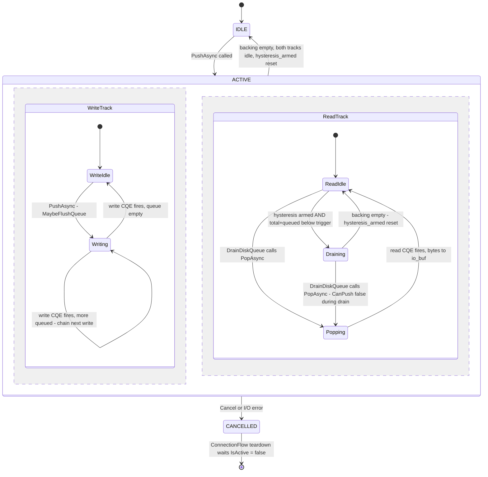
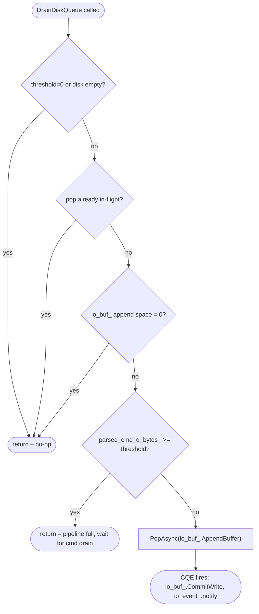
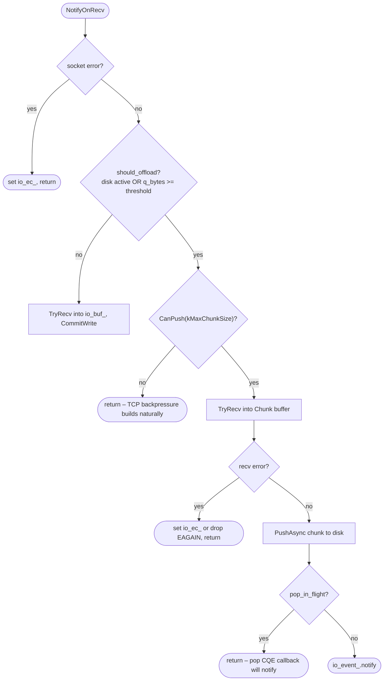
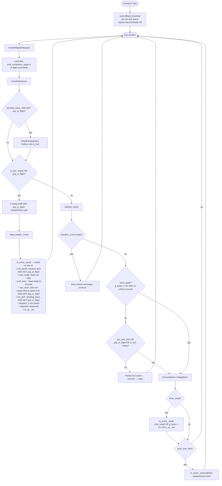
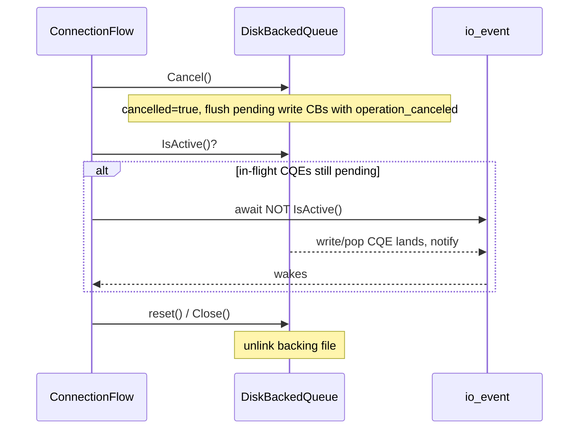

# Connection Disk Offload

---

## 1. Watermark Flags

Three thresholds form a three-level band:

| Flag                                   | Default      | Role |
|----------------------------------------|--------------|------|
| `pipeline_disk_offload_threshold`      | 0 (disabled) | **Offload trigger** – `parsed_cmd_q_bytes_ >= threshold` → incoming bytes go to disk instead of `io_buf_`. |
| `disk_backpressure_hysteresis_arm`     | x KB         | **High-water mark** – once `total_backing + queued >= arm`, `hysteresis_armed` is set, enabling the drain phase. |
| `disk_backpressure_hysteresis_trigger` | y KB         | **Low-water mark** – while armed and `total_backing + queued < trigger`, `IsDraining()=true`. New socket reads are blocked until the queue fully drains to memory. |


**Why hysteresis?**

We want to keep the disk queue active as long as it's busy and we also want to avoid the disk tax for pipelines that are being drained. Think of DrainDiskQueue reads to io_buf_, RecvNotification fires and we are forced to write
to disk. With hysterisis, we allow backpressure to fall naturally to tcp buffers while we drain the last chunks from the queue. Also note, we can use a staging buffer within the disk queue but I don't think it's worth it right now.

---

## 2. `DiskBackedQueue` State Machine



> **Note**: The two tracks run concurrently. A write CQE and a read CQE can be in-flight
> simultaneously — they always target different file offsets (writes append at `write_offset`,
> reads consume from `next_read_offset`). `IsActive() = false` only when **both** tracks
> are idle and `total_backing_bytes = 0`.

### Key predicates

```
IsActive()   = (!cancelled && total_backing_bytes > 0)
             || !write_queue.empty()
             || write_in_flight
             || pop_in_flight

IsDraining() = hysteresis_armed
             && (total_backing_bytes + queued_bytes) < hysteresis_trigger

CanPush(n)   = !cancelled
             && !IsDraining()
             && (total_backing_bytes + queued_bytes + n) < max_backing_size
```

---

## 3. `DrainDiskQueue` – per-loop drain step

Called once per `IoLoopV2` iteration, before `ReadPendingInput`.



The guard on `parsed_cmd_q_bytes_ >= threshold` is the back-pressure gate: the fiber
must wait for shard threads to execute commands and free memory before draining more
disk data into the parser.

---

## 4. `NotifyOnRecv` – recv routing

Called from the io_uring recv callback (edge-triggered).



---

## 5. `IoLoopV2` – main loop



### `force_await` dual role

`force_await = threshold > 0 AND parsed_cmd_q_bytes_ >= threshold AND parsed_to_execute_ = null`

1. **Spin guard** – prevents the fiber from busy-looping when `io_buf_` has data but the
   pipeline is full. Forces a yield so shard threads can run and drain commands.
2. **Offload bypass guard** – `ReadPendingInput` calls `TryRecv` directly into `io_buf_`
   with no `should_offload()` check. With `force_await` set, the parse guard skips
   `ReadPendingInput`, ensuring bytes continue going to disk rather than leaking into
   the in-memory buffer.

### The pop-in-flight `io_event_` notify guards

Two sites suppress `io_event_.notify()` while a pop CQE owns `io_buf_.AppendBuffer()`:

| Site | Guard |
|------|-------|
| `RegisterOnRecv` lambda | `if (!disk_queue_ \|\| !IsPopInFlight()) notify()` |
| `PushAsync` write-CQE callback | `if (!IsPopInFlight()) notify()` |

Without both guards the fiber wakes, sees `can_parse=false` (buffer half-written),
loops again, and starves the proactor that needs to fire the pop CQE.

The await predicate adds the matching guard on `can_poll`:
```cpp
bool can_poll = pending_input_ && !pop_in_flight;
```
This prevents spinning on `ReadPendingInput` (which is guarded by `!pop_in_flight`
at its call site) while `pending_input_` stays true.

---

## 6. End-of-connection teardown


