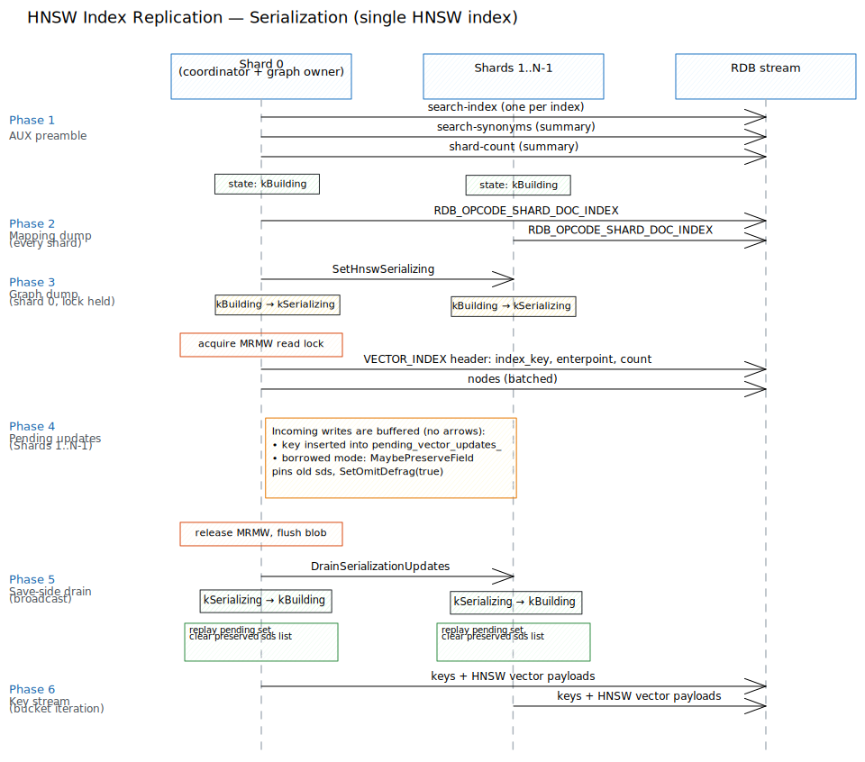
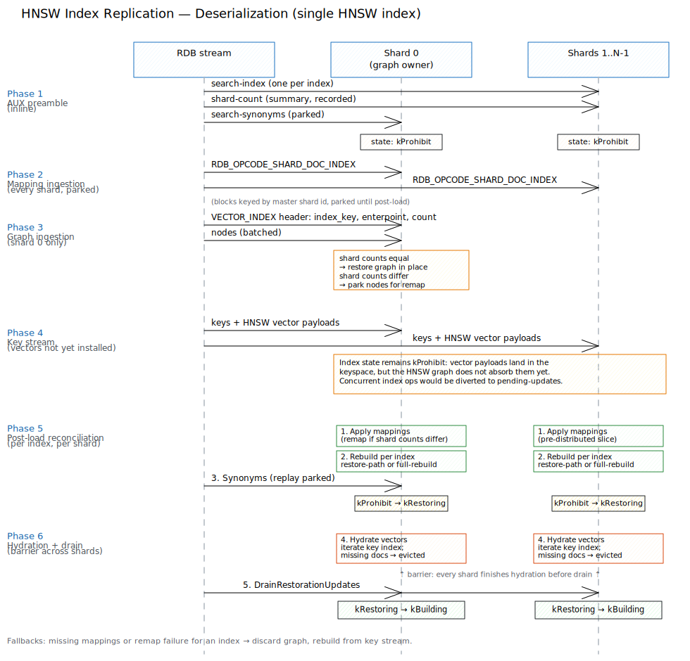

# HNSW Vector Index Replication

## 1. Overview

An HNSW (Hierarchical Navigable Small World) vector index in Dragonfly is global: a
single graph per `(index, field)` pair is shared across all shards, while the documents
it indexes are distributed per-shard. The full-sync RDB stream is by construction
per-shard. Replication must therefore carry two orthogonal pieces of state — the graph
and each shard's key space — and reassemble them on the replica, including the case where
master and replica shard counts differ.

This document specifies the wire format, the master/replica protocol, the index state
machine, and the invariants that make the scheme safe under concurrent writes.

### 1.1 Terminology

- **AUX field** — an RDB auxiliary record (key/value pair) interleaved with the data
  stream.
- **Summary flow** — the RDB sub-stream that carries global state (scripts, index
  definitions). A single summary flow exists per save.
- **Shard flow** — the per-shard RDB sub-stream that carries that shard's key/value
  data.
- **MRMW mutex** — a multi-reader / multi-writer mutex used by the global graph to
  serialize structural mutations against the serializer.
- **sds** — simple dynamic string, the backing storage of a hash field value.

## 2. Data Model

### 2.1 Identifiers

`DocId` is a 32-bit shard-local document identifier. `GlobalDocId` is a 64-bit value
containing the shard id in its upper 32 bits and the `DocId` in its lower 32 bits, and is
the only identifier used inside the HNSW graph. Because `GlobalDocId` encodes the
master's shard id, it must be rewritten when shard counts differ (§6).

### 2.2 Components

- **Global HNSW index.** One graph per `(index_name, field_name)`, addressed by
  `GlobalDocId`.
- **Per-shard key index.** Each shard maps its keys to shard-local `DocId`s. DocIds
  are issued independently per shard; together with the shard id they form the
  `GlobalDocId` stored in the graph.
- **Per-shard HNSW adapter.** Shard-local state associated with the global graph,
  including the preservation list required by the borrowed-vector invariant (§5.4).

### 2.3 Serialized structure

**`HnswNodeData`** — `internal_id`, `global_id`, `level`, and for each level `l` in
`0..level` the neighbour-link list (so `level + 1` link arrays). Vector payloads are
not part of this record; they are restored from the normal key stream.

Capacity, top level and element count are derived from the node stream itself during
restore; the entry point is the only graph-level parameter carried on the wire, and it
travels in the `RDB_OPCODE_VECTOR_INDEX` header (§3.2). Empty graphs are not
transmitted; the replica rebuilds them from the (empty) keyspace.

## 3. Wire Format

### 3.1 AUX fields

| Key | Payload | Scope |
|-----|---------|-------|
| `search-index` | `"<index_name> <FT.CREATE arguments…>"` | Summary flow and `SINGLE_SHARD_WITH_SUMMARY` flows unconditionally; per-shard flows only if the replica advertises capability `VER6` or later. Omitted entirely from RDB-to-disk saves. |
| `search-synonyms` | `"<index_name> <group_id> <terms…>"` | Summary flow. |
| `shard-count` | integer | Summary and `SINGLE_SHARD_WITH_SUMMARY` flows. Load-bearing: controls the remap branch (§6). |

### 3.2 Opcodes

`RDB_OPCODE_VECTOR_INDEX` (value `222`). One block per non-empty global HNSW index,
emitted by shard 0 only.

```
opcode                   u8   = 222
index_key                string    "<index_name>:<field_name>"
enterpoint_node          len
elements_number          len
repeated elements_number times:
  internal_id            u32         (little-endian raw)
  global_id              u64
  level                  u32
  for l in 0..=level:
    links_num            u32
    links                u32 × links_num
```

`index_key` is split on the final `:`. `enterpoint_node` and `elements_number` are RDB
varints (`SaveLen`/`LoadLen`); the per-node fields are packed little-endian. Indices
whose graph is empty are not emitted at all.

`RDB_OPCODE_SHARD_DOC_INDEX` (value `223`). One block per HNSW-indexed index, emitted by
every shard.

```
opcode        u8  = 223
shard_id      len
index_name    string
mapping_count len
repeated mapping_count times:
  key         string
  doc_id      len
```

## 4. Protocol

### 4.1 Master



In order of appearance in the RDB stream:

1. **AUX fields.** `search-index` is written for every index. The summary flow also
   writes `search-synonyms` once per synonym group and `shard-count` once.
2. **Mapping dump.** Each shard emits one `RDB_OPCODE_SHARD_DOC_INDEX` block per
   HNSW-indexed index, containing a snapshot of that shard's key→DocId table.
3. **Graph dump (shard 0 only, non-empty graphs only).** Shard 0 broadcasts a
   `kBuilding → kSerializing` transition to every shard; indices in other states are
   left as-is. It then acquires the read half of each global index's MRMW mutex in
   turn and emits one `RDB_OPCODE_VECTOR_INDEX` block per index, releasing the lock
   and flushing the serializer at the end of each one.
4. **Save-side drain.** Every shard replays its pending updates for indices currently
   in `kSerializing` and returns those indices to `kBuilding`.
5. **Key stream.** Bucket iteration proceeds as for any other data.

The graph dump is additionally gated by the `--serialize_hnsw_index` flag on the master.
When the flag is off, steps 2 and 3 are skipped and the replica rebuilds every index
from the key stream.

### 4.2 Replica



Inline processing:

- `search-index` dispatches `FT.CREATE` with idempotent semantics (existing definitions
  are left in place).
- `shard-count` is recorded and used to select the restore branch.
- Every `RDB_OPCODE_SHARD_DOC_INDEX` block is parked as a pending mapping keyed by the
  master's shard id.
- `RDB_OPCODE_VECTOR_INDEX` is either restored in place (same shard count) or parked
  as pending nodes (different shard count).

Post-load reconciliation, run once after the stream has been fully consumed:

1. **Apply mappings.** If shard counts match, each parked mapping is restored on the
   replica shard whose id equals the master shard id in the block. If they differ, the
   remap of §6 runs first and each replica shard receives its pre-distributed slice.
2. **Rebuild.** Each shard decides per index whether to take the restore path (graph
   was installed in step 1, → `kRestoring`) or to rebuild the index from scratch
   (graph missing or inconsistent, → `kBuilding` directly).
3. **Synonyms.** Parked synonym commands are replayed; the replica waits for index
   construction to complete on all shards.
4. **Hydrate.** Each shard iterates its key index, loads every live document, and
   populates vector data for the corresponding `GlobalDocId`. The key→DocId mapping is
   revalidated against the snapshot before any removal, because concurrent fibers may
   reuse freed DocIds. Nodes whose document is missing are removed from the graph; keys
   whose hydration cannot complete immediately are queued for the final drain.
5. **Drain.** Once every shard has finished hydration, each shard on the restore path
   replays its pending updates and transitions `kRestoring → kBuilding`. The drain is
   deferred until all shards have completed because the graph is global; a single
   shard cannot mark itself ready while others may still install vector data into the
   same graph. Shards that took the full-rebuild path are already in `kBuilding` and
   skip the drain.

The replica's `--deserialize_hnsw_index` flag mirrors the master flag: when off, both
opcodes are skipped on arrival and every index is rebuilt from the key stream.

## 5. Index States and Invariants

### 5.1 States

Each shard holds one state per index, drawn from the four values
`{kProhibit, kRestoring, kSerializing, kBuilding}`. States on different shards and on
different indices are independent. The state reflects the index's *phase* (loading,
restoring, serializing, steady-state) rather than the node's role — any instance
visits master-side states while saving and replica-side states while loading — but
in a typical replication topology each side only visits its own subset.

**Replica side.** The replica visits `kProhibit` first, then either rebuilds from
scratch or hydrates a restored graph, ending in `kBuilding`.

| State | When entered | Mutations | Exit |
|-------|--------------|-----------|------|
| `kProhibit` | Default at `InitIndex` while the shard is in LOADING. The shard has not yet decided whether to rebuild from scratch or restore from RDB graph data. | Buffered into the pending-updates list (may be discarded — see exit). | **Full-rebuild path:** directly to `kBuilding`; the pending-updates list is *cleared*, not replayed (the rebuild reindexes every document from the key stream). **Restore path:** to `kRestoring`. |
| `kRestoring` | Restore path only: graph data was installed from RDB and `Rebuild(is_restored=true)` ran, leaving vector payloads to be hydrated from the key stream. | Buffered for replay. | Restore-side drain → `kBuilding`, after hydration completes on **every** shard. |
| `kBuilding` | Reached directly via full rebuild, or via the restore-side drain. Terminal under a single full-sync. | Applied inline to the graph. | Promoted to `kSerializing` only if this replica later runs its own snapshot. |

The distinction between `kProhibit` and `kRestoring` is *which path was chosen*:
`kProhibit` means the shard is still buffering ops without a commitment to replay
them, and the full-rebuild exit will discard the buffer; `kRestoring` means the shard
has committed to keeping the buffer and replaying it on drain.

**Master side.** The master starts in `kBuilding` and is briefly promoted to
`kSerializing` for the duration of each graph dump.

| State | When entered | Mutations | Exit |
|-------|--------------|-----------|------|
| `kBuilding` | Steady state on the master. | Applied inline to the graph. | Promoted to `kSerializing` at the start of every graph dump. |
| `kSerializing` | Set right before a graph dump, only on indices currently in `kBuilding`. | Buffered for replay. | Save-side drain → `kBuilding`, after the dump completes. |

**Transitions.** Drains replay the pending-updates list against the current database
state; the full-rebuild exit out of `kProhibit` is the only state change that
*discards* buffered ops instead of replaying them.

1. `kProhibit → kBuilding` — full-rebuild path on the replica: the shard discards any buffered ops and rebuilds the index from scratch from the key stream.
2. `kProhibit → kRestoring` — restore path on the replica: graph data was installed from RDB; the shard now needs to hydrate vector payloads.
3. `kRestoring → kBuilding` — restore-side drain at the end of post-load reconciliation, after all shards finish hydration.
4. `kBuilding → kSerializing` — issued at the start of the graph dump on the side that is saving.
5. `kSerializing → kBuilding` — save-side drain at the end of the graph dump.

There is no direct transition between `kRestoring` and `kSerializing`.

**Safety carve-out.** Because `kSerializing` is reachable only from `kBuilding`, and
the save-side drain acts only on `kSerializing`, a save cannot disturb a `kProhibit`
or `kRestoring` index — neither the promotion nor the drain touches a half-restored
replica.

### 5.2 Single-writer invariant

The global graph is mutated only when the owning shard is in `kBuilding`. All other
states divert `Add` and `Remove` calls to a per-shard pending-updates list, which is
replayed on drain.

### 5.3 Consistent-snapshot invariant

While a graph dump is in progress, shard-level writes are accepted at the key layer;
their index side-effects are buffered. The MRMW read lock held on the graph prevents any
buffered mutation from committing until the dump completes.

### 5.4 Borrowed-vector invariant

A graph can be configured to store pointers into hash field sds rather than copying
vectors. In copy mode this invariant is a no-op. In borrowed mode, any mutation that
would free or overwrite such an sds while the index is not in `kBuilding` must retain
the original sds until the drain. Retention is per-shard, per-field. The containing
`PrimeValue` additionally suppresses defragmentation for the lifetime of the node to
prevent relocation of borrowed storage.

### 5.5 Identifier uniqueness

`GlobalDocId`s are unique across shards by construction. On fresh mapping load and on
remap (§6), per-shard DocId counters issue DocIds in the same order in which keys are
later installed, so counter values coincide with the DocIds materialized by the replica's
key index.

### 5.6 Restore ordering

Graph structure is restored before vector payloads are hydrated. A node whose document
is missing in the local database at hydration is removed from the graph. Nodes whose
vector data cannot be installed immediately are deferred to the post-load drain (§5.2);
they exist briefly with stale payloads but are never reachable by a search query, which
requires the index to be in `kBuilding`.

## 6. Shard Count Remap

When the `shard-count` AUX value differs from the replica's shard count, `GlobalDocId`s
carried in graph blocks refer to the master's shard layout and must be rewritten before
the graph can be installed.

1. **Build remap table.** For every `(index, master_shard, key, old_doc_id)` received in
   the mapping stream, compute the replica target shard for the key and issue a fresh
   DocId from a per-target counter. The counter order must match the order in which the
   replica later installs keys, so that counter values coincide with materialized DocIds.
2. **Remap and restore.** Rewrite every `global_id` in parked node records through the
   table, then restore the graph. Any index that cannot be fully remapped is added to a
   failed set.
3. **Pre-distribute mappings.** Group remapped keys by target shard into ordered key
   lists whose positions match the DocIds issued in step 1.
4. **Fallback.** Indices in the failed set, and indices for which no mappings arrived,
   are discarded and rebuilt from scratch from the key stream.

| Master shards | Replica shards | Mappings present | Action |
|---------------|----------------|------------------|--------|
| N | N | — | Direct restore on each shard at opcode arrival; no remap. |
| N | M (≠ N) | yes | Park nodes; remap, restore, pre-distributed mapping apply at post-load. |
| N | M (≠ N) | no, or remap fails | Discard graph, rebuild from key stream. |

## 7. Version Compatibility

The wire format is gated on the replica capability `VER6`, advertised through
`REPLCONF capa dragonfly`, and on the master flag `--serialize_hnsw_index`. Replicas
below `VER6` receive only the `FT.CREATE` definition through the summary flow and
reconstruct each index from the key stream alone. RDB saves to disk omit all
search-index data: search indices are a replication-only concern.

## 8. Open Issues

1. Multiple HNSW vector fields per index are not supported.
