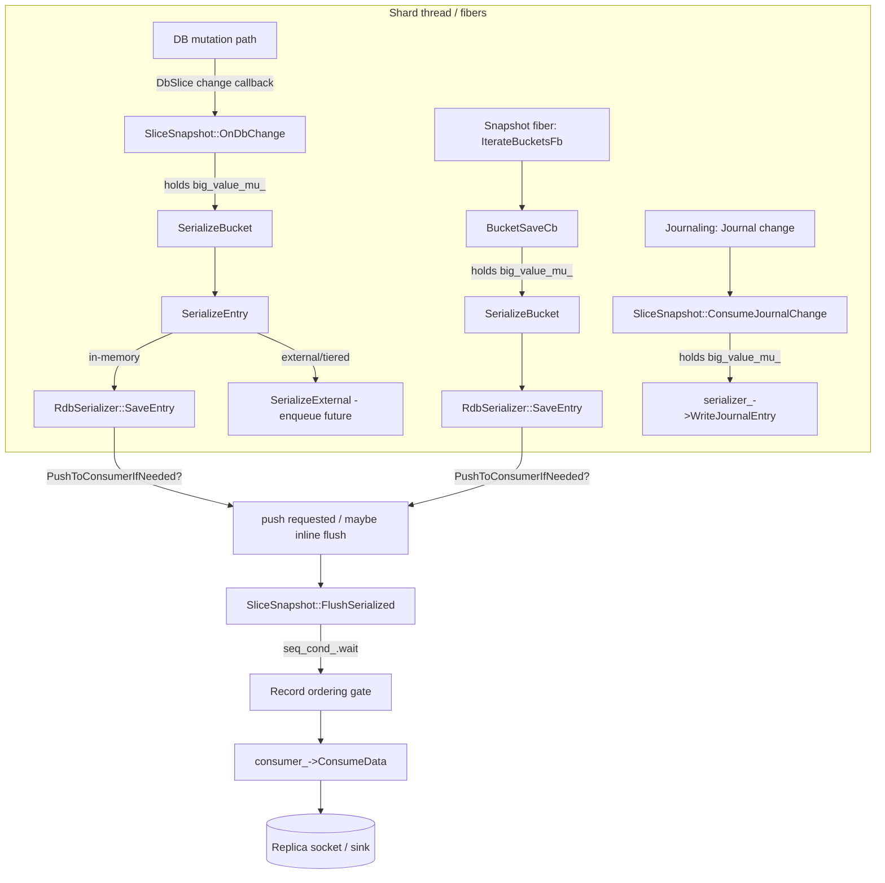
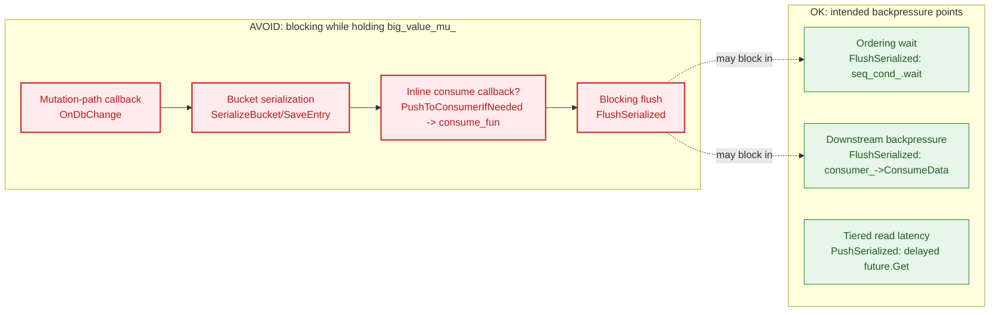
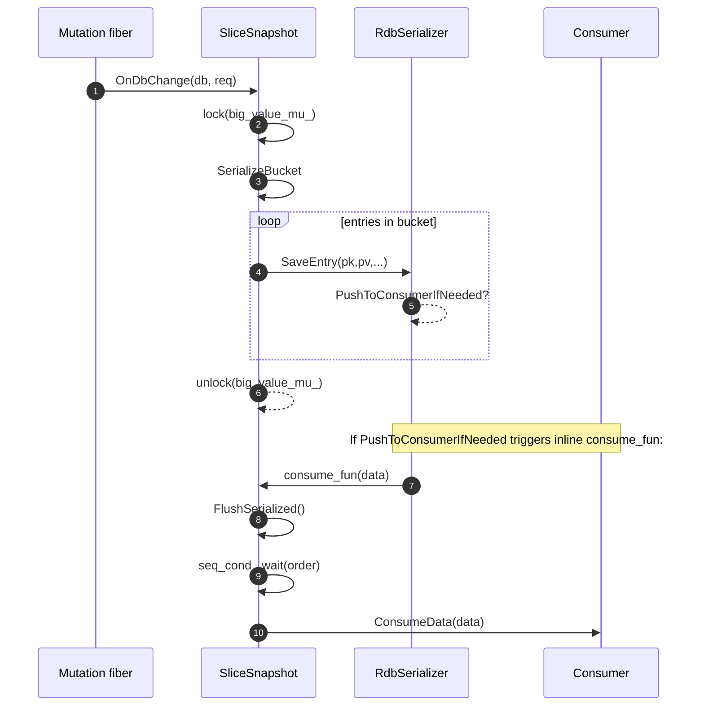
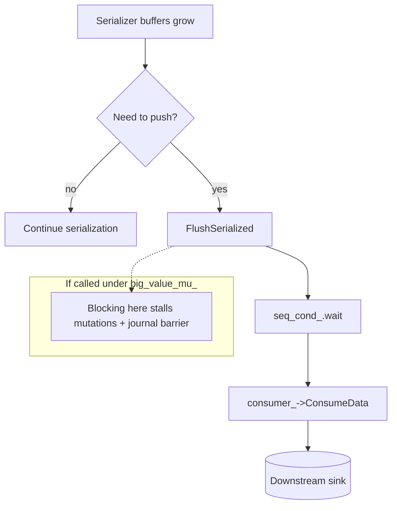
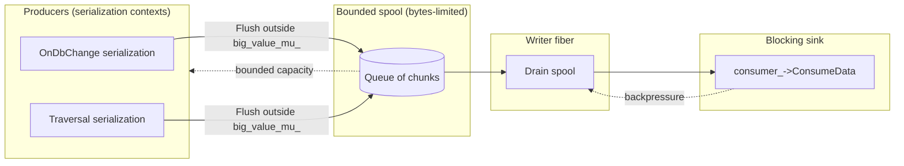

# Design draft: PIT snapshot + journal serialization (OnDbChange, flushing, backpressure)

_Date: 2026-02-09_

This document is a **design-oriented draft** (not final) that describes the current PIT snapshot
implementation around `SliceSnapshot::OnDbChange()` in `src/server/snapshot.cc`, highlights the
problem areas (blocking under `big_value_mu_`, memory growth, coupling to downstream sinks), and
proposes options to simplify the design while keeping **correctness** and **bounded memory**.

The focus is on **replication snapshotting**, where we must serialise a baseline dataset and then
stream journal changes such that the replica observes:

- baseline key/value first,
- then journal updates for that key,

without unbounded buffering and without stalling critical paths unnecessarily.

## TL;DR

- PIT snapshot correctness is based on bucket versions + serialize-before-mutate enforced by
  `OnDbChange()`.
- Backpressure is required to cap memory, but we should avoid blocking on downstream sinks while
  holding `big_value_mu_`.
- The most promising direction is: **separate "produce serialized bytes" from "write to blocking
  sink"** using a bounded spool/credit system, and make large bucket serialization incremental so
  it can yield outside the mutex.

## Diagrams

### 1) PIT snapshot + journal ordering (current high-level flow)



### 2) Blocking / hazard map



## Goals and constraints

### Goals

1. **Correctness:** replica must not observe a journal update before the baseline value for the
   same key.
2. **Bounded memory:** no design that can grow memory unboundedly under a slow consumer or a
   write-heavy workload.
3. **Predictable blocking:** if we must block (backpressure), do so at well-defined points and
   preferably outside `big_value_mu_`.
4. **Reasonable throughput:** keep fast-path overhead acceptable; avoid heavy work in mutation hooks
   where possible.

### Non-goals

- Removing backpressure. Snapshotting inherently needs it.
- Copy-on-write "log old values" schemes that can accumulate arbitrary amounts of data.

### Key constraints (Dragonfly-specific)

- `OnDbChange()` runs on the shard/mutation path and currently acquires `big_value_mu_`.
- `big_value_mu_` is used as an atomicity barrier between:
  - bucket serialization (snapshot baseline),
  - `ConsumeJournalChange()` ordering,
  - and DB mutations.

## Snapshot modes (high-level)

The snapshot code supports two modes:

1) **Point-in-time snapshot (PIT)** (`use_snapshot_version_ == true`) — the primary focus of this
  document.

- Snapshot is defined by a monotonically increasing `snapshot_version_` assigned when the snapshot starts.
- Buckets are serialized if their bucket-version is `< snapshot_version_`.
- Correctness relies on: **serialize-before-mutate** for buckets whose current version is old.
- `OnDbChange()` is the mechanism to serialize buckets "just-in-time" before a mutation changes them.

2) **Non-PIT snapshot** (`use_snapshot_version_ == false`) — currently exists as an alternative.
  It uses different machinery (e.g. moved-item handling) and is not covered here beyond this
  mention.

## Background: correctness contract (PIT + journals)

PIT mode relies on a bucket versioning contract:

- Each bucket has a version.
- Snapshot is defined as "serialize all buckets with version `< snapshot_version_`".
- To serialize each physical bucket exactly once, bucket version is set to `snapshot_version_`
  when the bucket is serialized.
- For any bucket that is about to be mutated while snapshotting is running, PIT must guarantee
  **serialize-before-mutate**: serialize the bucket's pre-mutation contents before the mutation can
  make the snapshot miss data.

`OnDbChange()` is the "just-in-time" hook used to uphold serialize-before-mutate.

### Journal ordering rule

The journal stream must be ordered relative to baseline values:

> For any key, the replica must receive the baseline value strictly before any journal entry that
> mutates that key.

In current code this is addressed by:

- `OnDbChange()` running before the mutation commits, and
- `ConsumeJournalChange()` taking `big_value_mu_` as a barrier to avoid interleaving with bucket
  serialization.

## PIT call flow: OnDbChange and descendants

### Entry: `SliceSnapshot::OnDbChange(DbIndex db_index, const DbSlice::ChangeReq& req)`

Relevant code:

- Grabs `big_value_mu_` unconditionally:
  - This is a *barrier* mutex used elsewhere (e.g. `ConsumeJournalChange`, `BucketSaveCb`, `OnMoved`).

- In PIT mode (`use_snapshot_version_`):
  - Extracts pointer to a `PrimeTable::bucket_iterator` from `req.update()`.
  - If a concrete iterator exists and is old (`GetVersion() < snapshot_version_`) ⇒ serialize that bucket.
  - If this is an insert (no iterator), uses `PrimeTable::CVCUponInsert(snapshot_version_, key, callback)` to locate the bucket and serialize it.

So the (PIT) descendant path is:

```
OnDbChange
  -> SerializeBucket (...)
       -> SerializeEntry (for each item)
            -> RdbSerializer::SaveEntry (for in-memory values)
            -> SerializeExternal (for tiered/external values)
```



### `SerializeBucket(DbIndex, PrimeTable::bucket_iterator it)`

- If PIT: sets bucket version to `snapshot_version_` (ensures bucket is serialized at most once).
- Iterates entries:
  - `SerializeEntry(db_index, it->first, it->second)`

### `SerializeEntry(DbIndex, const PrimeKey&, const PrimeValue&)`

1) Expire lookup:
- `db_array_[db_indx]->expire.Find(pk)` and `db_slice_->ExpireTime(...)`
- CPU-only, but can be non-trivial.

2) Optional memcache flag lookup:
- `db_slice_->GetMCFlag(...)`

3) Value handling:

- **In-memory values**:
  - `serializer_->SaveEntry(pk, pv, expire_time, mc_flags, db_indx)`

- **External/tiered values** (`pv.IsExternal()`):
  - Calls `SerializeExternal(...)` which schedules a tiered read future and pushes onto `delayed_entries_`.
  - No immediate I/O block at this call site.

### `RdbSerializer::SaveEntry(...)` (in `src/server/rdb_save.cc`)

Even with partial context, we know:

- `SaveEntry` writes key/value and metadata into an internal buffer.
- It calls `PushToConsumerIfNeeded(FlushState::kFlushEndEntry)` at end of entry.

The critical open question for preemption is: **does `PushToConsumerIfNeeded` invoke the `consume_fun_` callback synchronously?**

In `SliceSnapshot::Start()`, `consume_fun` is set to call `HandleFlushData(data)` when threshold is exceeded.

So a synchronous `consume_fun_` would mean:

```
OnDbChange (holds big_value_mu_)
  -> SerializeBucket
      -> SerializeEntry
          -> serializer_->SaveEntry
              -> PushToConsumerIfNeeded
                  -> consume_fun_ (if triggers)
                       -> SliceSnapshot::HandleFlushData
                            -> FlushSerialized
                                 -> consumer_->ConsumeData(...)   [blocking]
```

This is the biggest potential source of *unintended blocking inside the mutation-path callback*.

## Blocking and preemption map

This section identifies exactly where the system can block today, and classifies those blocking
points as either **intended backpressure points** or **hazards**.



This section separates (A) *definitely blocking* points and (B) *potentially blocking* points, based on the code included in `snapshot.cc`.

### A. Definitely blocking points (I/O or scheduler waits)

These occur in `FlushSerialized()` / `PushSerialized()`:

1) **Record ordering wait** in `FlushSerialized()`:

```cpp
seq_cond_.wait(lk, [&] { return id == this->last_pushed_id_ + 1; });
```

This can block if another producer has an earlier record ID and is stalled pushing it.

`last_pushed_id_` is the monotonic gate that preserves write order across **multiple producers**
(`IterateBucketsFb`, `OnDbChange`, and journal callbacks). Each flush assigns a unique `id`, and
`HandleFlushData` only allows the next sequential `id` to proceed. Without this gate, two fibers
could call `HandleFlushData` concurrently and push blobs out of order, which would interleave
baseline chunks and journal entries incorrectly and violate the “baseline-before-journal” rule.

**Concrete scenario:** Fiber A (bucket traversal) flushes baseline for key `k` and is assigned
`id = 10`, then blocks in `ConsumeData` due to backpressure. Fiber B (journal callback) flushes a
journal update for the same key and is assigned `id = 11`. If B is allowed to proceed while A is
blocked, the replica would receive the journal update before the baseline value for `k`, breaking
PIT ordering. The `last_pushed_id_` gate forces B to wait for A, preserving correctness.

2) **Downstream consumer write** in `FlushSerialized()`:

```cpp
consumer_->ConsumeData(std::move(sfile.val), cntx_);  // Blocking point
```

Depending on implementation, this may block on:
- bounded channel capacity
- network backpressure (replication socket)
- disk I/O (snapshot save)

This is an *intended backpressure point*.

3) **Tiered read wait** in `PushSerialized()` when draining `delayed_entries_`:

```cpp
auto res = entry.value.Get();  // Blocking point
```

This is explicit I/O waiting.

This is a backpressure point (tiered storage latency), but note: it currently happens inside
`PushSerialized()` which also flushes baseline bytes, mixing CPU work, I/O, and sink backpressure
in one function.

4) **Sleep-based throttling** (not I/O, but deliberate blocking) after flush when not background mode:

```cpp
ThisFiber::SleepFor(...);
```

### B. Potentially blocking points reachable from OnDbChange

Even though `OnDbChange()` does not call `PushSerialized()` directly, it.

#### 1) Inline consume callback via `RdbSerializer::PushToConsumerIfNeeded`

If `PushToConsumerIfNeeded` invokes `consume_fun_` synchronously from within `SaveEntry`, then `OnDbChange()` may indirectly call `HandleFlushData()` → `FlushSerialized()` and block in:

- `seq_cond_.wait`
- `consumer_->ConsumeData`

**while still holding `big_value_mu_`.**

This can create undesirable coupling:
- replication backpressure and channel fullness can stall the DB mutation path for an extended time.
- lock inversion risks increase, because other code (e.g. journal callback) uses the same mutex.

This is a **hazard**: backpressure is necessary, but we do not want it to manifest while holding
`big_value_mu_` on the mutation path.

#### 2) CPU-heavy preemption

Even if there's no blocking I/O, `OnDbChange()` can consume a large CPU slice:

- Serializing large containers (listpack/qlist/strmap/etc).
- Compression in later flush stages (but even pre-flush buffer preparation can be heavy).

Net effect: it can "preempt" in the sense of:
- burning fiber time slice
- causing increased latency for other fibers on the shard.

## Locking + correctness constraints

### `big_value_mu_` is a "multi-purpose barrier"

It protects multiple invariants:

- In PIT mode: acts as a barrier so bucket serialization and mutations do not interleave in ways that violate serialize-before-mutate.
- For journal streaming: `ConsumeJournalChange` takes this lock to guarantee journal entries are written after their corresponding baseline value.
- For non-PIT mode and moved-item handling: blocks moves/serialization races.

This is convenient but increases the blast radius of any blocking inside serialization.

### `SerializeBucket` also runs under `GetLatch()` in `BucketSaveCb`

In the main traversal path (`BucketSaveCb`), code locks:

- `big_value_mu_`
- then `*db_slice_->GetLatch()`

`OnDbChange()` does **not** take the latch.

This means the system relies on `big_value_mu_` as the primary race barrier between:
- `OnDbChange`-triggered serialization
- traversal serialization
- journal items appending

## Design options

The guiding constraints for evaluating options:

- Preserve PIT correctness + journal ordering.
- Preserve bounded memory via backpressure.
- Avoid blocking on downstream sinks while holding `big_value_mu_`.

### Option 0 (baseline): current PIT behavior

What it does:

- Two "producers" can serialize buckets into the shared `serializer_`:
  - traversal (`IterateBucketsFb` → `BucketSaveCb` → `SerializeBucket`)
  - mutation hook (`OnDbChange` → `SerializeBucket`)
- Flushing can block on `consumer_->ConsumeData`.
- Locking uses `big_value_mu_` as the main barrier.

Pros:

- Works today; minimal moving parts.

Cons / risks:

- If `PushToConsumerIfNeeded` triggers `consume_fun_` inline, `OnDbChange` can block with `big_value_mu_` held.
- Harder to reason about: mutation hook serialization + traversal serialization + flush ordering are
  coupled.

### Option 1: deferred flush requests + bounded spool (decouple sink I/O)

**Idea:** keep producing serialized bytes (including from `OnDbChange`) but avoid calling blocking
sink APIs while holding `big_value_mu_`. Introduce a bounded intermediate "spool" and a writer
fiber.

> **Definition: Spool**
> In this context, a "spool" is a bounded, in-memory buffer (queue) that temporarily holds
> serialized data chunks. It decouples the *producers* (bucket serialization logic) from the *consumer*
> (blocking I/O sink), allowing serialization to proceed without waiting for the sink unless the
> spool's capacity is reached (backpressure).

Sketch:

- `RdbSerializer::PushToConsumerIfNeeded` (or equivalent) only raises a *flush request*.
- Actual `serializer_->Flush(...)` happens in a context that is not holding `big_value_mu_`.
- Flushed chunks are pushed into a bounded spool (by bytes, not by count).
- A writer fiber drains spool → `consumer_->ConsumeData(...)`.
- If the consumer is slow, spool fills, and producers block waiting for spool capacity, but this
  blocking is **outside** `big_value_mu_`.



Pros:

- Preserves bounded memory.
- Centralizes all blocking on the sink to a writer fiber.
- Makes it possible to uphold the invariant "don't block while holding `big_value_mu_`".

Cons / open questions:

- Requires a new bounded spool abstraction and careful accounting of bytes.
- Requires new "safe points" where it's legal to fulfill flush requests.
- Still need a strategy for extremely large buckets (see Option 2).

### Option 1a: permit/budget API (same as Option 1, different interface)

Represent spool capacity as credits:

- `AcquireWriteBudget(nbytes)` may block until capacity is available.
- `CommitChunk(chunk)` is non-blocking once budget is acquired.

This is effectively an "async interface" for *memory/backpressure* even if the underlying sink is
synchronous.

### Option 2: resumable / incremental bucket serialization (streaming giant buckets)

**Idea:** make it possible to serialize a single huge bucket in smaller chunks, so we can flush
incrementally without storing GBs in serializer buffers.

Sketch:

- Under `big_value_mu_`, serialize up to K entries (CPU-only), without calling blocking sink APIs.
- Release `big_value_mu_`.
- Fulfill pending flush requests, flush serializer output into spool (may block on spool capacity).
- Reacquire `big_value_mu_` and continue from the saved iterator position.

Pros:

- Prevents "huge single bucket" from exploding temporary buffers.
- Creates natural safe points for backpressure outside the mutex.

Cons / open questions:

- Requires making bucket iteration state resumable and careful handling of bucket-version updates.
- Must ensure correctness if mutations interleave between chunks (e.g. treat bucket as "owned"
  until fully serialized, or enforce per-bucket gating).

### Option 3: single-producer serialization + per-bucket gating

**Idea:** `OnDbChange` does not serialize. It enqueues "bucket X must be serialized now". A single
snapshot fiber performs all serialization and flushing.

Correctness without COW requires gating:

- If mutation touches a bucket with version `< snapshot_version_`, it must wait until the snapshot
  fiber serializes that bucket.

Pros:

- Simplifies ownership: only one producer writes into `serializer_`.
- Backpressure and ordering are centralized.

Cons:

- Mutations may block waiting for local serialization completion (still okay; bounded memory), but
  could impact latency under heavy snapshot load.
- Requires per-bucket synchronization primitives.


## Recommended invariants

Regardless of the chosen option, explicitly enforce/document:

1. **No blocking under `big_value_mu_` on downstream sinks or I/O:**

   > While holding `big_value_mu_`, snapshot code must not call operations that can block on
   > downstream backpressure or I/O (`seq_cond_.wait`, `consumer_->ConsumeData`, tiered `future.Get`).

2. **Backpressure is mandatory for bounded memory:**

   - If consumer can't keep up, producers must stall (outside the mutex) rather than buffer
     unboundedly.

## Key follow-ups to validate risk (recommended readings)

To determine whether `OnDbChange()` can *currently* block on I/O/backpressure, verify:

1) `RdbSerializer::PushToConsumerIfNeeded(...)` in `src/server/rdb_save.cc`:
- Does it call `consume_fun_` synchronously?
- Under what conditions (buffer size, flush state) does it trigger?

2) `DbSlice::RegisterOnChange` and the context in which callbacks run:
- Is it always on the shard thread? (expected)
- Does it run under locks that would intensify risk if `OnDbChange` blocks?

3) The implementation of `SnapshotDataConsumerInterface::ConsumeData` and the channel/buffer it uses:
- how easily can it block?
- is it bounded and can it backpressure mutations?

## Summary

- `OnDbChange()` performs bucket serialization in PIT mode while holding `big_value_mu_`.
- It does not directly flush/push data, but if `RdbSerializer::PushToConsumerIfNeeded` invokes `consume_fun_` synchronously, then `OnDbChange()` may indirectly call `HandleFlushData()` → `FlushSerialized()` and block in:
  - `seq_cond_.wait(...)`
  - `consumer_->ConsumeData(...)`
- External tiered I/O blocking is confined to `PushSerialized()` via `future.Get()`, not `OnDbChange()`.
- PIT simplification must preserve backpressure (bounded memory). If we avoid flushing while holding
  `big_value_mu_`, we need a mechanism to flush/stream serialization incrementally with bounded
  intermediate buffering (e.g. deferred flush requests + bounded spool) so giant buckets do not
  grow temporary buffers to GBs.

## Review Comments

### Analysis Validation

The analysis correctly identifies the critical hazard: **blocking on I/O or backpressure while holding `big_value_mu_`**.

*   **Blocking Propagation:** Since `big_value_mu_` is a shared barrier for mutation (`OnDbChange`), background serialization (`IterateBucketsFb`), and journaling (`ConsumeJournalChange`), any blocking while holding this mutex stalls the entire shard (including the mutation path).
*   **Deadlock/Stall scenarios:** While `fb2::Mutex` avoids strict deadlocks by yielding on contention, a "Stall" where the main shard fiber waits for the background fiber (which is doing I/O) essentially stops the system, negating the benefit of background snapshotting.

### Refinement on Option 1 (Spooling)

The "Bounded Spool" approach is the correct direction, but it requires careful lock management to be effective.

1.  **Hazards of "Block on Spool Full":**
    If `OnDbChange` serializes a bucket and then tries to push to a full spool, it must block. If it blocks *while holding* `big_value_mu_`, we still have the same hazard (blocking the shard while holding the barrier).

2.  **Suggestion: "Reserve-Then-Lock" Pattern:**
    To avoid blocking inside the lock, `OnDbChange` should:
    *   **Step 1 (No Lock):** Check spool capacity or reserve space (e.g., waiting for `kMinBlobSize` to be available). Use a semaphore or condition variable here. This wait happens *without* preventing other operations (like `IterateBucketsFb` continuing to work, provided it doesn't need the main fiber).
    *   **Step 2 (Lock):** Acquire `big_value_mu_`.
    *   **Step 3 (Serialize):** Serialize the bucket into a memory buffer (consuming the reserved space). The `RdbSerializer` should be adapted to flush to this memory buffer instead of the sink.
    *   **Step 4 (Unlock):** Release `big_value_mu_`.
    *   **Step 5 (Push):** Enqueue the buffer into the spool for the writer fiber.

3.  **Handling Huge Values:**
    If a single bucket is larger than the spool capacity (e.g., a huge list), strict buffering might not work without growing memory.
    *   *Design Choice:* Allow the spool to temporarily exceed the limit for single large "atomic" pushes, OR implement a chunked serialization that releases the lock between chunks (complex for PIT correctness).
    *   Given the "serialize-before-mutate" constraint, we must serialize the whole bucket (or the specific entry being mutated) before releasing the lock. Overshooting the spool limit for one huge bucket is likely the pragmatic trade-off.

### Implementation Notes

*   **Serializer Sharing:** Since `SerializeBucket` is atomic (guarded by `big_value_mu_`), `IterateBucketsFb` and `OnDbChange` safely share the same `RdbSerializer` instance. The serializer state is consistent when the lock is acquired.
*   **Buffer Management:** Instead of in-memory strings, consider using a chain/rope structure (like `absl::Cord` or a custom block chain) for the spool to avoid large contiguous allocations and copies.
*   **Backpressure Signal:** The "Writer Fiber" (draining the spool) is the natural place to apply backpressure (stop reading from spool -> spool fills -> producers block at Step 1).

### Conclusion

Option 1 is viable and recommended, provided that **reservation/waiting for space occurs outside the critical section**.
