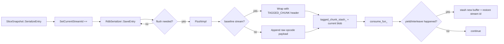
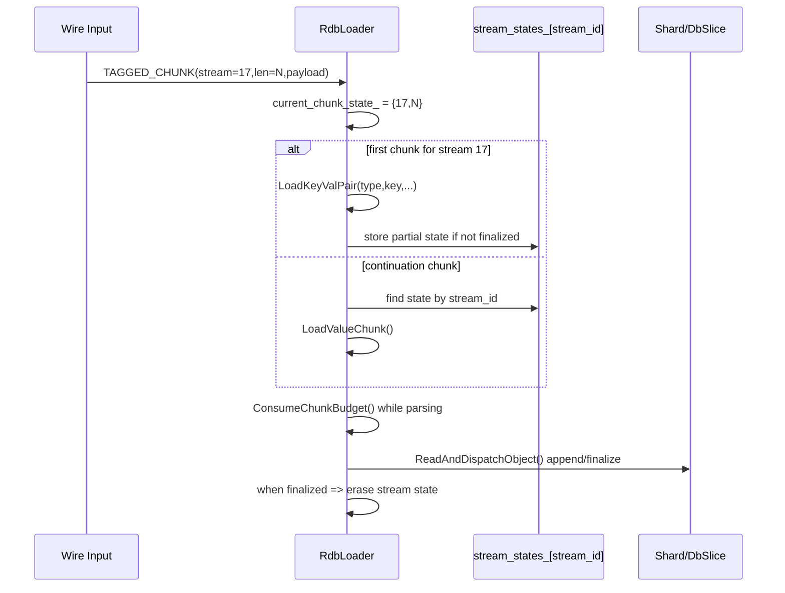
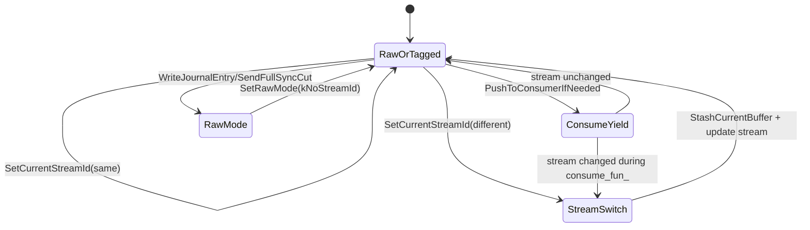

# PR #6926 Design Review: Tagged RDB Chunks for Interleaved Replication Streams

## Context and Goal

PR [#6926](https://github.com/dragonflydb/dragonfly/pull/6926) introduces a **tagged chunk wire format** for RDB replication data so a receiver can safely reconstruct key payloads even when output from different logical streams is interleaved.

The core problem being addressed is:

- A large key can be serialized across multiple flushes/chunks.
- During a flush callback (`consume_fun_`), the serializer fiber can yield.
- While yielded, other data may be serialized (another key or journal opcodes).
- Without chunk tags, the receiver cannot reliably associate resumed chunks with the original partial object.

The PR adds:

- A new opcode: `RDB_OPCODE_TAGGED_CHUNK = 224`
- Per-entry stream IDs for baseline key-value serialization
- Serializer-side stashing/re-tagging logic when stream identity changes mid-flight
- Loader-side chunk budget accounting and per-stream reconstruction state
- Tests that verify mixed stream/journal wire ordering

---

## What Changes Functionally

### 1) Wire format: tagged chunk envelope

Baseline key/value payload chunks are wrapped as:

```text
[RDB_OPCODE_TAGGED_CHUNK][stream_id:u32 LE][payload_len:u32 LE][payload bytes...]
```

Journal/full-sync opcodes are treated as **raw/non-baseline** and are emitted with sentinel stream id semantics (`kNoStreamId = 0`) on the serializer side.

### 2) Snapshot-side stream assignment

`SliceSnapshot` now increments `next_stream_id_` per `SerializeEntry` / delayed entry, and calls:

- `serializer_->SetCurrentStreamId(next_stream_id_++)`
- then `SaveEntry(...)`

Tagging is enabled only when flush mode allows it and the feature flag is on:

- `FLAGS_serialization_tagged_chunks`

### 3) Serializer behavior under interleaving

When tagged mode is enabled:

- Serializer tracks `current_stream_id_`.
- On stream change, it stashes current `mem_buf_` into `tagged_chunk_stash_`.
- `FlushImpl` tags baseline chunks, appends raw chunks for non-baseline records, then emits combined stash+buffer output.
- `PushToConsumerIfNeeded` snapshots stream ID pre-yield; if stream changed while yielded, it stashes new data and restores old stream ID to keep chunk attribution coherent.
- Compression path is moved/adjusted so compression can occur on output blob in tagged mode; prepare-time compression can be disabled (`allow_prepare_flush_compression_`).

### 4) Loader behavior

Loader introduces `current_chunk_state_`:

- `stream_id`
- `remaining_payload_bytes`

It tracks per-stream reconstruction state in `stream_states_` and adds `LoadValueChunk()` to resume incomplete values.

`ConsumeInput`/`ConsumeChunkBudget` ensure reads do not exceed tagged payload boundaries.

Collection readers (`ReadSet`, `ReadHMap`, `ReadZSet`, `ReadListQuicklist`, `ReadStreams`) now stop at chunk budget exhaustion and preserve remaining work in `pending_read_`.

### 5) Chunked object map keying fix

`now_chunked_` changed from key-only to `(db_index, key)` to avoid collisions when same key name exists across DBs during chunked loading.

---

## End-to-End Data Flow



---

## Loader Reconstruction Model



---

## Internal State Machine (Serializer)



---

## Why This Works

The design solves the ambiguity by introducing explicit stream identity on chunk boundaries and preserving continuation state on the receiver.

Key correctness properties:

1. **Chunk boundaries are explicit** via `(stream_id, payload_len)`.
2. **Loader never over-reads a chunk** due to `ConsumeChunkBudget`.
3. **Partial object continuation is keyed by stream_id** and resumes with stored `pending_read_` and object metadata.
4. **Interleaving tolerance** is improved by stashing buffer content when stream identity changes during yield windows.

---

## Potential Problems / Risks

## 1) Stream ID exhaustion and wrap-around

`next_stream_id_` is `uint32_t` and has a TODO for exhaustion handling.

Risk:

- Long-lived replication with high key churn can eventually wrap.
- Reuse without robust generation/retire semantics could map incoming continuation chunks to stale state.

Recommendation:

- Define wrap policy explicitly (disconnect/reset stream, skip reserved IDs, or epoch-based keying).
- Add defensive checks for accidental stream ID reuse while prior state still exists.

## 2) Crash-on-corruption behavior (`CHECK`)

There are TODOs noting `CHECK_EQ` should become errors.

Risk:

- Malformed or adversarial input can crash process instead of returning recoverable load errors.

Recommendation:

- Replace `CHECK*` in input-validation paths with structured `RdbError(errc::rdb_file_corrupted)` and fail replication cleanly.

## 3) Unbounded `stream_states_` growth

`stream_states_` can grow if many streams are opened and not finalized promptly.

Risk:

- Memory pressure or OOM under pathological interleaving or malformed sender behavior.

Recommendation:

- Add a configurable upper bound on active streams.
- On bound breach, fail sync safely with explicit diagnostics.

## 4) Stash memory amplification

`tagged_chunk_stash_` accumulates stashed data and compression of stashed pieces is intentionally limited/skipped in some paths.

Risk:

- Temporary memory spikes under frequent stream switches/yields.
- Potential throughput impact from repeated copy/append operations.

Recommendation:

- Track stash high-water metrics.
- Consider segmented stash buffers to avoid repeated large string copies.

## 5) Mixed compression semantics complexity

Compression moved from only prepare-flush to optional blob-level behavior with tagged mode flags (`allow_prepare_flush_compression_`).

Risk:

- Higher complexity around when data is compressed and which bytes count toward chunk length.
- Potential regressions in compression ratio or CPU under interleaving-heavy workloads.

Recommendation:

- Add focused perf/ratio benchmarks for tagged mode vs non-tagged mode.
- Add invariants/tests for compressed tagged payload length accounting.

## 6) Compatibility constraints

`RDB_OPCODE_TAGGED_CHUNK` is a new opcode.

Risk:

- Any consumer not supporting opcode 224 will fail to parse.

Mitigation in this PR:

- Feature is flag-gated (`serialization_tagged_chunks`) and enabled in snapshot path only when configured.

Recommendation:

- Document version/feature negotiation expectations for mixed-version replication topologies.

## 7) Sentinel stream id (`0`) coupling

`kNoStreamId = 0` is used to represent non-baseline/raw records.

Risk:

- Future changes that accidentally assign `0` to baseline entries could silently bypass chunk tagging assumptions.

Recommendation:

- Enforce non-zero baseline IDs at assignment point and add tests.

## 8) Partial-read coverage assumptions

Chunk-budget stopping logic is added to several container/object readers.

Risk:

- If any object type path still consumes beyond budget without checks, tagged boundaries can desynchronize loader state.

Recommendation:

- Audit all read paths for chunk-budget accounting.
- Add fuzz/property tests validating “never over-consume payload_len”.

---

## Operational Observability Gaps

Current implementation would benefit from metrics/logging for:

- active stream state count (`stream_states_.size()`)
- stash size high-water (`tagged_chunk_stash_.size()`)
- number of stream switches while yielded
- chunk budget violations / corrupted chunk headers

This would make field diagnosis much easier if replication stalls or fails.

---

## Suggested Follow-up Test Matrix

1. **Wrap-around simulation**: force small stream-id type in test build and validate behavior on rollover.
2. **Malformed chunks**: wrong payload lengths, unknown stream IDs, truncated payload, over-consume attempts.
3. **Heavy interleaving**: many alternating streams + journal entries at low flush thresholds.
4. **Compression + tagging**: all compression modes with tagged chunks.
5. **Cross-DB duplicate keys**: confirm `(db,key)` chunk-map behavior remains correct.

---

## Summary

This PR adds a meaningful protocol and state-management upgrade for replication robustness under interleaved chunk emission. The overall approach is sound: explicit chunk identity plus bounded parsing and continuation state on the loader side.

The main concerns are around hard-fail checks, state growth bounds, stream-id lifecycle, and complexity introduced by stash/compression interactions. Addressing these with bounded resources, recoverable error paths, and additional validation tests would substantially harden the design.
