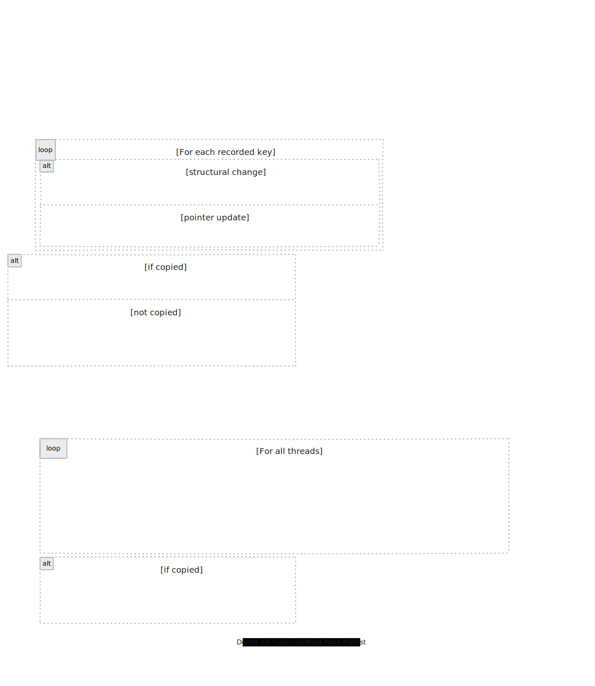

# Pub/Sub Architecture

This document describes how Dragonfly implements the Publish-Subscribe (Pub/Sub) messaging
paradigm within its shared-nothing, multi-threaded architecture. It covers the global
subscription registry backed by a `ShardedHashMap` with fine-grained per-shard locking,
the RCU-style pointer swap used for lock-free reads on the publish path, the asynchronous
message delivery pipeline, and the backpressure system that protects the server from
slow-subscriber OOM.

## Overview

In a shared-nothing architecture, handling `PUBLISH` and `SUBSCRIBE` commands presents a
unique challenge: subscriptions must be globally addressable across all threads, but taking a
global lock on every `PUBLISH` would create a severe bottleneck. A single popular channel
with thousands of subscribers could serialize all publish operations onto one shard thread.

Dragonfly solves this with a **`ChannelStore` backed by `ShardedHashMap`** — a hash map
split into 16 independently-locked shards:

- **Reads (`PUBLISH` / `SPUBLISH`)** acquire a per-shard shared read lock (`read_mu_`) and
  read the `SubscribeMap` pointer via an atomic acquire load (`UpdatablePointer::Get()`).
  Multiple readers on the same shard proceed concurrently.
- **Writes (`SUBSCRIBE` / `UNSUBSCRIBE` / `PSUBSCRIBE` / `PUNSUBSCRIBE`)** acquire the
  shard's exclusive write lock (`write_mu_`), copy the `SubscribeMap`, apply the mutation,
  and atomically swap the pointer — all without blocking readers. Concurrent writes to
  *different* shards are fully independent.

This design avoids contention on a single shard thread for heavy throughput on a single
channel and seamlessly scales across multiple threads even with a small number of channels.
Publish latency is low because no inter-thread hop is required to look up subscribers — any
thread can read the global `ChannelStore` directly.

Dragonfly supports three flavors of Pub/Sub:

| Flavor | Commands | Scope | Cluster mode |
|--------|----------|-------|--------------|
| **Standard** | `PUBLISH`, `SUBSCRIBE`, `UNSUBSCRIBE` | Global (all channels) | Blocked — returns error |
| **Pattern** | `PSUBSCRIBE`, `PUNSUBSCRIBE` | Global (glob-matched) | Blocked — returns error |
| **Sharded** | `SPUBLISH`, `SSUBSCRIBE`, `SUNSUBSCRIBE` | Per-slot (channel name determines slot) | Supported |

## Primary Data Structures

| Type | Location | Role |
|------|----------|------|
| `ChannelStore` | `src/server/channel_store.h` | Global registry mapping channels/patterns to subscribers. Backed by two `ShardedHashMap` instances (channels and patterns). |
| `ChannelStoreUpdater` | `src/server/channel_store.h` | Batches subscribe/unsubscribe operations per shard and applies them via `ShardedHashMap::Mutate`. |
| `ChannelStore::Subscriber` | `src/server/channel_store.h` | Represents a subscribed client. Wraps `facade::ConnectionRef` plus a pattern string. |
| `ShardedHashMap` | `src/core/sharded_hash_map.h` | Thread-safe hash map split into 16 shards, each with independent `write_mu_` (Mutex) and `read_mu_` (SharedMutex). |
| `ChannelStore::ChannelMap` | `src/server/channel_store.h` | `ShardedHashMap<string, UpdatablePointer, 16>` — maps channel/pattern names to subscriber lists across 16 independently-locked shards. |
| `ChannelStore::SubscribeMap` | `src/server/channel_store.h` | `flat_hash_map<ConnectionContext*, ThreadId>` — maps subscriber contexts to their owning thread. |
| `ChannelStore::UpdatablePointer` | `src/server/channel_store.h` | Atomic wrapper around `SubscribeMap*`. Supports lock-free reads (`acquire`) and RCU-style swaps (`release`). |
| `ConnectionState::SubscribeInfo` | `src/server/conn_context.h` | Per-connection set of subscribed channels and patterns. Created lazily on first subscription. |
| `Connection::PubMessage` | `src/facade/dragonfly_connection.h` | Carries a formatted pub/sub message through the async dispatch queue. |
| `Connection::MessageHandle` | `src/facade/dragonfly_connection.h` | Variant wrapper (`PubMessage`, `MonitorMessage`, `MigrationRequest`, etc.) for the control-path dispatch queue. |
| `QueueBackpressure` | `src/facade/dragonfly_connection.cc` | Per-thread struct tracking `subscriber_bytes` and enforcing the `publish_buffer_limit`. |
| `facade::ConnectionRef` | `src/facade/connection_ref.h` | Weak reference to a connection. Thread-safe expiry check; dereference only on owning thread. |

## Data Flow Overview

<div align="center">
  
</div>

## Subscription Management (Shard-Locked ChannelStore)

### Data Structure Layout

The `ChannelStore` holds two `ChannelMap` instances — one for exact-channel subscriptions and
one for pattern subscriptions. Each `ChannelMap` is a `ShardedHashMap<string, UpdatablePointer, 16>`
backed by 16 independently-locked shards:

<div align="center">
  
</div>

Each shard carries two fiber-aware locks:

| Lock | Type | Purpose |
|------|------|---------|
| `write_mu_` | `util::fb2::Mutex` | Serializes writers within the shard. Readers never acquire it. |
| `read_mu_` | `util::fb2::SharedMutex` | Acquired shared by readers (`FindIf`, `ForEachShared`); acquired exclusively only for structural map changes (insert/erase) and for safe deletion of old `SubscribeMap` pointers (draining in-flight readers). |

`UpdatablePointer` wraps a `std::atomic<SubscribeMap*>` with `memory_order_acquire` on read
and `memory_order_release` on write. This ensures that when a thread reads the pointer, it
also sees the fully constructed `SubscribeMap` that the writer published.

### Two Granularities of Update

The `ChannelStoreUpdater` groups pending operations by shard index and processes each shard
in a single `Mutate()` call, minimizing lock acquisitions:

1. **RCU pointer swap (existing channel)** — when a subscriber is added/removed from a channel
   that already exists in the map. The `SubscribeMap` is copied, the mutation is applied, and
   the `UpdatablePointer` is atomically swapped via `Set()`. This happens under `write_mu_`
   only — readers are NOT blocked. The old `SubscribeMap` is placed in a `freelist_` and
   deleted after acquiring `read_mu_` exclusively (draining in-flight readers).

2. **Structural map change (new channel / last subscriber leaves)** — when a channel slot must
   be inserted (first subscriber) or erased (last subscriber leaves). Inside the `Mutate()`
   callback, the `AcquireReaderExclusiveLock` callable is invoked, which acquires `read_mu_`
   exclusively, blocking all readers on that shard while the key is inserted or erased.
   Writers on *other* shards are unaffected.

### Apply() Flow

<div align="center">
  
</div>

The `ChannelStoreUpdater::Apply()` method iterates over each shard that has pending
operations and calls `map.Mutate(ShardId{sid}, ...)` to acquire `write_mu_` once per shard.
Inside the callback:

1. **Phase 1 — RCU pointer swaps (under `write_mu_` only):** For each key where the channel
   already exists, the `SubscribeMap` is copied, the subscriber is added/removed, and the
   `UpdatablePointer` is atomically swapped. Old `SubscribeMap` pointers are saved in a
   per-shard `freelist_`. Readers continue concurrently on the shared `read_mu_`.

2. **Phase 2 — Structural map changes (under `read_mu_` exclusive):** If any keys require
   inserting a new slot or erasing the last subscriber's slot, `AcquireReaderExclusiveLock()`
   is called. This acquires `read_mu_` exclusively, draining any in-flight readers on this
   shard. The insert/erase is then performed on the mutable map reference.

3. **Phase 3 — Freelist cleanup:** After `Mutate()` returns (releasing `write_mu_`),
   `WithReadExclusiveLock(ShardId{sid}, ...)` is called to acquire `read_mu_` exclusively
   once more, ensuring all readers that may have loaded old `SubscribeMap` pointers have
   completed. The old `SubscribeMap` pointers in the freelist are then safely deleted.

### Per-Key Mutation Logic

Inside the `Mutate()` callback, each key in the shard's pending operations is processed:

```
Phase 1 — RCU swaps (write_mu_ held, read_mu_ NOT held):

  For each key in shard_keys:
    it = m.find(key)

    Case 1: Adding, key exists (existing channel)
      → old_sm = it->second.Get()
      → new_sm = new SubscribeMap{*old_sm}
      → new_sm->emplace(cntx_, thread_id_)
      → it->second.Set(new_sm)            // atomic release-store
      → freelist_.push_back(old_sm)        // defer deletion

    Case 2: Removing, key exists, >1 subscriber
      → old_sm = it->second.Get()
      → new_sm = new SubscribeMap{*old_sm}
      → new_sm->erase(cntx_)
      → it->second.Set(new_sm)            // atomic release-store
      → freelist_.push_back(old_sm)        // defer deletion

    Case 3: Adding, key NOT in map (new channel)
      → mark needs_map_change[i] = true   // deferred to Phase 2

    Case 4: Removing, last subscriber (channel disappears)
      → mark needs_map_change[i] = true   // deferred to Phase 2

Phase 2 — Structural changes (read_mu_ acquired exclusive):

  If any needs_map_change:
    locked_map = AcquireReaderExclusiveLock()

    Case 3: → locked_map.map.emplace(key, new SubscribeMap{{cntx_, thread_id_}})
    Case 4: → delete it->second.Get()
             → locked_map.map.erase(it)
```

Old `SubscribeMap` pointers from Phase 1 are not immediately deleted because concurrent
readers on other threads may still hold references obtained via `UpdatablePointer::Get()`.
They are placed in a `freelist_` and deleted only after `WithReadExclusiveLock` completes —
at which point every reader on that shard has released `read_mu_` (shared) and no reader can
hold a reference to the old maps.

### Connection-Level Subscription State

Each connection tracks its own subscriptions in `ConnectionState::SubscribeInfo`:

```cpp
struct SubscribeInfo {
  absl::flat_hash_set<std::string> channels;
  absl::flat_hash_set<std::string> patterns;

  bool IsEmpty() const;
  unsigned SubscriptionCount() const;
};
```

- **Created lazily**: `subscribe_info` is allocated on the first `SUBSCRIBE` or `PSUBSCRIBE`.
  A `subscriptions` counter on `ConnectionContext` is incremented.
- **Destroyed on empty**: when all channels and patterns are removed, `subscribe_info` is
  reset and `subscriptions` is decremented.
- **Gates pub/sub mode**: `AsyncOperations::operator()(PubMessage)` checks
  `cntx()->subscriptions == 0` and discards stale messages that arrive after full
  unsubscription (possible due to inter-thread dispatch delays).
- **Cleaned up on disconnect**: `Service::OnConnectionClose` calls `UnsubscribeAll()` and
  `PUnsubscribeAll()` if `subscribe_info` is non-null, ensuring the `ChannelStore` is
  updated even if the client disconnects abruptly.

## Message Publishing and Dispatch

### `ChannelStore::SendMessages`

When a client issues `PUBLISH channel message` (or `SPUBLISH`):

```
SendMessages(channel, messages, sharded)
  1. subscribers = FetchSubscribers(channel)
     → exact match: channels_.FindIf(channel, ...) (shared read lock on shard)
     → pattern match: patterns_.ForEachShared(...)
         for each (pat, subs): if GlobMatcher{pat}.Matches(channel): Fill(subs, pat, &result)
     → sort result by thread_id  (enables efficient per-thread dispatch)

  2. If subscribers empty → return 0

  3. Backpressure gate (per destination thread):
     For each unique subscriber thread:
       Connection::EnsureMemoryBudget(sub_thread)
       → blocks fiber if that thread's subscriber_bytes > publish_buffer_limit

  4. Build message payload:
     BuildSender copies channel + message into a single shared_ptr<char[]>
     Creates string_view references into the shared buffer

  5. Cross-thread dispatch:
     shard_set->pool()->DispatchBrief(cb)
       → cb runs on EVERY I/O thread
       → uses lower_bound on sorted subscribers to find this thread's connections
       → for each local subscriber: conn->SendPubMessageAsync(PubMessage{...})

  6. Return subscriber count
```

### `BuildSender` — Shared Buffer Optimization

The `BuildSender` helper (anonymous namespace in `channel_store.cc`) creates a functor that
captures the message payload in a single allocation:

```cpp
auto buf = shared_ptr<char[]>{new char[channel.size() + messages_size]};
memcpy(buf.get(), channel.data(), channel.size());
// ... copy each message contiguously after the channel
```

The `shared_ptr` is captured by value in the dispatch functor, so all subscribers share the
same underlying buffer. Each `PubMessage` holds a copy of the `shared_ptr` (incrementing the
reference count) along with `string_view`s pointing into it. This avoids per-subscriber
string allocations.

### `FetchSubscribers` — Routing and Pattern Matching

```
FetchSubscribers(channel)
  1. Exact match: channels_.FindIf(channel, ...)
     → acquires read_mu_ shared on the channel's shard
     → if found, Fill() creates Subscriber entries from the SubscribeMap

  2. Pattern match: patterns_.ForEachShared(...)
     → iterates ALL pattern shards (each read_mu_ shared independently)
     → for each (pat, subs): GlobMatcher{pat, case_sensitive=true}.Matches(channel)
     → matching subscribers are added with their pattern string

  3. Sort by Subscriber::ByThread (thread_id ordering)
     → enables O(log n) per-thread lookup during dispatch
```

Note: `FetchSubscribers` is not a global snapshot — each shard is locked independently, so
the result may not reflect a fully consistent state. This trade-off is acceptable for pub/sub
use cases.

The `Fill` helper reads the `SubscribeMap` (via `UpdatablePointer::Get()` — acquire load)
and creates `Subscriber` structs that hold a `ConnectionRef` (weak reference) obtained via
`conn->Borrow()`.

## Delivery: I/O Loop and Dispatch

Once a message lands on the destination thread via `DispatchBrief`, the callback calls
`conn->SendPubMessageAsync(PubMessage{...})`. This wraps the message in a `MessageHandle`
and pushes it onto the connection's `dispatch_q_` via `SendAsync()`.

How that queue is drained depends on which I/O loop the connection uses. Dragonfly has two
I/O loop implementations, selected at connection setup time:

| Loop | Flag / Condition | Protocols | Architecture |
|------|-----------------|-----------|--------------|
| **v1** (`IoLoop` + `AsyncFiber`) | Default for Redis, TLS | Redis (RESP), TLS connections | Two-fiber: blocking recv loop (producer) + `AsyncFiber` (consumer) |
| **v2** (`IoLoopV2`) | `--experimental_io_loop_v2` (default: true), non-TLS Memcache only | Memcache | Single-fiber: event-driven via `RegisterOnRecv`, dispatch queue drained inline |

### v1: `IoLoop` + `AsyncFiber` (Redis connections)

This is the primary path for all Redis Pub/Sub traffic. Each connection manages two streams:

| Stream | Queue | Contents |
|--------|-------|----------|
| **Data Path** | `parsed_head_` (linked list) | Pipelined Redis commands parsed by `IoLoop` |
| **Control Path** | `dispatch_q_` (deque of `MessageHandle`) | PubSub messages, Monitor events, Migration requests, Checkpoints, Invalidations |

`IoLoop` runs in the connection's main fiber: it calls `recv()` (blocking the fiber, not the
thread), parses commands into the `parsed_head_` linked list, and notifies the consumer.

`AsyncFiber` runs as a **separate dedicated fiber** (`Connection::AsyncFiber()`) that
consumes both streams in a prioritized loop:

<div align="center">
  
</div>

**Key insight**: The dispatch queue (Control Path) takes **default priority** over the
pipeline (Data Path). The pipeline is processed only when `dispatch_q_` is empty or when the
`async_dispatch_quota` (default: 100) is reached. The quota prevents Control Path items from
starving the Data Path: after processing `async_dispatch_quota` dispatch queue items without
interleaving pipeline work, the fiber yields to let `IoLoop` parse pending socket data, then
switches to pipeline processing.

### v2: `IoLoopV2` (Memcache connections)

`IoLoopV2` is an event-driven, single-fiber loop that uses `socket->RegisterOnRecv()`
instead of blocking on `recv()`. There is no separate `AsyncFiber` — the dispatch queue is
drained **inline** at the top of each iteration (strict priority over command parsing), using
the same `AsyncOperations` handler as v1. Key differences: no `async_dispatch_quota`
interleaving, no pipeline squashing, and backpressure uses `notifyAll()` instead of
per-publisher `notify()`.

> **Note**: `IoLoopV2` is currently enabled only for non-TLS Memcache connections
> (`--experimental_io_loop_v2`, default: true). Since Pub/Sub is a Redis-only feature,
> **all Pub/Sub traffic flows through the v1 `AsyncFiber` path**.

### PubMessage Processing (shared by v1 and v2)

Both loops dispatch `PubMessage` through the same handler:
`AsyncOperations::operator()(const PubMessage& pub_msg)`.

```
operator()(const PubMessage& pub_msg)
  // Discard stale messages after client fully unsubscribed
  if cntx()->subscriptions == 0:
    return  // silently drop

  // Cluster migration: force-unsubscribe the client
  if pub_msg.force_unsubscribe:
    → send PUSH ["sunsubscribe", channel, 0]
    → cntx()->Unsubscribe(channel)
    return

  // Format RESP push message
  if pattern empty:
    type = is_sharded ? "smessage" : "message"
    → send PUSH [type, channel, message]
  else:
    → send PUSH ["pmessage", pattern, channel, message]
```

Messages are sent as RESP3 Push types (`CollectionType::PUSH`) via
`RedisReplyBuilder::SendBulkStrArr`.

## Backpressure

Fast publishers sending to slow subscribers can cause unbounded memory growth in the
dispatch queues. Dragonfly prevents this with a **per-thread memory budget** for subscriber
messages.

### Memory Accounting

Memory is tracked at two levels:

| Scope | Variable | Location |
|-------|----------|----------|
| **Per-thread** (all connections) | `QueueBackpressure::subscriber_bytes` | `atomic_size_t`, thread-local struct |
| **Per-connection** | `dispatch_q_subscriber_bytes_` | Connection member |
| **Per-thread stats** | `conn_stats.dispatch_queue_subscriber_bytes` | `ConnectionStats` |

`UpdateDispatchStats(msg, add)` is called:
- **On enqueue** (`add=true`): in `SendAsync()`, before pushing to `dispatch_q_`.
  Atomically increments `subscriber_bytes`.
- **On dequeue** (`add=false`): via `absl::Cleanup` in `ProcessAdminMessage()`, after the
  message handler returns. Atomically decrements `subscriber_bytes`.

### Throttling Publishers

Before dispatching messages, `ChannelStore::SendMessages` calls
`Connection::EnsureMemoryBudget(sub_thread)` for each unique destination thread:

```cpp
void Connection::EnsureMemoryBudget(unsigned tid) {
  thread_queue_backpressure[tid].EnsureBelowLimit();
}

void QueueBackpressure::EnsureBelowLimit() {
  pubsub_ec.await([this] {
    return subscriber_bytes.load(memory_order_relaxed) <= publish_buffer_limit;
  });
}
```

This blocks the publishing fiber (not the thread) until the destination thread's subscriber
memory drops below the `publish_buffer_limit` (default: 128MB, configurable via
`--publish_buffer_limit`).

### Wake-up Path

In the `AsyncFiber` loop, after processing a dispatch queue message:

```cpp
if (subscriber_over_limit &&
    conn_stats.dispatch_queue_subscriber_bytes < qbp.publish_buffer_limit)
  qbp.pubsub_ec.notify();  // wake ONE blocked publisher
```

The check snapshots the "over limit" state before processing and only notifies if the state
transitioned from over-limit to under-limit. This avoids spurious wake-ups.

## Cluster Mode Integration

### Standard Pub/Sub — Blocked

In cluster mode, standard `PUBLISH`, `SUBSCRIBE`, `PSUBSCRIBE`, `UNSUBSCRIBE`, and
`PUNSUBSCRIBE` commands return an error:

```
(error) PUBLISH is not supported in cluster mode yet
```

This is enforced in `Service::Publish`, `Service::Subscribe`, `Service::Unsubscribe`,
`Service::PSubscribe`, and `Service::PUnsubscribe` by checking `IsClusterEnabled()`.

### Sharded Pub/Sub — Supported

Sharded Pub/Sub (`SPUBLISH`, `SSUBSCRIBE`, `SUNSUBSCRIBE`) works in cluster mode. The
channel name is treated as a key for slot routing purposes:

```cpp
// In Service::FindKeys:
if (cid->PubSubKind() == CO::PubSubKind::SHARDED) {
  if (cid->name() == "SPUBLISH")
    return KeyIndex(0, 1);      // channel is the key
  return {KeyIndex(0, args.size())};  // all channels are keys
}
```

This ensures that `SPUBLISH` and `SSUBSCRIBE` for the same channel are routed to the same
slot, and cluster slot ownership checks apply.

### Slot Migration — Forced Unsubscription

When cluster slots migrate away from a node, `ChannelStore::UnsubscribeAfterClusterSlotMigration`
is called:

```
UnsubscribeAfterClusterSlotMigration(deleted_slots)
  1. Collect: ForEachShared over channels_, collect subscribers for channels
     whose slot is in deleted_slots
  2. Remove: RemoveAllSubscribers(channel) for each matched channel
     → uses Mutate() to erase under exclusive read_mu_
  3. Notify: AwaitFiberOnAll dispatches force-unsubscribe messages
     to affected connections on their owning threads
```

`RemoveAllSubscribers` calls `map.Mutate(channel, ...)` which acquires `write_mu_` and then
`read_mu_` exclusively to erase the channel entry and delete its `SubscribeMap`.

On each thread, `UnsubscribeConnectionsFromDeletedSlots` sends `PubMessage`s with
`force_unsubscribe=true`, which triggers `sunsubscribe` push messages to affected clients.

## Keyspace Event Notifications

Dragonfly integrates a limited form of keyspace notifications through the Pub/Sub system.
Currently, only expired-key events (`Ex`) are supported, controlled by the
`--notify_keyspace_events` flag.

When enabled:
1. `DbSlice` sets `expired_keys_events_recording_ = true`.
2. As keys expire (via `ExpireIfNeeded`), their names are appended to
   `db->expired_keys_events_`.
3. At the end of `DeleteExpiredStep`, batched events are published:

```cpp
channel_store->SendMessages(
    absl::StrCat("__keyevent@", cntx.db_index, "__:expired"),
    events, false);
events.clear();
```

This uses the standard `SendMessages` path, so clients subscribed to
`__keyevent@0__:expired` receive notifications through the same dispatch pipeline.

## Command Registration

All Pub/Sub commands are registered in `Service::Register` (`src/server/main_service.cc`):

| Command | Arity | Flags | ACL |
|---------|-------|-------|-----|
| `PUBLISH` | 3 | `CO::LOADING \| CO::FAST` | `PUBSUB \| FAST` |
| `SPUBLISH` | 3 | `CO::LOADING \| CO::FAST` | `PUBSUB \| FAST` |
| `SUBSCRIBE` | -2 | `CO::NOSCRIPT \| CO::LOADING` | `PUBSUB \| SLOW` |
| `SSUBSCRIBE` | -2 | `CO::NOSCRIPT \| CO::LOADING` | `PUBSUB \| SLOW` |
| `UNSUBSCRIBE` | -1 | `CO::NOSCRIPT \| CO::LOADING` | `PUBSUB \| SLOW` |
| `SUNSUBSCRIBE` | -1 | `CO::NOSCRIPT \| CO::LOADING` | `PUBSUB \| SLOW` |
| `PSUBSCRIBE` | -2 | `CO::NOSCRIPT \| CO::LOADING` | `PUBSUB \| SLOW` |
| `PUNSUBSCRIBE` | -1 | `CO::NOSCRIPT \| CO::LOADING` | `PUBSUB \| SLOW` |
| `PUBSUB` | -1 | `CO::LOADING \| CO::FAST` | `SLOW` |

Notable flags:
- `CO::FAST` on `PUBLISH`/`SPUBLISH` — these are non-transactional, lock-free reads.
- `CO::NOSCRIPT` on all subscribe/unsubscribe — cannot be called from Lua scripts.
- `CO::LOADING` — permitted during database loading.
- None of the Pub/Sub commands are transactional (`IsTransactional() == false`).

## Key Files Reference

| Purpose | File Path |
|---------|-----------|
| ChannelStore & ChannelStoreUpdater | `src/server/channel_store.h`, `src/server/channel_store.cc` |
| ShardedHashMap (shard-locked backing store) | `src/core/sharded_hash_map.h` |
| Pub/Sub command handlers | `src/server/main_service.cc` (`Publish`, `Subscribe`, `Unsubscribe`, `PSubscribe`, `PUnsubscribe`, `Pubsub`) |
| Connection-level subscription state | `src/server/conn_context.h`, `src/server/conn_context.cc` (`ChangeSubscriptions`, `UnsubscribeAll`, `PUnsubscribeAll`) |
| PubMessage, AsyncFiber, backpressure | `src/facade/dragonfly_connection.h`, `src/facade/dragonfly_connection.cc` |
| ConnectionRef (weak subscriber refs) | `src/facade/connection_ref.h` |
| Global `channel_store` pointer | `src/server/channel_store.h` (extern), `src/server/main_service.cc` (lifecycle) |
| Keyspace event integration | `src/server/db_slice.cc` (`DeleteExpiredStep`) |
| Cluster slot migration unsub | `src/server/channel_store.cc` (`UnsubscribeAfterClusterSlotMigration`, `RemoveAllSubscribers`) |
| GlobMatcher for pattern matching | `src/core/glob_matcher.h` |
