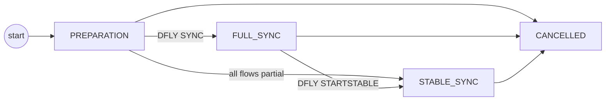
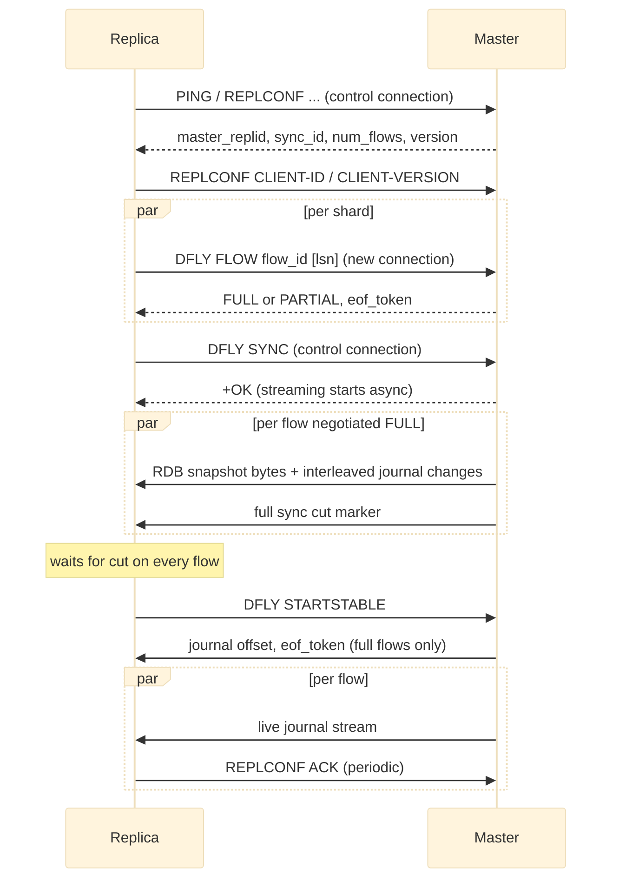
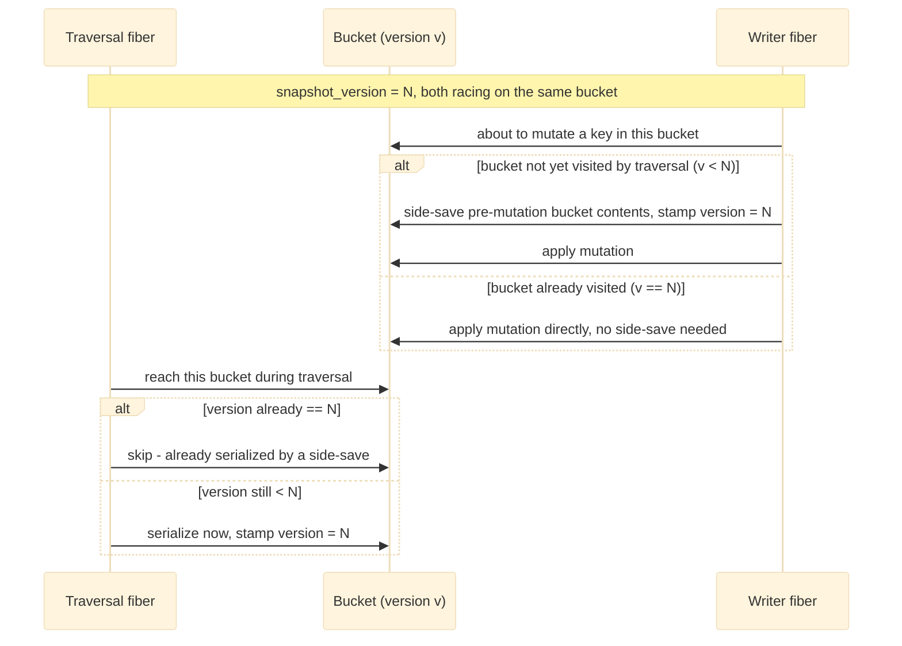
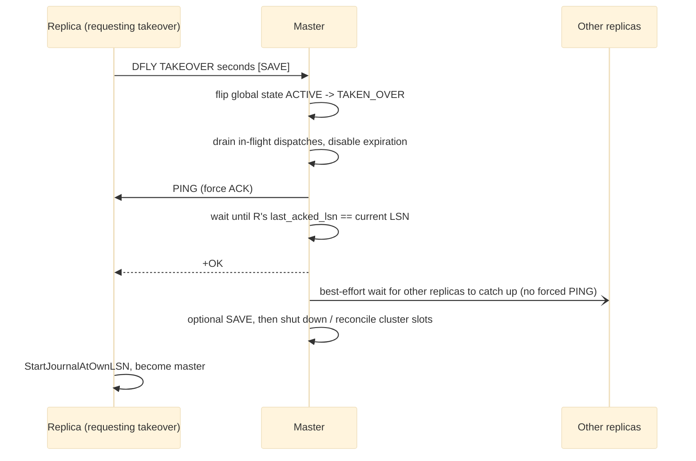

# Replication design

This document describes how Dragonfly-to-Dragonfly replication works: the handshake, full sync,
partial sync, stable-state streaming, and failover/takeover. It does not cover Dragonfly acting
as a *replica of Redis* in detail (see "Replicating from a Redis master" at the end) or cluster
slot migration, which is a related but separate mechanism built on the same journal-streaming
machinery described below.

## Two roles, two state machines

Replication has two independent state machines that talk to each other over one control
connection plus one connection *per shard* ("flow"):

- **Master side**: one session per connected replica, moving through
  `PREPARATION -> FULL_SYNC -> STABLE_SYNC`, with `CANCELLED` reachable from any state.
- **Replica side**: a set of flags - connected, greeted, syncing, sync-ok - that accumulate as
  the handshake and sync progress, and reset back to nothing on any failure.



Both machines are per session: a master shards each replica's sync session into one flow per
master shard, i.e. one TCP connection per master shard. The replica mirrors this with one
per-flow worker.

## Terminology used below

- **LSN** (Log Sequence Number): a per-shard, monotonically increasing counter for journal
  entries. It identifies the *next* entry that will be written. LSNs are **not** comparable
  across shards - each shard has an independent sequence.
- **Flow**: one shard's replication connection. A replica with `N` master-side shards has `N`
  flows, mapped by flow-id to shard-id.
- **`master-replid`**: a random ID generated once per master process lifetime. Used by replicas
  to detect that they reconnected to a *different* master (e.g. after a restart) versus the same
  one.

---

## 1. Handshake (per-connection greeting)

A replica connects with a plain RESP client and issues, in order:

1. `PING` - expects `+PONG`.
2. `REPLCONF listening-port <port>` - `+OK`.
3. `REPLCONF ip-address <ip>` (only if `--replica_announce_ip` is set) - best-effort, a bad
   response is only logged as a warning (older masters may not support it).
4. `REPLCONF capa eof capa psync2` - `+OK`.
5. `REPLCONF capa dragonfly` - the master's reply distinguishes a Redis master (single-element
   `+OK`) from a Dragonfly master (a multi-bulk array).

On the master side, `REPLCONF CAPA dragonfly` is handled specially: it allocates a `sync_id` and
reserves one flow slot per shard, then replies with a 5-element array:

```
<master_replid> <sync_id "SYNCn"> <num_flows = shard count> <protocol version> <lineage_id>
```

The replica parses this response. Notable behavior:

- If the advertised `master_replid` equals the replica's own client id, it refuses (protects
  against accidentally replicating from itself).
- If the master's `master_replid` differs from the one this replica last saw, and
  `--break_replication_on_master_restart` is set, replication is aborted outright (protects a
  replica from silently flushing its dataset because the same-address master process restarted
  with fresh, unrelated data). Otherwise the previously-remembered per-flow LSNs are dropped,
  which forces a full resync (partial sync is only attempted against the same `master_replid` the
  replica last saw, or against the specific "different master" case described in
  [Partial sync after promotion / failover](#partial-sync-after-promotion--failover)).
- The 5th field, `lineage_id`, is stored but only consulted by an experimental feature that is
  out of scope for this document.

Then, only for a Dragonfly master, the replica sends:

- `REPLCONF CLIENT-ID <id>` - lets the master tag the session with the replica's stable cluster
  node ID.
- `REPLCONF CLIENT-VERSION <version>` - the replica's own protocol version, stored on the session
  and later used to gate partial-sync behavior and RDB feature framing (search index blobs etc.).

After this the replica marks itself as greeted.

## 2. Per-flow negotiation (`DFLY FLOW`)

For each of the `num_flows` shards, the replica opens a **new** TCP connection and sends:

```
DFLY FLOW <master_repl_id> <dfly_session_id> <flow_id> [<lsn>] [<last_master_id> <lsn-vec>]
```

- `<lsn>` is appended only if the replica remembers a *same-master* resumable LSN for this flow
  (from a previous disconnect) and the master's advertised version supports it and
  `--replica_partial_sync` is enabled.
- `<last_master_id> <lsn-vec>` (the previous master's id and a `-`-joined vector of per-shard
  LSNs) is appended only when the replica has remembered sync data from a *different* master it
  used to follow (see [Partial sync after promotion / failover](#partial-sync-after-promotion--failover))
  and the master's version supports it.



On the master, the flow handler validates `master_id`, resolves `flow_id` and the session,
migrates the connection to the shard's own thread, and lazily initializes that shard's journal
ring buffer if not already active (buffer capacity is `--shard_repl_backlog_len`, default 8192
entries).

It then decides full vs. partial sync (only while the session state is still `PREPARATION`):

1. **Failover match**: this master itself descends from a promoted replica (it ran
   `REPLICAOF NO ONE` or `REPLTAKEOVER` and remembers the old master's id plus per-shard LSNs it
   had reached), and the requesting replica's `last_master_id` matches that remembered id. In
   that case the LSN to resume from is taken from the replica's supplied `lsn-vec` for this
   `flow_id`, not from the `<lsn>` argument.
2. Otherwise, if a bare `<lsn>` was sent, that is the candidate resume point (reconnect to the
   *same* master/flow).

The candidate LSN is only honored if it is still retrievable: either it equals the current LSN
(nothing missed) or it falls inside the shard's ring buffer (between the buffer's oldest and
newest retained entry). If the buffer has already evicted that LSN (replica was disconnected too
long, or the buffer is too small), the master logs it and falls back to full sync for that flow -
silently, no error is sent for this specific failure.

The master replies to `DFLY FLOW` with `(sync_type, eof_token)` where `sync_type` is `"FULL"` or
`"PARTIAL"`, and `eof_token` is a fresh random 40-hex string used later only in the full-sync path
to mark the end of the RDB stream out-of-band from the RDB format itself.

**Important asymmetry**: partial/full sync is decided *per flow*, independently, at `DFLY FLOW`
time - before the replica has even sent `DFLY SYNC`. `DFLY SYNC` (below) fans out to shards and,
for any flow that was negotiated as `PARTIAL`, skips starting a full-sync saver for that flow
entirely.

## 3. Full sync (`DFLY SYNC`)

Once *all* flows have replied to `DFLY FLOW`, the replica sends `DFLY SYNC <sync_id>` on the
*first* (control) connection. The master requires session state `PREPARATION`, and - under a
guard so no write transaction is mid-flight - starts a full-sync snapshot on every shard whose
flow was **not** already resolved to `PARTIAL` (a flow already resolved to partial makes the
full-sync start a no-op / error path). It then transitions the session to `FULL_SYNC` and replies
`+OK` - **without waiting for the snapshot itself to finish**; the RDB bytes stream asynchronously
over the already-open flow sockets.

Per shard, starting full sync:

- Creates an RDB saver writing directly to the flow's socket. Shard 0 additionally saves the
  "summary" (Lua scripts, global metadata, search index defs) alongside its own data; the rest
  save only their own shard's data.
- Begins a bucket-traversal snapshot. Crucially, when journal streaming is requested the snapshot
  **registers itself as a journal consumer before it starts iterating the hash table**, ahead of
  the traversal fiber launch. Any write that lands on a key/bucket *after* the snapshot cursor
  already passed it is captured as a journal entry and appended into the very same RDB byte
  stream, interleaved with bucket data. This is what makes it safe for clients to keep writing
  during full sync: there is no snapshot-to-journal handoff gap, because the journal listener is
  live for the entire duration of the snapshot, not just after it.
- Once all buckets are traversed, the snapshot writes a "full sync cut" marker into the RDB
  stream.

On the replica, each flow feeds its socket into an RDB loader with a callback that decrements a
shared counter the first time the cut marker is observed. The replica blocks until every flow has
hit its cut - this is how the replica knows the RDB "photo" portion is done on all shards
simultaneously, even though each shard streams independently and at its own pace.

After the cut, the master's snapshot is *not* done: journal changes are still being forwarded
into the RDB stream. The transition out of that is driven separately by `DFLY STARTSTABLE` (next
section) - finalizing the full sync sends the journal offset as an RDB opcode (read back on the
replica), flushes, and only then writes the raw `eof_token` bytes to the socket. The replica's
full-sync worker reads and verifies that `eof_token` off the wire before considering the flow's
full sync complete, and stashes any bytes read past the token to be replayed as the start of the
stable-sync stream (the token can arrive already followed by live journal bytes on a fast enough
connection).

If every flow negotiated `PARTIAL`, none of this happens: the sync type short-circuits to
"partial" and the replica skips straight to sending `DFLY STARTSTABLE`. Mixed full/partial across
flows of the same session is treated as unrecoverable ("won't do a partial sync: some flows must
fully resync") - replication for that session errors out and reconnects from scratch.

Flushing the replica's existing dataset happens once, before starting the full-sync flows, only
if *all* flows resolved to full - a purely-partial resync never touches existing data.

### Bucket serialization, locking, and concurrent writes

The snapshot traversal and live client writes run concurrently against the same hash table
without a global lock. The mechanism (shared by full sync, `SAVE`/`BGSAVE`, and cluster slot
migration) is a per-bucket copy-on-write scheme:



- The traversal fiber walks physical hash-table buckets. Every bucket has a version number; the
  snapshot remembers a target version taken at start. A bucket is only serialized if its version
  is still older than the target, and it is stamped with the target version *before* serializing
  (so a concurrent second visit - from either the traversal continuing or a write racing it - is
  a guaranteed no-op).
- A write is *not* blocked by the snapshot. The database layer notifies the snapshot for every
  bucket about to be touched, *before* the mutation is applied. That notification runs the same
  serialize-if-not-yet-visited logic inline, on the writer's own fiber ("side-saved") -
  capturing the pre-mutation value - and marks the bucket done so the traversal skips it later.
  If the bucket was already serialized, this is just a version check with no extra work. Either
  way, the calling write's own fiber does this work and then proceeds with its mutation; other
  client fibers touching *other* buckets are never blocked by this, because each bucket's
  version/latch state is independent - there is no table-wide lock anywhere in this path.
- The only genuine mutex involved protects the *output stream* (the shared serializer's
  buffer/socket-writer), not bucket access: it stops the traversal fiber's in-progress write of a
  large value from interleaving, mid-value, with a side-saved change from another fiber onto the
  same output stream. It is only actually held when tagged-chunk serialization is disabled; the
  tagged-chunk wire format normally makes this unnecessary. It is never used to gate access to a
  bucket.
- For values offloaded to tiered storage, an async fetch-in-flight is tracked per bucket via a
  small per-bucket latch, so a second touch of that *specific* bucket (e.g. the traversal
  reaching it while a side-save is still waiting on a tiered read) blocks only until that one
  bucket's pending read resolves - again bucket-scoped, not global.

The invariant this guarantees: for any key, the replica/snapshot must observe the pre-mutation
value strictly before the journal entry that mutates it, and the mechanism above provides that
without ever stalling writes to unrelated keys.

### Throttling the snapshot

Full-sync (and plain `SAVE`/`BGSAVE`) egress is rate-limited per shard thread, configured from
`--snapshot_egress_limit_bytes` (bytes/second; `0` disables throttling, which is the default). It
uses a GCRA (generic cell rate algorithm) to decide how long the traversal fiber must sleep to
keep the observed byte rate under the limit.

Two call sites cooperate: the bucket-traversal loop asks to be throttled once per iteration,
blocking if the shard is currently over budget, and the actual write path records bytes when
data is pushed out. The throttler distinguishes high- and low-priority egress: regular bulk
snapshot data pushed from the traversal fiber itself is recorded as low priority, while data
pushed from any other fiber (e.g. an inline side-save reacting to a live write) is recorded as
high priority and is not throttled until low-priority egress has already claimed its own baseline
share of the budget. This keeps the bulk snapshot from starving the live journal traffic riding
along the same connection, and vice versa - a saturated snapshot egress budget slows the
traversal down, not ordinary writes.

The same per-thread throttler instance is also used by the stable-sync journal streamer and by
cluster migration's bucket loop, so `--snapshot_egress_limit_bytes` effectively caps total
replication/migration egress bandwidth per shard thread, not just the initial full-sync photo.

## 4. Stable sync (`DFLY STARTSTABLE`)

The replica sends `DFLY STARTSTABLE <sync_id>` once full sync's cut is observed on every flow (or
immediately, for an all-partial session). The master requires session state `FULL_SYNC` or
`PREPARATION` (the latter covers the all-partial case, where `DFLY SYNC` was never sent) and that
every flow's connection is still alive. For each shard:

- If the flow was full: finalize the snapshot, send the journal offset and EOF token, as
  described above.
- If the flow was partial: nothing to stop (no saver was ever started).
- Either way: start a live journal streamer on the flow socket.

Starting the journal streamer: if this is a full-sync flow (which always starts stable sync from
"now"), it registers as a live journal consumer immediately. If it's a partial-sync flow with a
nonzero starting LSN, it does **not** register yet - a background writer first walks the ring
buffer entry by entry from the requested LSN forward and writes each one to the socket directly,
*then* registers as a live consumer once it has caught up to the current LSN. If the buffer
entries get evicted out from under it while it's replaying (shouldn't normally happen since the
eviction check already passed at `DFLY FLOW` time, but the buffer keeps advancing concurrently),
it reports an unrecoverable error instead of silently resyncing.

The session transitions to `STABLE_SYNC` and the master replies `+OK`. On the replica, a
read/ack worker pair per flow starts and blocks until an error/cancel tears it all down - there's
no clean way to leave stable sync; the *only* way out is via an error after cancellation.

### Wire format & command grouping

Each journal entry carries an opcode (`SELECT`, `EXPIRED`, `COMMAND`, `PING`, `LSN`) plus, for
`COMMAND`/`EXPIRED`, a transaction id, database index, and the backed command arguments. The
replica turns the raw stream into per-transaction records one at a time and (when tracking LSNs)
cross-checks the LSN opcode's embedded value against its own running counter, logging (not
failing) on mismatch.

Multi-shard transactions (global commands `FLUSHALL`/`FLUSHDB`/`DFLYCLUSTER FLUSHSLOTS`, and
ordinary cross-shard multi-commands identified by a shared transaction id) are re-synchronized
across flow workers: each flow inserts its transaction id into a shared map and waits until all
participating shards have received their portion, then a barrier ensures exactly one flow (the
one that inserted first) actually executes a *global* command exactly once, while all flows wait
again on the barrier for it to finish before continuing. This is necessary because each flow
worker reads and executes independently and out of lockstep with other flows.

`PING` journal entries (used by the master to force an ACK, see
[Backpressure & ACKs](#backpressure--acks) and [Takeover](#5-takeover-repltakeover--dfly-takeover))
are counted toward the replica's executed-record count but do not touch the transaction executor,
and - if this replica shard's own journal happens to be active - are re-recorded into it as well.

### Backpressure & ACKs

Each flow runs an acks worker that periodically (`--replication_acks_interval`, default 1000ms)
or immediately after `>= 1024` newly-executed records sends `REPLCONF ACK <executed_count>` back
to the master on the same flow socket. The master records the last-acked LSN per flow - this
write happens on whichever thread owns that shard's flow connection, so it is never touched
cross-thread.

On the master side, the journal streamer blocks the *journal-writing* fiber (not the replica
connection) whenever the pending write buffer reaches `--replication_stream_output_limit`
(default 1MB) until the in-flight socket write drains, up to `--replication_timeout` (default
30000ms) before giving up and cancelling the whole replication session with an error. This is the
master's push-back mechanism against a slow or stuck replica - it is asymmetric: a replica
falling behind stalls *all writers on that shard* on the master, not just the one connection.

### Detecting a stuck full sync

Independently of ACKs, the master's periodic per-shard heartbeat checks every replica still
holding an active full-sync saver on this shard; if that saver's last write time is older than
`--replication_timeout` it force-cancels that whole replica session. This only applies to the
full-sync phase (the saver reference is cleared once full sync is finalized); stable sync relies
on the journal streamer's own backpressure timeout instead.

## Partial sync buffer & its limits

The partial-sync "recent history" is a per-shard ring buffer sized by `--shard_repl_backlog_len`
(default 8192 entries - a count of entries, not bytes). It is populated by every journal write
regardless of whether any replica is currently connected (journaling for a shard starts once a
replica first attaches and, notably, also when *this* node was demoted from master to
replica-of-someone-else and later resumes acting as a source, see below). A replica reconnecting
after the requested LSN has been evicted from the buffer, or after the buffer was explicitly
cleared (triggered by forcing all replicas to full sync), always falls back to full sync for the
affected flow(s) - there is no partial partial-sync; a flow is either fully resumable or must
fully resync.

Clearing the buffer deliberately advances the LSN counter past whatever is currently buffered,
specifically so that a stale replica-held LSN can never accidentally alias a *future* LSN in an
emptied buffer and be granted a bogus "partial sync" over data it never actually saw.

## Partial sync after promotion / failover

When a replica is promoted to master, other replicas that were following the *old* master can
still resume via partial sync instead of a full resync, using the "different master" path of the
flow negotiation's failover-match check described above.

Promotion happens via `REPLICAOF NO ONE` or via `REPLTAKEOVER`/`DFLY TAKEOVER`. Both eventually
stop the local replica role, which - if it had reached stable sync - returns a snapshot of the
old master's id and the per-flow LSNs this node had executed. This is stashed for later use.
Other replicas that were following the old master send their own remembered
`last_master_id`/`lsn-vec` when they reconnect (from their own stop/reconnect path); if it
matches, they can resume from their own last-seen LSN in the new master's *same* journal
sequence, because a promoted node continues its journal LSN numbering from where it left off as a
replica, rather than resetting to 1 or to a new epoch.

That LSN continuity comes from restarting each shard's journal at the number of journal records
this node has actually executed for the flows mapped to that shard (at least 1, since journal
numbering starts at 1) - not at 0. This happens in two promotion paths:

- `REPLICAOF NO ONE`, gated by `--replicaof_no_one_start_journal` (default `true`) - "preserves
  journal offsets after `REPLICAOF NO ONE`".
- `REPLTAKEOVER`, unconditionally, before issuing the takeover RPC to the old master - so this
  node's journal is already warm and partial-sync-ready the moment the takeover completes and it
  becomes master.

## 5. Takeover (`REPLTAKEOVER` / `DFLY TAKEOVER`)

`REPLTAKEOVER <seconds> [SAVE]` is issued on the replica; it forwards to the master as
`DFLY TAKEOVER <seconds> [SAVE] <sync_id>`. On the master, while holding a shared lock on the
requesting session and requiring it already be in `STABLE_SYNC`:



1. Atomically flips the master's global state `ACTIVE -> TAKEN_OVER` - this is the actual
   "lockdown"; a concurrent second takeover attempt fails here.
2. Waits (bounded by the given timeout) for all in-flight command dispatches across all listeners
   to finish, and disables key expiration so nothing mutates state during the handoff window.
3. For the *requesting* replica only, sends a journal `PING` (forces every stable-sync flow to
   send a fresh ACK immediately instead of waiting for its normal interval) and busy-waits until
   the last-acked LSN on every shard equals the master's current LSN, i.e. the replica has now
   applied everything.
4. If that succeeds, replies `+OK` to the takeover request, then - best-effort, without forcing a
   PING (which would itself advance the LSN and defeat partial sync for those nodes) - waits for
   *every other* connected replica to catch up too, so they don't miss data or need a full resync
   against the replica that is about to become the new master.
5. Optionally does a synchronous `SAVE` (test-only knob), then shuts the process down
   (non-cluster mode) or, in cluster mode, reconciles cluster slot ownership onto the new master.

The replica side of the handoff (turning the confirmed OK into "I'm now master") restarts its own
journal at its own last-executed LSN *before* issuing the takeover RPC (so its own journal is
warm and partial-sync-ready the moment it becomes master), and only flips into master mode after
the master confirms `+OK` and the old replica role is torn down.

## 6. Cancellation, disconnects, and cleanup

Any error on any flow (socket error, protocol error, timeout) invokes the session's error
handler, installed at session creation: it detaches a worker that stops replication for that
`sync_id`. Stopping a session performs, in order:

1. Flip session state to `CANCELLED` and cancel the shared execution context - any fiber blocked
   waiting on it unblocks and starts unwinding.
2. Fan out to every shard and run that flow's cleanup - for a full-sync flow this shuts the
   socket and cancels the RDB saver; for a stable-sync flow it shuts the socket and cancels the
   journal streamer.
3. Join the error handler worker, then erase the session and republish the lock-free snapshot
   used by `INFO`/metrics readers.

The replica's own error handling is layered similarly: its main loop resets all state flags back
down to just "enabled" on any failure at any phase and loops, waiting
`--master_reconnect_timeout_ms` (default 1000ms) before retrying the whole handshake from DNS
resolution onward - a disconnect at any point restarts from the greeting, it never resumes a
handshake mid-way. Only whether a full sync was ever completed, and the last-seen per-flow LSNs
(captured at the top of the stop/reconnect path) survive across the reconnect, and only the
latter is what makes partial sync on reconnect possible.

## Observability

- `INFO REPLICATION` / `DFLYCLUSTER`-style tooling reports session state as one of
  `preparation`, `full_sync`, `stable_sync` (or `online` if
  `--info_replication_valkey_compatible`), `cancelled`.
- The master-side per-replica summary (id, address, port, state, lag) is built from a
  thread-local snapshot, updated under a lock and republished to every proactor so readers never
  take a lock.
- Replication lag is only meaningful (and only computed) for replicas in `STABLE_SYNC`: per
  shard, current LSN minus last-acked LSN, maximized across shards.
- `DFLY REPLICAOFFSET` returns the master's current per-shard LSN vector - used by `WAIT` to know
  what LSN replicas must reach.
- The replica exposes its own view for `INFO`/`CLIENT LIST`: a human-readable phase derived
  purely from its state flags (`DISABLED`/`TCP_CONNECTING`/`GREETING`/
  `FULL_SYNC_IN_PROGRESS`/`INITIAL_SYNC`/`STABLE_SYNC`).

## Replicating from a Redis master

If the handshake's `REPLCONF capa dragonfly` reply is a single-element `+OK` (not a Dragonfly
master), the replica falls back to standard Redis replication: it issues `PSYNC ? -1`, parses
either a `+FULLRESYNC <replid> <offset>` (disk-based, size-prefixed RDB) or a diskless
`EOF:<40-byte-token>` stream, loads it through the same RDB loader used for Dragonfly full sync
(single-shard, no sharded flows - everything arrives on one connection), then parses the plain
RESP command stream Redis sends during stable sync, batches/squashes commands, and periodically
sends `REPLCONF ACK <offset>`. Partial resync (`PSYNC` `CONTINUE`) is explicitly **not
implemented** - a `+CONTINUE` reply is treated as an error ("partial replication not supported
yet"), so every reconnect to a Redis master is a full resync. Dragonfly does not support the
reverse direction (a Redis instance replicating from a Dragonfly master).
