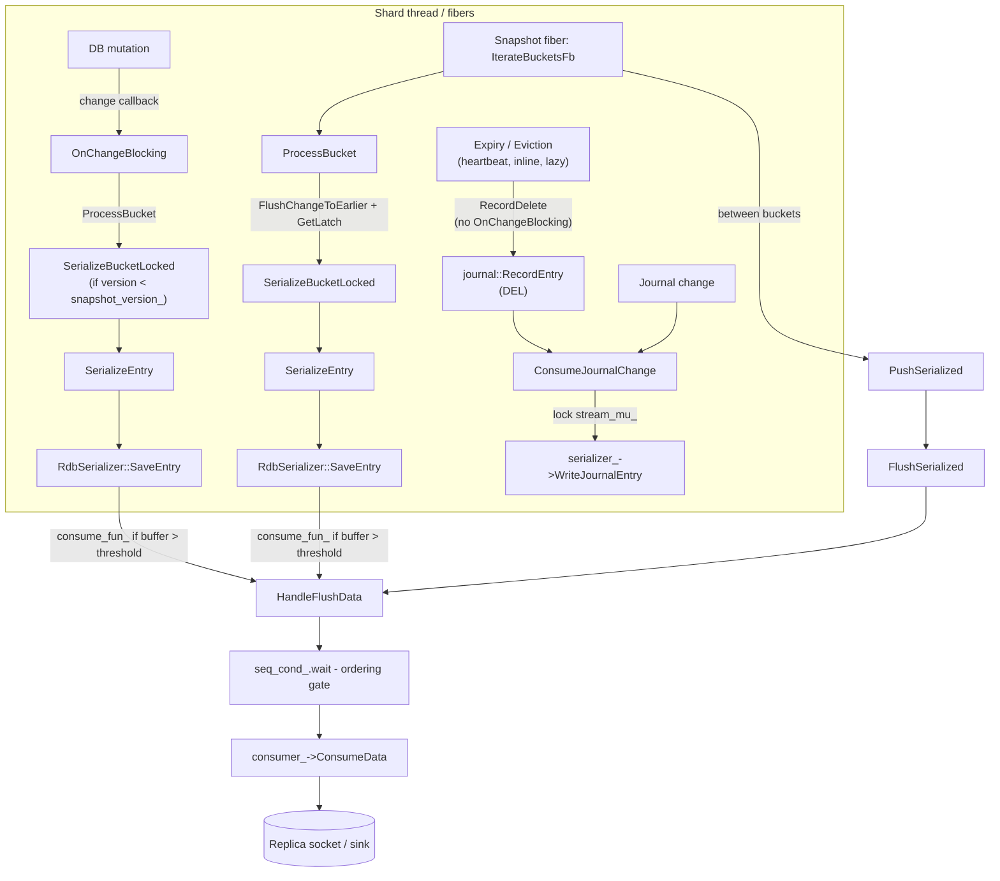
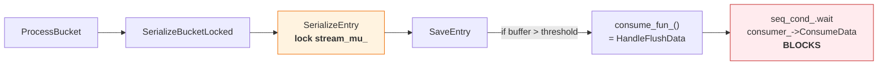
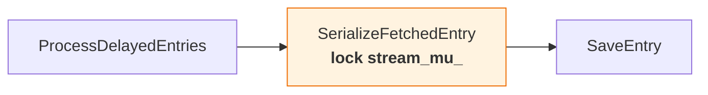
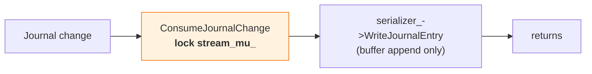
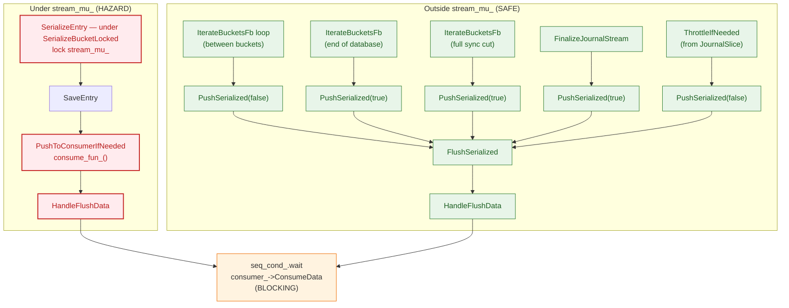

# Shard Serialization

This document describes how Dragonfly serializes a single shard's data via `SliceSnapshot`. It
covers the point-in-time (PIT) serialization mode, its correctness guarantees, and the mechanisms
used to coordinate concurrent mutations with the serialization process.

## Overview

Shard serialization is used for two purposes:

1. **Backups (RDB save)** — Must produce a consistent point-in-time snapshot.
2. **Replication (full sync)** — Serializes baseline data and then streams journal changes.

Both use PIT mode. The traversal infrastructure is
`IterateBucketsFb` → `ProcessBucket` → `SerializeBucketLocked` → `SerializeEntry`, with
flushing/backpressure via `HandleFlushData` → `consumer_->ConsumeData`.

## Core Types

| Type | Location | Role |
|------|----------|------|
| `SerializerBase` | `src/server/serializer_base.h` | Base class: change listener, bucket processing, dependency tracking |
| `BucketDependencies` | `src/server/serializer_base.h` | Tracks per-bucket dependencies (tiered reads, big-value streaming) |
| `BucketIdentity` | `src/server/serializer_base.h` | Opaque bucket identity (`uintptr_t` — the bucket's memory address) |
| `DelayedEntryHandler` | `src/server/serializer_base.h` | Manages tiered (offloaded) entries awaiting async reads |
| `SliceSnapshot` | `src/server/snapshot.h` | Orchestrates shard serialization (extends `SerializerBase`) |
| `RdbSerializer` | `src/server/rdb_save.h` | Serializes entries into RDB-format buffers |
| `SnapshotDataConsumerInterface` | `src/server/snapshot.h` | Downstream sink interface |
| `RdbSaver::Impl` | `src/server/rdb_save.cc` | Consumer impl: writes to socket or channel |
| `ThreadLocalMutex` | `src/server/synchronization.h` | Fiber-aware mutex for stream serialization |
| `LocalLatch` | `src/server/synchronization.h` | Non-preempting latch (counter + condvar) |
| `ChangeReq` | `src/server/table.h` | Variant of `bucket_iterator` or `BucketSet` describing a table mutation |

## Data Flow Overview



## PIT Mode (Point-in-Time Snapshot)

PIT mode captures an exact snapshot of the shard at the logical moment `snapshot_version_` was
assigned.

### Bucket Versioning

Dragonfly's `DashTable` ([dashtable.md](dashtable.md)) maintains a version counter per physical
bucket. The snapshot must serialize all buckets with version `< snapshot_version_`.

- `ProcessBucket` (in `SerializerBase`) stamps the bucket version to `snapshot_version_` via
  `SetVersion` **before** calling `SerializeBucketLocked`, ensuring each bucket is serialized
  exactly once.
- Mutations bump bucket versions, so buckets mutated after the snapshot started will have
  version `>= snapshot_version_` and are skipped by the traversal.
- Buckets not yet traversed but about to be mutated require **serialize-before-mutate**,
  enforced by `OnChangeBlocking()`.

### Ordering Invariant

> For any key, the replica must receive the baseline value **strictly before** any journal entry
> that mutates that key.

We will use two terms for journal changes:
- **Self-contained**: the journal entry fully determines the resulting logical state and can be
  replayed without the prior value (for example `SET`, `DEL`).
- **Baseline-dependent**: the journal entry describes a mutation of an existing value and requires
  the baseline state to be reconstructed first (for example `HSET`, `LPUSH`).

For **transaction-driven mutations** this is guaranteed because:
1. `OnChangeBlocking` runs before the mutation commits and serializes the bucket if needed.
2. The serialization (including `BucketDependencies::Wait` for tiered values) completes before
   `OnChangeBlocking` returns, so the mutation and its subsequent journal emission cannot
   overtake an in-progress bucket serialization.

**Important caveat:** not all journal entries follow the
`OnChangeBlocking` → mutation → `RecordJournal` → `ConsumeJournalChange` sequence. Several code
paths emit journal entries via `journal::RecordEntry` directly, bypassing `OnChangeBlocking`
entirely. See [Journal Entries Without `OnChangeBlocking`](#journal-entries-without-onchangeblocking)
below.

### Journal Entries Without `OnChangeBlocking`

Not all journal entries follow the transaction-driven
`OnChangeBlocking` → mutation → `RecordJournal` → `ConsumeJournalChange`
sequence. Several code paths call `journal::RecordEntry` directly (→
`JournalSlice::AddLogRecord` → `ConsumeJournalChange`), bypassing `OnChangeBlocking` entirely:

| Source | Journal command | Trigger |
|--------|----------------|---------|
| `ExpireIfNeeded` (`db_slice.cc`) | `DEL` | Lazy expiry during key lookup, active expiry sweep (`DeleteExpiredStep`), heartbeat-driven eviction (`FreeMemWithEvictionStepAtomic`) |
| `PrimeEvictionPolicy::Evict` (`db_slice.cc`) | `DEL` | Inline eviction when a DashTable bucket overflows during insert |
| `generic_family.cc` (SCAN-based deletion) | `DEL` | `RecordDelete` after `DbSlice::Del` in the RM command |
| `set_family.cc` / `hset_family.cc` (SCAN-based deletion) | `DEL` | `RecordDelete` after `DbSlice::Del` in SPOP/HSCAN-based paths |
| `dflycmd.cc`, `replica.cc`, `cluster_family.cc` | `PING` / `DFLYCLUSTER` | Control signals: takeover sync, PING propagation, cluster config |

All data-mutating entries above are self-contained `DEL` commands. The non-mutating entries
(`PING`, `DFLYCLUSTER`) carry no key-level semantics.

**Why this matters for `ConsumeJournalChange` and `stream_mu_`:** these journal entries
still flow through `ConsumeJournalChange`, which acquires `stream_mu_`. Today the mutex
serves two purposes on these paths:

1. **Serializer buffer exclusivity** — preventing a journal write from interleaving with an
   in-progress `SerializeBucketLocked` call that shares the same `serializer_` instance.
2. **Baseline-before-journal ordering** — a `DEL K` must not reach the output stream (or a
   separate journal stream) while K's baseline is still being serialized. Even with separate
   serializer buffers and tagged-chunk interleaving, the consumer could process `DEL K` before
   receiving the full baseline, violating the ordering invariant. The mutex prevents this today
   by blocking the journal write until `SerializeBucketLocked` completes.

The lock is *not* needed for transaction-style ordering against `OnChangeBlocking` (these paths
bypass it entirely), but it is needed for both concerns above. Removing it requires (a) separate
serializer buffers (Phase 2, item 7) **and** (b) a mechanism to defer the `DEL` until the
bucket's baseline is fully emitted (Phase 1, item 6 — deferred deletion queue).

**Could these paths call `OnChangeBlocking` before deleting?** Not safely:

- **`ExpireIfNeeded`:** `SerializeBucketLocked` (called from `OnChangeBlocking`) can preempt,
  but `ExpireIfNeeded` must not — `ExpireAllIfNeeded` calls `serialization_latch_.Wait()` and
  lazy expiry in `FindInternal` relies on cooperative scheduling.
- **`PrimeEvictionPolicy::Evict`:** `Evict` runs inside DashTable's insert path while the
  table is mid-structural-mutation. `OnChangeBlocking` calls `SerializeBucketLocked` (iterates
  the bucket) — unsafe here. Re-entrancy risk.
- **`FreeMemWithEvictionStepAtomic`:** runs from heartbeat with `serialization_latch_` held;
  `OnChangeBlocking` per evicted key would add overhead and preemption points inside the loop.

The ordering issue is twofold: byte-stream integrity
([§1](#1-shard-wide-stall-under-stream_mu_)) and baseline-before-journal correctness — a
`DEL` must not be emitted (even to a separate stream) while the same key's baseline is still
being serialized. Roadmap item 6 proposes a **deferred deletion queue** to address this
without blocking or re-entrancy.

### Mutation Path: `OnChangeBlocking`

The `DbSlice` change callback dispatches `ChangeReq` (a `std::variant`) to two overloads of
`SerializerBase::OnChangeBlocking`:

**For updates (existing bucket):**

```
OnChangeBlocking(db_index, bucket_iterator)
  -> ProcessBucket(db_index, bucket_iterator, on_update=true)
       if bucket version >= snapshot_version_:
         flush delayed entries for this bucket (if tiered)
         BucketDependencies::Wait(bucket)
         return (already serialized)
       SetVersion(snapshot_version_)
       BucketDependencies::Increment(bucket)
       -> SerializeBucketLocked(db_index, bucket_iterator)
       BucketDependencies::Decrement(bucket)
       ProcessDelayedEntries(...)
```

For updates, `ChangeReq` holds a `PrimeTable::bucket_iterator`. If the bucket has not
been serialized yet (version `< snapshot_version_`), it is serialized now via `ProcessBucket`.

**For inserts (new key):**

```
OnChangeBlocking(db_index, BucketSet)
  for each bucket_iterator in BucketSet.buckets():
    -> ProcessBucket(db_index, bucket_iterator, on_update=true)
```

For inserts, `DbSlice` calls `CVCUponInsert` to identify all buckets the insert would touch
(home, neighbor, stash — or the entire segment on a split) and passes the resulting `BucketSet`
to the change callback. `OnChangeBlocking` iterates each bucket in the set, calling
`ProcessBucket` to serialize any that have version `< snapshot_version_`.

### Traversal Path: `ProcessBucket` (from `IterateBucketsFb`)

```
IterateBucketsFb:
  pt->TraverseBuckets(cursor, lambda(bucket_iterator) {
    ProcessBucket(db_index, bucket_iterator, on_update=false)
  })

ProcessBucket(db_index, bucket_iterator, on_update=false):
  if bucket version >= snapshot_version_:
    skip (already serialized by OnChangeBlocking or a previous visit)
  FlushChangeToEarlierCallbacks(...)
  lock(*db_slice_->GetLatch())
  // re-check version after FlushChangeToEarlierCallbacks (may have stamped it)
  if bucket version >= snapshot_version_:
    recurse → ProcessBucket (for the skip path)
  SetVersion(snapshot_version_)
  BucketDependencies::Increment(bucket)
  -> SerializeBucketLocked(db_index, bucket_iterator)
       for each occupied slot:
         -> SerializeEntry -> SaveEntry -> PushToConsumerIfNeeded
  BucketDependencies::Decrement(bucket)
  ProcessDelayedEntries(...)
```

The version check is the key optimization: buckets already serialized by `OnChangeBlocking` are
skipped. The `BucketDependencies` mechanism ensures that when a bucket is skipped on the mutation
path (`on_update=true`), any in-flight tiered reads are completed first — `ProcessBucket` calls
`ProcessDelayedEntries` to flush the bucket's delayed entries and then
`BucketDependencies::Wait` to block until all dependencies resolve.

## Shared Infrastructure

The following sections apply to all serialization paths.

### Traversal: `IterateBucketsFb`

```
IterateBucketsFb(send_full_sync_cut)
  for each database:
    for each logical bucket via PrimeTable::TraverseBuckets():
      -> ProcessBucket(db_index, bucket_iterator, on_update=false)
      PushSerialized(false)  // explicit flush between buckets
      yield if CPU time > ~15us
    ProcessDelayedEntries(true, 0)  // drain all remaining delayed entries
    PushSerialized(true)            // force-flush after each database
  if send_full_sync_cut:
    serializer_->SendFullSyncCut()
    PushSerialized(true)
```

### Serialization: `SerializeBucketLocked` and `SerializeEntry`

`SerializeBucketLocked` iterates all occupied slots in a physical bucket and calls
`SerializeEntry` for each. `SerializeEntry` looks up expiry and memcache flags, then either:
- For in-memory values: acquires `stream_mu_` and calls
  `serializer_->SaveEntry(pk, pv, expire_time, mc_flags, db_index)`.
- For tiered (external) values: calls `EnqueueOffloaded` to push a `TieredDelayedEntry`
  into the `delayed_entries_` multimap, keyed by `BucketIdentity`.

### Journal Path: `ConsumeJournalChange`

```
ConsumeJournalChange(item)
  lock(stream_mu_)
  serializer_->WriteJournalEntry(item.journal_item.data)
  unlock(stream_mu_)
```

Active when `stream_journal == true` (replication). Acquires `stream_mu_` to ensure journal
entries are not interleaved with bucket serialization. Does **not** flush data — only appends to
the serializer buffer. Flushing happens later via `ThrottleIfNeeded` → `PushSerialized(false)`,
called from `JournalSlice` after the journal callback returns.

### Flushing and Backpressure

#### `HandleFlushData(std::string data)` — Common Blocking Sink

All serialized data ultimately flows through `HandleFlushData`:

1. Assigns monotonically increasing record ID (`rec_id_++`).
2. Optionally yields (background mode).
3. **Blocks** on `seq_cond_.wait` until `id == last_pushed_id_ + 1` (sequential ordering).
4. **Blocks** on `consumer_->ConsumeData(data, cntx_)` (downstream write).
5. Updates `last_pushed_id_`, notifies waiters via `seq_cond_.notify_all()`.
6. Optionally sleeps to throttle CPU (non-background mode, up to 2ms proportional to CPU spent).

#### `FlushSerialized()`

Calls `serializer_->Flush(kFlushEndEntry)` to extract and optionally compress the buffer, then
passes the result to `HandleFlushData`.

#### `PushSerialized(bool force)`

Skips if `!force` and `serializer_->SerializedLen() < kMinBlobSize` (8KB). Otherwise calls
`FlushSerialized()` to drain the main serializer buffer.

#### `RdbSerializer::PushToConsumerIfNeeded(FlushState flush_state)`

```cpp
void RdbSerializer::PushToConsumerIfNeeded(SerializerBase::FlushState flush_state) {
  if (consume_fun_ && SerializedLen() > flush_threshold_) {
    string blob = Flush(flush_state);
    consume_fun_(std::move(blob));  // synchronous!
  }
}
```

Only fires when `consume_fun_` is set **and** the buffer exceeds `flush_threshold_`. When it
fires, it **synchronously** invokes the callback, which for `SliceSnapshot` is `HandleFlushData`.

## All Code Paths That Acquire `stream_mu_`

Currently there are **three** call sites that lock `stream_mu_`:

### Path 1: `SerializeEntry` (in-memory values, under `SerializeBucketLocked`)



### Path 2: `SerializeFetchedEntry` (tiered values, from `ProcessDelayedEntries`)



### Path 3: `ConsumeJournalChange` (journal callback)



This path does **not** reach `HandleFlushData`. It only appends to the serializer buffer.

## All Code Paths That Reach `HandleFlushData`



## Delayed Serialization of Tiered Entities

Tiered string values are not read synchronously under `stream_mu_`. Instead,
`SerializeEntry` calls `EnqueueOffloaded` which pushes a `TieredDelayedEntry` into
`delayed_entries_` (a `std::multimap<BucketIdentity, ...>`), keyed by the originating bucket's
address. The actual read and serialization happen later via `ProcessDelayedEntries`, called
from `ProcessBucket` after `SerializeBucketLocked` returns, or at the end of each database
traversal.

The `BucketDependencies` mechanism tracks in-flight tiered reads per bucket:
- `EnqueueOffloaded` calls `BucketDependencies::Increment(bucket)`.
- `ProcessDelayedEntries` calls `BucketDependencies::Decrement(bucket)` after each entry is
  serialized.
- On the mutation path (`on_update=true`), `ProcessBucket` calls
  `ProcessDelayedEntries(false, bucket)` to flush the bucket's delayed entries, then
  `BucketDependencies::Wait(bucket)` to block until all dependencies resolve.

This creates two distinct notions of "bucket finished":

1. **Traversal finished** — `SerializeBucketLocked` has iterated every entry and returned.
2. **Baseline fully emitted** — all delayed tiered entries from that bucket have also been
   read, serialized, and flushed (tracked by `BucketDependencies`).

For in-memory values these coincide; for tiered values they do not.

The ordering invariant (`baseline(K)` before `journal(K)`) still applies. Because the baseline
for a tiered key `K` may only materialize when `ProcessDelayedEntries` drains the entry,
a bucket's completion point extends from "finished iterating" to "all delayed values serialized
and flushed". The `BucketDependencies::Wait` mechanism ensures that `OnChangeBlocking` blocks
until this completion point is reached.

Note: `RestoreStreamer` (used for slot migration) also extends `SerializerBase` and uses the
same `BucketDependencies`/`DelayedEntryHandler` infrastructure.

## Locking and Synchronization

### `stream_mu_` (ThreadLocalMutex)

A `ThreadLocalMutex` (`src/server/synchronization.h`) serving as the primary synchronization
barrier for the serializer output buffer.

**Important:** `ThreadLocalMutex::lock()` and `unlock()` are **no-ops** when
`serialization_max_chunk_size == 0`. This means `stream_mu_` only provides actual
synchronization when big-value streaming is enabled. When it is disabled, all `lock_guard`
calls on this mutex are effectively free, and the system relies on cooperative scheduling
(no preemption during serialization) for correctness.

Its role: Prevents mutations from modifying a bucket while it is being serialized, and
prevents journal entries from being written during bucket serialization. This enforces both
serialize-before-mutate and the ordering invariant.

| Path | Lock held | Additional locks |
|------|-----------|-----------------|
| `SerializeEntry` (in `SerializeBucketLocked`) | `stream_mu_` | none |
| `SerializeFetchedEntry` | `stream_mu_` | none |
| `ConsumeJournalChange` | `stream_mu_` | none |

### `GetLatch()` (LocalLatch / `serialization_latch_`)

Acquired by `ProcessBucket` (traversal path, `on_update=false`) in addition to the version
check. This is a non-preempting latch (`src/server/synchronization.h`) that increments a
blocking counter, preventing `Heartbeat()` from running if `SerializeBucketLocked` preempts
(e.g., during large value serialization).

Also used by `ExpireAllIfNeeded`, `DeleteExpiredStep`, and `FreeMemWithEvictionStepAtomic`
which call `serialization_latch_.Wait()` before proceeding.

### `BucketDependencies`

Per-bucket dependency tracking (`src/server/serializer_base.h`). Uses a
`flat_hash_map<BucketIdentity, shared_ptr<LocalLatch>>`. Each in-flight operation
(tiered read, big-value streaming) increments the count; `Wait(bucket)` blocks until
the count reaches zero.

### `seq_cond_` (CondVarAny)

Condition variable used in `HandleFlushData` to ensure records are pushed to the consumer
in sequential order of their `rec_id_`. If fiber A has `id=5` and fiber B has `id=6`, B waits
until A finishes pushing and updates `last_pushed_id_` to 5.
This is needed because fibers are awakened in arbitrary order and reordering flushed chunks breaks
the wire protocol.


## Inefficiencies and Improvement Goals

This section identifies concrete problems in the current serialization design and the
improvements that address them. The [Technical Roadmap](#technical-roadmap) maps these into an ordered execution
plan.

**Hard constraints** (apply to all improvements):
- **Backpressure must be maintained.** A slow consumer must slow down the producer; we cannot
  buffer unboundedly.
- **Bounded serialization memory.** Intermediate buffers must not grow proportionally to the
  dataset size.


### 1. Shard-wide stall under `stream_mu_`

**Problem.** `stream_mu_` is a single shard-wide mutex that guards three distinct concerns simultaneously:

1. **Bucket atomicity** — the bucket must not be mutated while `SerializeBucketLocked` iterates it.
2. **Serializer buffer exclusivity** — `serializer_` must not be written to by two fibers.
3. **Journal ordering** — journal entries must not interleave with bucket serialization.

When `consume_fun_` fires under the lock (large value → `PushToConsumerIfNeeded` →
`HandleFlushData`), the mutex is held across blocking I/O (`seq_cond_.wait`,
`consumer_->ConsumeData`). This stalls the entire shard: traversal, mutations, and journal writes
all contend on the same lock.

**Why the mutex is needed in `ConsumeJournalChange`.**
Transaction paths are already ordered by `OnChangeBlocking` (it runs and returns before
`ConsumeJournalChange` on the same fiber). The mutex matters for
[paths that bypass `OnChangeBlocking`](#journal-entries-without-onchangeblocking) —
inline eviction and heartbeat-driven deletions. Without it, inline eviction could produce:

**Counter-example without the `ConsumeJournalChange` mutex — inline eviction via `PrimeEvictionPolicy::Evict`:**
1. Traversal calls `SerializeBucketLocked(B)` and begins iterating it; the bucket contains key `K`
   (a large hash, serialized element-by-element). The traversal preempts mid-entry via
   `consume_fun_`.
2. While the traversal is preempted, a client command triggers a DashTable insert on a different
   bucket. The insert finds no free slot in its home bucket and calls
   `PrimeEvictionPolicy::Evict`, which selects `K` as the victim.
3. `Evict` removes `K` from the table and — still on the same fiber, inside the DashTable
  insert — calls `journal::RecordEntry(DEL K)` directly, bypassing `OnChangeBlocking`.
4. `ConsumeJournalChange` appends `DEL K` to the shared serializer buffer immediately, even
  though traversal has already emitted only a prefix of `K`'s baseline.
5. Traversal resumes and appends the remaining bytes of `K`'s baseline.

Result: the replica's byte stream contains `[partial baseline of K] [DEL K] [rest of baseline
of K]`. The RDB decoder sees a truncated entry followed by an unexpected journal opcode, or
parses garbage if the lengths happen to align. Even if the `DEL` is parsed out-of-band, the
subsequent baseline bytes reconstruct `K` on the replica, reversing the deletion.

**Goal.** Separate the three concerns so that:
- bucket atomicity uses bucket-level mechanisms (versioning + bucket completion state);
- buffer exclusivity uses per-serializer isolation (each producer owns its buffer);
- journal ordering uses bucket completion state and deferred deletion queues;
- no code path blocks on downstream I/O while holding a shard-wide lock.

**Approach.** See [§4 summary table](#4-summary-mutex-roles-and-their-replacements) for the
full mapping. Key mechanisms: bucket completion state ([§2](#2-imprecise-bucket-completion-tracking)),
separate serializer instances ([§3](#3-shared-serializer-buffer-and-wire-format-coupling)),
and non-preempting chunk production. See Roadmap items 6, 7, 8, 9.

### 2. Imprecise bucket completion tracking

**Problem.** The system has no explicit notion of when a bucket's baseline is *fully emitted*
(see [Delayed Serialization of tiered entities](#delayed-serialization-of-tiered-entities)
for details on how tiered values extend bucket completion beyond `SerializeBucketLocked`'s
return). The current `BucketDependencies` mechanism tracks in-flight tiered reads, but there
is no formal state machine distinguishing "being serialized" from "fully covered". This
creates issues:

- A journal entry for key K can reach the output buffer (via `ConsumeJournalChange`) before
  K's delayed tiered baseline is drained — violating the
  [ordering invariant](#ordering-invariant) (see PR #6824).
- [Non-transaction journal entries](#journal-entries-without-onchangeblocking) (expiry, eviction)
  bypass `OnChangeBlocking` entirely. Since there is no bucket completion state to consult, `DEL`
  entries can interleave mid-serialization of the deleted key's baseline.

**Goal.** Make "baseline fully emitted" precise for every bucket — including tiered values —
so that ordering decisions can be expressed through per-bucket state rather than shard-wide mutex exclusion.

**Approach.**
- Introduce a per snapshot instance/bucket state machine:
  `NotVisited` → `Serializing` → `DelayedPending` → `Covered`.
  Each bucket is identified by a stable `BucketIdentity`. A bucket must remain in the
  tracking map (`currently_serialized_: map<BucketIdentity, State>`) until all work completes; otherwise `version >= snapshot_version_` + absent-from-map would falsely read as `Covered`.
  State encoding:

  | State | Encoding | Meaning |
  |-------|----------|---------|
  | **NotVisited** | `version < snapshot_version_`, not in map | Traversal has not reached this bucket |
  | **Serializing** | `version >= snapshot_version_`, in map as `Serializing` | Traversal is iterating this bucket |
  | **DelayedPending** | `version >= snapshot_version_`, in map as `DelayedPending` | Iteration done, tiered entries still pending |
  | **Covered** | `version >= snapshot_version_`, not in map | Baseline fully emitted |

- Associate delayed tiered entries with their originating bucket instead of the global queue.
  Transition to `Covered` only after all delayed entries are flushed.
  (Note: the current `delayed_entries_` multimap is already keyed by `BucketIdentity`, which
  is a step toward this, but the formal state machine is not yet implemented.)
- **Transaction-driven mutations:** `OnChangeBlocking` blocks (fiber-aware wait) on
  `Serializing`/`DelayedPending` buckets; proceeds immediately on `NotVisited` (serialize
  now) or `Covered` (baseline already emitted). Since `OnChangeBlocking` → mutation →
  `RecordJournal` → `ConsumeJournalChange` is sequential on the mutation fiber, blocking
  `OnChangeBlocking` guarantees baseline-before-journal.
  (Note: the current code already implements blocking via `BucketDependencies::Wait` in
  `ProcessBucket`, but not the full state machine.)
- **Non-transaction deletions (expiry, eviction):** `OnChangeBlocking` is
  [infeasible on these paths](#journal-entries-without-onchangeblocking). Instead, use a **deferred
  deletion queue**: enqueue the key when the bucket is `Serializing`/`DelayedPending`; drain
  (emit `DEL`) when the bucket transitions to `Covered`. See roadmap item 6 for details.
- **Latency tradeoff:** blocking `OnChangeBlocking` on `DelayedPending` means a mutation fiber can
  stall for the duration of a tiered disk read (see roadmap item 6 for mitigation).

See Roadmap items 3, 5, 6.

### 3. Shared serializer buffer and wire-format coupling

**Problem.** `ConsumeJournalChange` and `SerializeBucketLocked` write to the same `serializer_`
buffer (the "buffer exclusivity" role from [§1](#1-shard-wide-stall-under-stream_mu_)).
Even with separate buffers, interleaved output from two serializers cannot be demuxed by the
consumer without a framing protocol — a journal entry injected mid-RDB-entry produces an
unparseable byte stream (see the [eviction counter-example](#1-shard-wide-stall-under-stream_mu_)
for a concrete scenario).

**Goal.** Decouple journal and bucket serialization so they can produce data independently,
without sharing a buffer or requiring a shard-wide lock for output integrity.

**Approach.**
- **Tagged-chunk wire format.** Extend the serialization format with tagged chunks: each
  mid-entry flush produces a chunk tagged with a stream ID. The consumer reassembles same-ID
  chunks before decoding. Small values (single chunk) use the existing format unchanged —
  no overhead. Controlled by a master-side flag (`--serialization_tagged_chunks`).
- **Separate `RdbSerializer` per producer.** Give journal entries and bucket serialization
  their own serializer instances. Each produces tagged chunks independently. With separate
  buffers, `ConsumeJournalChange` no longer needs `stream_mu_` for buffer exclusivity.
- **Flushing strategy:** small values serialize the entire bucket without preemption; large
  values release the lock between chunks and apply backpressure outside the critical section.
  Bucket contents remain stable across the gap because PIT versioning prevents re-serialization and `OnChangeBlocking` blocking (§1) prevents mutation.

See Roadmap items 4, 7.

### 4. Summary: mutex roles and their replacements

The previous subsections identify `stream_mu_`'s three roles and the mechanisms that
replace each:

| Mutex role | Replacement | Source |
|-----------|-------------|--------|
| Journal ordering | Bucket completion state + deferred deletion queue | §1 |
| Buffer exclusivity | Separate `RdbSerializer` per producer + tagged chunks | §3 |
| Bucket atomicity | Bucket versioning + `OnChangeBlocking` blocking | §1, §2 |

Once all replacements are in place and validated, the mutex can be narrowed per path,
and eventually removed entirely. The roadmap structures this as a sequence of incremental
steps (Phases 0–3), each validated before the next begins.

## Technical Roadmap

The improvements identified above are interdependent. The safest path is to split them into
small, verifiable steps that first improve observability and correctness scaffolding, then
improve PIT and PIT+tiered correctness/robustness, and only after that tackle deeper
serializer / lock-removal changes.

### Phase 0 — Baseline and guardrails

1. **Document current invariants in code comments and tests.**
   - Make the key ordering rules explicit near `SerializerBase::OnChangeBlocking`,
     `SliceSnapshot::ConsumeJournalChange`, `RestoreStreamer::OnChangeBlocking`, and
     `DbSlice::FlushChangeToEarlierCallbacks`.
   - Prefer focused replication tests over purely end-to-end hash comparisons. The current
     broad replication suite is useful, but Phase 0 needs tests that fail specifically when an
     ordering invariant is broken.
   - Add focused tests for:
     - PIT: baseline-before-journal for baseline-dependent mutations.
     - tiered values: delayed serialization still preserves baseline-before-journal.
   - Suggested test strategy:
     - **PIT ordering guardrail:** add a test in `tests/dragonfly/replication_test.py` that
       starts full sync with PIT mode, performs a small controlled set of
       baseline-dependent updates during full sync (`HSET`, `LPUSH`, `APPEND`, `XADD`), waits for
       stable sync, and then asserts exact key/value equality for only those keys. The intent is
       to make a baseline-before-journal violation fail on a tiny, debuggable workload.
     - **tiered delayed-entry guardrail:** rehabilitate the currently skipped tiered replication
       test in `tests/dragonfly/tiering_test.py` and make it assert not just final equivalence,
       but that concurrent writes to tiered keys during full sync do not lose updates.
   - Suggested assertions:
     - assert exact values for a small curated key set, not just whole-dataset hashes;
     - assert replica reaches stable sync and catches up via `check_all_replicas_finished`;
     - assert path-activation counters from logs where available (`side_saved`, `moved_saved`);
     - for tricky cases, prefer deterministic key-level checks over probabilistic stress-only
       validation.
   - Suggested scope split:
     - keep the existing large/stress replication tests as coarse regression coverage;
     - add a handful of small, deterministic Phase 0 tests whose only purpose is to guard the
       invariants this roadmap depends on.
   - Goal: freeze the current correctness contract before changing behavior.

2. **Add lightweight observability for snapshot/journal interleavings.**
   - Count how often `ConsumeJournalChange` runs while a bucket is being serialized.
   - Count flushes triggered under `stream_mu_` versus outside it.
   - Suggested locations for counters / debug stats:
     - increment a counter when `ConsumeJournalChange` acquires the barrier while
       `serialize_bucket_running_` is true;
     - increment separate counters for `HandleFlushData` reached from under `stream_mu_`
       versus from `PushSerialized` outside the critical section;
   - Suggested exposure:
     - start with log lines in the existing `Exit SnapshotSerializer` / replication progress logs;
     - if the signals become broadly useful, promote them to INFO/stats fields later.
   - Suggested rollout rule:
     - add observability before optimization, and require each new fast path to demonstrate that
       the expected path was actually exercised in tests.
   - Goal: validate which paths are actually hot and which optimizations are worth the risk.

### Phase 1 — PIT and PIT+tiered foundation

3. **Introduce explicit bucket-level completion state.**
   - **Prerequisites:** Phase 0.1–0.2.
   - Implement the per-snapshot-instance state machine described in
     [§2](#2-imprecise-bucket-completion-tracking): `NotVisited` → `Serializing` →
     `DelayedPending` → `Covered`, keyed by `BucketIdentity`.
   - Keep this state entirely instance-local to `SliceSnapshot` / `RestoreStreamer`.
   - Note: the current `BucketDependencies` and `delayed_entries_` multimap keyed by
     `BucketIdentity` provide a foundation, but do not yet implement the formal state machine.
   - Goal: replace vague "bucket iteration finished" reasoning with an explicit state machine
     that will later serve PIT+tiered correctness decisions.

4. **Extend the wire format with tagged chunks.**
   - **Prerequisites:** none.
   - Implements the tagged-chunk format described in
     [§3](#3-shared-serializer-buffer-and-wire-format-coupling). Entries that may be split
     across preemption points are wrapped in a per-stream-tag envelope; single-chunk entries
     use the existing format unchanged (no overhead).
   - **Wire format:** `RDB_OPCODE_DF_MASK`-style flag bit (`DF_MASK_FLAG_CHUNKED`). When set,
     payload is `stream_tag: uint32, payload_length: uint32, payload: bytes`. Entries without
     the flag are unchanged.
   - **Enablement:** master-side flag (`--serialization_tagged_chunks`), not `DflyVersion`
     (which doesn't apply to DFS backups). The loader detects tagged chunks by the flag bit
     and reassembles transparently.
   - Pure format + loader-side work — no changes to serialization logic or locking. Can be
     developed independently of Phases 0–1.
   - **Scope:** replication and DFS backups. Only legacy `.rdb` format does not need tagged
     chunks (`SnapshotFlush::kDisallow`, no concurrent bucket serialization).
   - Why early: Phase 2 (item 7) needs separate serializers whose interleaved output requires
     tagged chunks for demuxing.
   - Goal: have the wire-format infrastructure ready before Phase 2 needs it.

5. **Associate delayed tiered serialization with bucket state.**
   - **Prerequisites:** 1.3.
   - Address the [tiered completion gap](#delayed-serialization-of-tiered-entities): strengthen
     the association of `delayed_entries_` with their originating bucket (already keyed by
     `BucketIdentity` in the current `std::multimap`) and tie it to the formal state machine.
   - Only transition a bucket to `Covered` once its delayed tiered entries are emitted.
   - Goal: make "baseline fully emitted" precise, not just "bucket iteration finished".

6. **Use bucket completion state to harden PIT ordering guarantees.**
   - **Prerequisites:** 1.3 and 1.5.
   - Re-express the PIT ordering rule in terms of bucket completion state, not just mutex
     exclusion and `bucket.version`.
   - For in-memory values, PIT ordering is already sound by construction (sequential
     `OnChangeBlocking` → mutation → `ConsumeJournalChange` on the same fiber). The real gap is
     **tiered delayed entries** (see
     [Delayed Serialization](#delayed-serialization-of-tiered-entities)): a journal entry
     can reach the buffer before the delayed baseline is drained.
   - **`OnChangeBlocking` blocking:** block (fiber-aware wait) when the bucket is `Serializing` or
     `DelayedPending`; proceed on `NotVisited` (serialize now → `Covered`) or `Covered`
     (baseline already emitted). Because `OnChangeBlocking` → mutation → `RecordJournal` →
     `ConsumeJournalChange` is sequential on the mutation fiber, blocking `OnChangeBlocking`
     guarantees baseline-before-journal for all transaction-driven mutations.
     (Note: the current code already blocks via `BucketDependencies::Wait` in `ProcessBucket`,
     providing partial coverage of this guarantee.)
   - **Deferred deletion queue** for
     [non-transaction journal paths](#journal-entries-without-onchangeblocking) (expiry, eviction —
     where `OnChangeBlocking` is infeasible). When a deletion encounters a bucket in
     `Serializing`/`DelayedPending`, enqueue the key into a per-bucket
     `pending_deletions: vector<string>` (bounded by bucket capacity, typically 12–14 slots).
     The traversal fiber drains the queue — emitting deferred `DEL` entries — when
     transitioning the bucket to `Covered`. For `NotVisited`/`Covered` buckets, `DEL` is
     emitted immediately as today. Properties:
     - no blocking, re-entrancy, or preemption on the deletion fiber;
     - baseline-before-journal ordering preserved by construction.
   - After this item, `stream_mu_` is no longer needed for journal ordering, but is still
     needed for [buffer exclusivity](#3-shared-serializer-buffer-and-wire-format-coupling)
     (items 7–8).
   - **Latency tradeoff:** blocking `OnChangeBlocking` on `DelayedPending` can stall a mutation
     fiber for the duration of a tiered disk read (`Future<io::Result<string>>`). Acceptable
     for correctness; monitor and consider `KeepBoth` fallback if latency is excessive.
   - Use Phase 0 tests to validate PIT+tiered behavior under preemption and backpressure.
   - Goal: make the existing production path easier to reason about before adding new behavior.

### Phase 2 — Reduce PIT blocking and serializer fragility

7. **Give journal and bucket serialization separate `RdbSerializer` instances.**
   - **Prerequisites:** 1.4 and 1.6.
   - NOTE: maybe unnecessary if rely on 1.4.
   - Addresses the [shared buffer problem](#3-shared-serializer-buffer-and-wire-format-coupling)
     and the primary [shard-wide stall hazard](#1-shard-wide-stall-under-stream_mu_).
   - The fix: give journal entries their own `RdbSerializer` instance. Bucket serialization
     and journal serialization never share a buffer. Each produces tagged chunks (item 4)
     that the consumer (replica or DFS loader) reassembles by stream tag.
   - The same separation is needed for **DFS backups** (no journal, but still PIT): once
     per-bucket locks (item 6) replace the shard-wide `stream_mu_`, two concurrent
     `SerializeBucketLocked` calls can run on different buckets (traversal fiber on bucket A
     preempts mid-entry via `consume_fun_`, `OnChangeBlocking` serializes bucket B). Each call
     needs its own buffer; tagged chunks allow their interleaved output to be reassembled.
   - With separate serializers, `stream_mu_` is no longer needed for buffer exclusivity.
     `ConsumeJournalChange` writes to its own serializer without acquiring `stream_mu_`
     at all (journal ordering is already guaranteed by bucket completion state from item 6).
   - The flushing strategy depends on value size:
     - **Small values (typical case):** `consume_fun_` is disabled (or made a no-op) while
       the lock is held. `SerializeBucketLocked` serializes the entire bucket into the bucket
       serializer's buffer without preempting — the buffer grows but stays bounded because
       most buckets contain only small entries. After `SerializeBucketLocked` returns and the lock
       is released, the accumulated buffer is flushed as a tagged chunk outside the lock.
     - **Large values (e.g., a 1 GB set):** the existing `kFlushMidEntry` boundaries become
       lock-release points. After serializing a bounded batch of elements, the lock is
       released, the accumulated chunk is flushed (with backpressure) outside the lock, and
       the lock is re-acquired for the next batch. Bucket contents remain stable across the
       gap because (a) PIT versioning prevents re-serialization and (b) `OnChangeBlocking` blocking
       (item 6) prevents the mutation from committing. Both are required: (a) alone prevents
       double-serialization but not mid-value mutation; (b) alone prevents mutation but not
       concurrent `SerializeBucketLocked` entry.
   - Goal: eliminate blocking under `stream_mu_` by removing the shared-buffer reason for
     holding it, rather than by restructuring the lock/unlock pattern around the same buffer.

8. **Simplify `rec_id_` / `seq_cond_` ordering once tagged-chunk delivery is proven.**
   - **Prerequisites:** 2.7, 1.4.
   - With tagged chunks support, we may not need a consistent global order between different
     fibers. In that case `rec_id_` / `seq_cond_.wait` become redundant.
   - Remove `rec_id_` / `seq_cond_` only after demonstrating (via tests and observability)
     that we do not corrupt the replication stream.
   - Goal: avoid removing an ordering mechanism before its replacement is demonstrably sound.

9. **Narrow `stream_mu_` after the above is proven.**
   - **Prerequisites:** 2.7–2.8.
   - Keep serialize-before-mutate semantics intact.
   - Remove or narrow mutex roles only where bucket state, serializer isolation, and
     tagged-chunk delivery already provide an equivalent correctness guarantee.
   - Goal: simplify the active production path incrementally, not speculatively.

### Phase 3 — Reassess `stream_mu_` globally

10. **Narrow the lock's role by path.**
    - **Prerequisites:** 2.9.
    - Keep only what is still required for serialize-before-mutate correctness.
    - Goal: shrink the lock surface incrementally instead of attempting full removal at once.

11. **Attempt full `stream_mu_` removal only after all prerequisites are in place.**
    - **Prerequisites:** 3.10.
    - Preconditions:
      - non-preempting bounded serialization chunks,
      - precise bucket coverage state,
      - delayed tiered ownership tracked to completion,
      - journal ordering independent of the mutex,
      - tests covering PIT and tiered cases.
    - Goal: ensure lock removal is the final simplification step, not the first risky rewrite.
