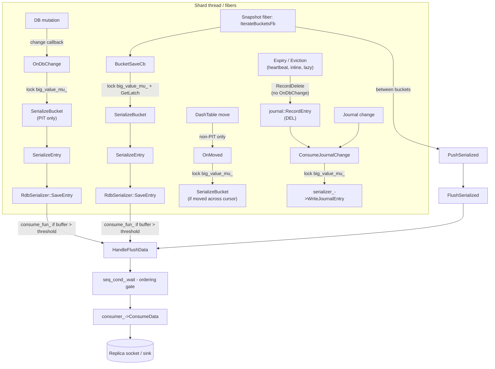
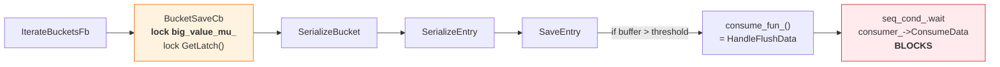
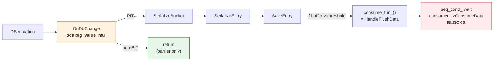
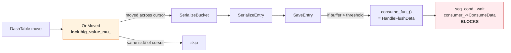
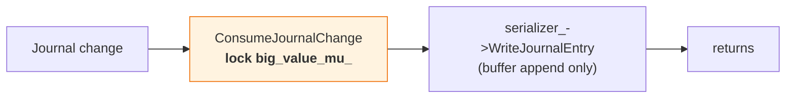
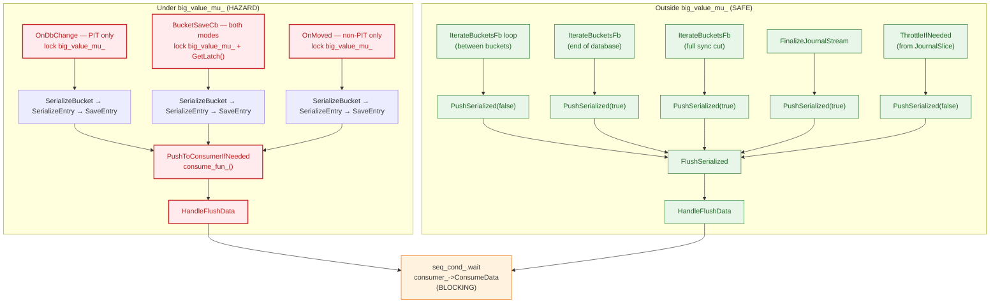

# Shard Serialization

This document describes how Dragonfly serializes a single shard's data via `SliceSnapshot`. It
covers both point-in-time (PIT) and non-PIT serialization modes, their correctness guarantees,
and the mechanisms used to coordinate concurrent mutations with the serialization process.

## Overview

Shard serialization is used for two purposes:

1. **Backups (RDB save)** — Must produce a consistent point-in-time snapshot. Always uses PIT mode.
2. **Replication (full sync)** — Serializes baseline data and then streams journal changes. Can
   use either PIT or non-PIT mode, controlled by the `--point_in_time_snapshot` flag (default: true).

Both modes share the same traversal infrastructure (`IterateBucketsFb` → `BucketSaveCb` →
`SerializeBucket` → `SerializeEntry`) and the same flushing/backpressure machinery
(`HandleFlushData` → `consumer_->ConsumeData`). They differ in **how they handle concurrent
mutations** during the traversal.

| | PIT mode | Non-PIT mode |
|---|----------|-------------|
| Flag | `use_snapshot_version_ == true` | `use_snapshot_version_ == false` |
| Used for | Backups and replication | Replication only |
| Consistency | Exact point-in-time snapshot | Eventual consistency (baseline + journal) |
| `OnDbChange` | Serializes bucket before mutation | Barrier only (no serialization) |
| `OnMoved` | Not registered | Handles DashTable item reshuffling |
| Bucket versioning | Yes — skip already-serialized buckets | No — serialize every bucket visited |
| Throughput | Lower (mutation path does serialization work) | Higher (mutation path only acquires mutex) |

## Core Types

| Type | Location | Role |
|------|----------|------|
| `SliceSnapshot` | `src/server/snapshot.h` | Orchestrates shard serialization |
| `RdbSerializer` | `src/server/rdb_save.h` | Serializes entries into RDB-format buffers |
| `SnapshotDataConsumerInterface` | `src/server/snapshot.h` | Downstream sink interface |
| `RdbSaver::Impl` | `src/server/rdb_save.cc` | Consumer impl: writes to socket or channel |
| `ThreadLocalMutex` | `src/server/synchronization.h` | Fiber-aware mutex for atomicity barrier |
| `ChangeReq` | `src/server/table.h` | Describes a table mutation (update or insert) |

## Data Flow Overview



## PIT Mode (Point-in-Time Snapshot)

PIT mode captures an exact snapshot of the shard at the logical moment `snapshot_version_` was
assigned. It is the default for both backups and replication.

### Bucket Versioning

Dragonfly's `DashTable` ([dashtable.md](dashtable.md)) maintains a version counter per physical
bucket. The snapshot must serialize all buckets with version `< snapshot_version_`.

- `SerializeBucket` sets the bucket version to `snapshot_version_`, ensuring each bucket is
  serialized exactly once.
- Mutations bump bucket versions, so buckets mutated after the snapshot started will have
  version `>= snapshot_version_` and are skipped by the traversal.
- Buckets not yet traversed but about to be mutated require **serialize-before-mutate**,
  enforced by `OnDbChange()`.

### Ordering Invariant

> For any key, the replica must receive the baseline value **strictly before** any journal entry
> that mutates that key.

We will use two terms for journal changes:
- **Self-contained**: the journal entry fully determines the resulting logical state and can be
  replayed without the prior value (for example `SET`, `DEL`).
- **Baseline-dependent**: the journal entry describes a mutation of an existing value and requires
  the baseline state to be reconstructed first (for example `HSET`, `LPUSH`).

For **transaction-driven mutations** this is guaranteed because:
1. `OnDbChange` runs before the mutation commits and serializes the bucket if needed.
2. `OnDbChange` unconditionally acquires `big_value_mu_` first, so the mutation and its
  subsequent journal emission cannot overtake an in-progress bucket serialization.

**Important caveat:** not all journal entries follow the
`OnDbChange` → mutation → `RecordJournal` → `ConsumeJournalChange` sequence. Several code
paths emit journal entries via `journal::RecordEntry` directly, bypassing `PreUpdateBlocking`
and `OnDbChange` entirely. See [Journal Entries Without `OnDbChange`](#journal-entries-without-ondbchange)
below.

### Journal Entries Without `OnDbChange`

Not all journal entries follow the transaction-driven
`PreUpdateBlocking` → `OnDbChange` → mutation → `RecordJournal` → `ConsumeJournalChange`
sequence. Several code paths call `journal::RecordEntry` directly (→
`JournalSlice::AddLogRecord` → `ConsumeJournalChange`), bypassing `OnDbChange` entirely:

| Source | Journal command | Trigger |
|--------|----------------|---------|
| `ExpireIfNeeded` (`db_slice.cc`) | `DEL` | Lazy expiry during key lookup, active expiry sweep (`DeleteExpiredStep`), heartbeat-driven eviction (`FreeMemWithEvictionStepAtomic`) |
| `PrimeEvictionPolicy::Evict` (`db_slice.cc`) | `DEL` | Inline eviction when a DashTable bucket overflows during insert |
| `generic_family.cc` (SCAN-based deletion) | `DEL` | `RecordDelete` after `DbSlice::Del` in the RM command |
| `dflycmd.cc`, `replica.cc`, `cluster_family.cc` | `PING` / `DFLYCLUSTER` | Control signals: takeover sync, PING propagation, cluster config |

All data-mutating entries above are self-contained `DEL` commands. The non-mutating entries
(`PING`, `DFLYCLUSTER`) carry no key-level semantics.

**Why this matters for `ConsumeJournalChange` and `big_value_mu_`:** these journal entries
still flow through `ConsumeJournalChange`, which acquires `big_value_mu_`. Today the mutex
serves two purposes on these paths:

1. **Serializer buffer exclusivity** — preventing a journal write from interleaving with an
   in-progress `SerializeBucket` call that shares the same `serializer_` instance.
2. **Baseline-before-journal ordering** — a `DEL K` must not reach the output stream (or a
   separate journal stream) while K's baseline is still being serialized. Even with separate
   serializer buffers and tagged-chunk interleaving, the consumer could process `DEL K` before
   receiving the full baseline, violating the ordering invariant. The mutex prevents this today
   by blocking the journal write until `SerializeBucket` completes.

The lock is *not* needed for transaction-style ordering against `OnDbChange` (these paths
bypass it entirely), but it is needed for both concerns above. Removing it requires (a) separate
serializer buffers (Phase 2, item 7) **and** (b) a mechanism to defer the `DEL` until the
bucket's baseline is fully emitted (Phase 1, item 6 — deferred deletion queue).

**Could these paths call `OnDbChange` before deleting?** Not safely:

- **`ExpireIfNeeded`:** `SerializeBucket` (called from `OnDbChange`) can preempt, but
  `ExpireIfNeeded` must not — `ExpireAllIfNeeded` calls `serialization_latch_.Wait()` and
  lazy expiry in `FindInternal` relies on cooperative scheduling.
- **`PrimeEvictionPolicy::Evict`:** `Evict` runs inside DashTable's insert path while the
  table is mid-structural-mutation. `OnDbChange` calls `SerializeBucket` (iterates the
  bucket) and `CVCUponInsert` (probes the table) — both unsafe here. Re-entrancy risk.
- **`FreeMemWithEvictionStepAtomic`:** runs from heartbeat with `serialization_latch_` held;
  `OnDbChange` per evicted key would add overhead and preemption points inside the loop.

The ordering issue is twofold: byte-stream integrity
([§1](#1-shard-wide-stall-under-big_value_mu_)) and baseline-before-journal correctness — a
`DEL` must not be emitted (even to a separate stream) while the same key's baseline is still
being serialized. Roadmap item 6 proposes a **deferred deletion queue** to address this
without blocking or re-entrancy.

### Mutation Path: `OnDbChange` (PIT)

```
OnDbChange(db_index, req)
  lock(big_value_mu_)
  if req is update (existing bucket):
    bit = *req.update()
    if !bit.is_done() && bit.GetVersion() < snapshot_version_:
      -> SerializeBucket(db_index, *bit)
  else (insert, new key):
    key = get<string_view>(req.change)
    -> table->CVCUponInsert(snapshot_version_, key, callback)
         callback(bucket_iterator):
           -> SerializeBucket(db_index, it)
  unlock(big_value_mu_)
```

For updates, `ChangeReq::update()` returns a `PrimeTable::bucket_iterator`. If the bucket has not
been serialized yet (version `< snapshot_version_`), it is serialized now.

For inserts, `CVCUponInsert` (`src/core/dash.h`) simulates the insert to identify which buckets'
versions would change, and serializes each one with version `< snapshot_version_` via the callback.

### Traversal Path: `BucketSaveCb` (PIT)

```
BucketSaveCb(db_index, bucket_iterator)
  lock(big_value_mu_)
  if bucket version >= snapshot_version_:
    skip (already serialized by OnDbChange or a previous visit)
  FlushChangeToEarlierCallbacks(...)
  lock(*db_slice_->GetLatch())
  -> SerializeBucket(db_index, bucket_iterator)
       set bucket version = snapshot_version_
       for each occupied slot:
         -> SerializeEntry -> SaveEntry -> PushToConsumerIfNeeded
```

The version check is the key optimization: buckets already serialized by `OnDbChange` are skipped.

## Non-PIT Mode (Eventual Consistency)

Non-PIT mode is available **only for replication** (`stream_journal == true`) and is enabled by
setting `--point_in_time_snapshot=false`. It improves server throughput during full sync by
eliminating serialization work from the mutation path.

### Design Rationale

A replica does not need an exact point-in-time snapshot. It needs to reach eventual consistency:
after the full sync baseline is delivered and the journal stream catches up, the replica's state
must match the master's current state. This weaker guarantee allows the snapshot to be "fuzzy" —
it may include some mutations that happened after the snapshot started and miss others, as long as
the journal stream fills in the gaps.

### How It Differs from PIT

**`OnDbChange` does no serialization.** In non-PIT mode, the `if (use_snapshot_version_)` block
is skipped entirely. `OnDbChange` only acquires `big_value_mu_` and returns immediately. This
serves as a **barrier** — it prevents mutations from modifying a bucket while it is being
serialized by the traversal fiber — but it does not serialize anything itself.

**No bucket version tracking.** `SerializeBucket` does not set the bucket version. `BucketSaveCb`
does not check or skip based on version. Every bucket visited by the traversal is serialized
unconditionally.

**`OnMoved` handles DashTable reshuffling.** When items are inserted into DashTable, existing items
may be moved between buckets (due to hash table splitting/merging). In PIT mode this is handled by
`OnDbChange` + bucket versioning. In non-PIT mode, since `OnDbChange` does no serialization, a
separate `OnMoved` callback is needed to catch items that "jump" across the traversal cursor:

```
OnMoved(db_index, items)
  lock(big_value_mu_)
  for each (source_cursor, dest_cursor) in items:
    if IsPositionSerialized(dest_cursor) && !IsPositionSerialized(source_cursor):
      -> SerializeBucket(db_index, CursorToBucketIt(dest))
```

An item needs re-serialization when it moves **from** a not-yet-visited bucket **to** an
already-visited bucket. Without this, the item would be missed entirely: the traversal already
passed the destination, and the source bucket still has the item removed.

**`CVCUponInsert` is not used.** In PIT mode, `OnDbChange` calls `CVCUponInsert` for inserts
to proactively serialize *all* buckets the insert would touch (home, neighbor, stash — or the
entire segment on a split) **before** the insert commits. This is necessary because PIT must
capture the pre-mutation state of every affected bucket. Non-PIT has no such requirement.
Instead, the insert proceeds, and `OnMoved` reactively handles any items that were displaced
across the traversal cursor. For truly new keys (not displaced existing items), non-PIT relies on
the cursor visiting the key's bucket later, or on the journal stream capturing the insert.

### `IsPositionSerialized` — Cursor-Based Position Tracking

```cpp
bool IsPositionSerialized(DbIndex id, PrimeTable::Cursor cursor) {
  uint8_t depth = db_slice_->GetTables(id).first->depth();
  return id < snapshot_db_index_ ||
         (id == snapshot_db_index_ &&
          (cursor.bucket_id() < snapshot_cursor_.bucket_id() ||
           (cursor.bucket_id() == snapshot_cursor_.bucket_id() &&
            cursor.segment_id(depth) < snapshot_cursor_.segment_id(depth))));
}
```

Compares a cursor position against the current traversal position (`snapshot_cursor_`,
`snapshot_db_index_`). A position is "serialized" if it is behind the cursor — i.e., the
traversal has already visited it.

### Traversal Path: `BucketSaveCb` (Non-PIT)

```
BucketSaveCb(db_index, bucket_iterator)
  lock(big_value_mu_)
  // no version check — serialize every bucket unconditionally
  lock(*db_slice_->GetLatch())
  -> SerializeBucket(db_index, bucket_iterator)
       // no version update
       for each occupied slot:
         -> SerializeEntry -> SaveEntry -> PushToConsumerIfNeeded
```

### Correctness in Non-PIT Mode

Non-PIT mode guarantees:
- Every key that existed when the traversal started and was not deleted before being visited will
  be serialized at least once (by the traversal or by `OnMoved`).
- Keys inserted after the traversal started will appear in the journal stream.
- Keys may be serialized in a state newer than the snapshot start (since mutations are not blocked
  by `OnDbChange` serialization, only by the mutex barrier).
- The journal stream, combined with the baseline, produces an eventually consistent replica.

What it does **not** guarantee:
- Point-in-time consistency. The serialized baseline is a "fuzzy" view spanning the traversal
  duration.

## Shared Infrastructure

The following sections apply to both PIT and non-PIT modes.

### Traversal: `IterateBucketsFb`

```
IterateBucketsFb(send_full_sync_cut)
  for each database:
    for each logical bucket via PrimeTable::TraverseBuckets():
      -> BucketSaveCb(db_index, bucket_iterator)
      PushSerialized(false)  // explicit flush between buckets
      yield if CPU time > ~15us
    PushSerialized(true)     // force-flush after each database
  if send_full_sync_cut:
    serializer_->SendFullSyncCut()
    PushSerialized(true)
```

### Serialization: `SerializeBucket` and `SerializeEntry`

`SerializeBucket` iterates all occupied slots in a physical bucket and calls `SerializeEntry` for
each. `SerializeEntry` looks up expiry and memcache flags, then calls
`serializer_->SaveEntry(pk, pv, expire_time, mc_flags, db_index)`.

### Journal Path: `ConsumeJournalChange`

```
ConsumeJournalChange(item)
  lock(big_value_mu_)
  serializer_->WriteJournalEntry(item.journal_item.data)
  unlock(big_value_mu_)
```

Active in both modes when `stream_journal == true`. Acquires `big_value_mu_` to ensure journal
entries are not interleaved with bucket serialization. Does **not** flush data — only appends to
the serializer buffer. Flushing happens later via `ThrottleIfNeeded` → `PushSerialized(false)`,
called from `JournalSlice` after the journal callback returns.

### Flushing and Backpressure

#### `HandleFlushData(std::string data)` — Common Blocking Sink

All serialized data ultimately flows through `HandleFlushData`:

1. Assigns monotonically increasing record ID (`rec_id_++`).
2. Optionally yields (background mode).
3. **Blocks** on `seq_cond_.wait` until `id == last_pushed_id_ + 1` (sequential ordering).
4. **Blocks** on `consumer_->ConsumeData(data, cntx_)` (downstream write).
5. Updates `last_pushed_id_`, notifies waiters via `seq_cond_.notify_all()`.
6. Optionally sleeps to throttle CPU (non-background mode, up to 2ms proportional to CPU spent).

#### `FlushSerialized(RdbSerializer* serializer)`

Calls `serializer->Flush(kFlushEndEntry)` to extract and optionally compress the buffer, then
passes the result to `HandleFlushData`. Uses the main `serializer_` if no argument is given.

#### `PushSerialized(bool force)`

Skips if `!force` and `serializer_->SerializedLen() < kMinBlobSize` (8KB). Otherwise calls
`FlushSerialized()` to drain the main serializer buffer.

#### `RdbSerializer::PushToConsumerIfNeeded(FlushState flush_state)`

```cpp
void RdbSerializer::PushToConsumerIfNeeded(SerializerBase::FlushState flush_state) {
  if (consume_fun_ && SerializedLen() > flush_threshold_) {
    string blob = Flush(flush_state);
    consume_fun_(std::move(blob));  // synchronous!
  }
}
```

Only fires when `consume_fun_` is set **and** the buffer exceeds `flush_threshold_`. When it
fires, it **synchronously** invokes the callback, which for `SliceSnapshot` is `HandleFlushData`.

## All Code Paths That Acquire `big_value_mu_`

Currently there are **five** call sites in `snapshot.cc` that lock `big_value_mu_`. The diagrams
below show the complete call chain from lock acquisition to potential blocking points.

### Path 1: `BucketSaveCb` (traversal fiber, both modes)



### Path 2: `OnDbChange` (mutation fiber, PIT only)



### Path 3: `OnMoved` (non-PIT only)



### Path 4: `ConsumeJournalChange` (journal callback, both modes)



This path does **not** reach `HandleFlushData`. It only appends to the serializer buffer.

## All Code Paths That Reach `HandleFlushData`



## Delayed Serialization of tiered entities

Tiered string values are not read synchronously under `big_value_mu_`. Instead,
`SerializeExternal` pushes a `TieredDelayedEntry` into `delayed_entries_`; the actual read and
serialization happen later in `PushSerialized()`, outside the bucket-serialization critical
section. The current implementation is fragile — delayed entries live in a global side queue
rather than being associated with their originating bucket, and this can corrupt the output
stream — a delayed tiered value may be emitted after a journal entry for the same key,
violating baseline-before-journal ordering (see PR #6824).

Note: `RestoreStreamer` (used for slot migration) has its own delayed-entry mechanism via
`CmdSerializer`, which uses a keyed `flat_hash_map` rather than a plain deque. The analysis
below focuses on `SliceSnapshot`; the `RestoreStreamer` path has analogous concerns but a
different data structure.

This creates two distinct notions of "bucket finished":

1. **Traversal finished** — `SerializeBucket` has iterated every entry and returned.
2. **Baseline fully emitted** — all delayed tiered entries from that bucket have also been
   read, serialized, and flushed.

For in-memory values these coincide; for tiered values they do not.

The ordering invariant (`baseline(K)` before `journal(K)`) still applies. Because the baseline
for a tiered key `K` may only materialize when `PushSerialized()` drains `delayed_entries_`,
a bucket's completion point extends from "finished iterating" to "all delayed values serialized
and flushed".

## Locking and Synchronization

### `big_value_mu_` (ThreadLocalMutex)

A `ThreadLocalMutex` (`src/server/synchronization.cc`) serving as the primary synchronization
barrier.

**Important:** `ThreadLocalMutex::lock()` and `unlock()` are **no-ops** when
`serialization_max_chunk_size == 0`. This means `big_value_mu_` only provides actual
synchronization when big-value streaming is enabled. When it is disabled, all `lock_guard`
calls on this mutex are effectively free, and the system relies on cooperative scheduling
(no preemption during serialization) for correctness.

Its role differs by mode:

**PIT mode:** Prevents mutations from modifying a bucket while it is being serialized, and
prevents journal entries from being written during bucket serialization. This enforces both
serialize-before-mutate and the ordering invariant.

**Non-PIT mode:** Prevents mutations from modifying a bucket while `BucketSaveCb` is serializing
it (data consistency within a single bucket). Also serves as a barrier for `ConsumeJournalChange`
and `OnMoved`.

| Path | Mode | Lock held | Additional locks |
|------|------|-----------|-----------------|
| `BucketSaveCb` | Both | `big_value_mu_` | `GetLatch()` |
| `OnDbChange` | Both | `big_value_mu_` | none |
| `OnMoved` | Non-PIT | `big_value_mu_` | none |
| `ConsumeJournalChange` | Both | `big_value_mu_` | none |

### `GetLatch()` (LocalLatch)

Acquired by `BucketSaveCb` in addition to `big_value_mu_`. This is a non-preempting latch
(`src/server/synchronization.h`) that increments a blocking counter, preventing `Heartbeat()`
from running if `SerializeBucket` preempts (e.g., during large value serialization).

### `seq_cond_` (CondVarAny)

Condition variable used in `HandleFlushData` to ensure records are pushed to the consumer
in sequential order of their `rec_id_`. If fiber A has `id=5` and fiber B has `id=6`, B waits
until A finishes pushing and updates `last_pushed_id_` to 5.
This is needed because fibers are awaken in arbitrary order and reordering flushed chunks breaks
the wire protocol.


## Inefficiencies and Improvement Goals

This section identifies concrete problems in the current serialization design and the
improvements that address them. The [Technical Roadmap](#technical-roadmap) maps these into an ordered execution
plan.

**Hard constraints** (apply to all improvements):
- **Backpressure must be maintained.** A slow consumer must slow down the producer; we cannot
  buffer unboundedly.
- **Bounded serialization memory.** Intermediate buffers must not grow proportionally to the
  dataset size.


### 1. Shard-wide stall under `big_value_mu_`

**Problem.** `big_value_mu_` is a single shard-wide mutex that guards three distinct concerns simultaneously:

1. **Bucket atomicity** — the bucket must not be mutated while `SerializeBucket` iterates it.
2. **Serializer buffer exclusivity** — `serializer_` must not be written to by two fibers.
3. **Journal ordering** — journal entries must not interleave with bucket serialization.

When `consume_fun_` fires under the lock (large value → `PushToConsumerIfNeeded` →
`HandleFlushData`), the mutex is held across blocking I/O (`seq_cond_.wait`,
`consumer_->ConsumeData`). This stalls the entire shard: traversal, mutations, journal writes,
and `OnMoved` all contend on the same lock.

**Why the mutex is needed in `ConsumeJournalChange`.**
Transaction paths are already ordered by `OnDbChange` (it acquires `big_value_mu_` first, so
`ConsumeJournalChange` on the same fiber cannot start while traversal holds the lock). The
mutex matters for [paths that bypass `OnDbChange`](#journal-entries-without-ondbchange) —
inline eviction and heartbeat-driven deletions. Without it, inline eviction could produce:

**Counter-example without the `ConsumeJournalChange` mutex — inline eviction via `PrimeEvictionPolicy::Evict`:**
1. Traversal calls `SerializeBucket(B)` and begins iterating it; the bucket contains key `K`
   (a large hash, serialized element-by-element). The traversal preempts mid-entry via
   `consume_fun_`.
2. While the traversal is preempted, a client command triggers a DashTable insert on a different
   bucket. The insert finds no free slot in its home bucket and calls
   `PrimeEvictionPolicy::Evict`, which selects `K` as the victim.
3. `Evict` removes `K` from the table and — still on the same fiber, inside the DashTable
  insert — calls `journal::RecordEntry(DEL K)` directly, bypassing `OnDbChange`.
4. `ConsumeJournalChange` appends `DEL K` to the shared serializer buffer immediately, even
  though traversal has already emitted only a prefix of `K`'s baseline.
5. Traversal resumes and appends the remaining bytes of `K`'s baseline.

Result: the replica's byte stream contains `[partial baseline of K] [DEL K] [rest of baseline
of K]`. The RDB decoder sees a truncated entry followed by an unexpected journal opcode, or
parses garbage if the lengths happen to align. Even if the `DEL` is parsed out-of-band, the
subsequent baseline bytes reconstruct `K` on the replica, reversing the deletion.

**Goal.** Separate the three concerns so that:
- bucket atomicity uses bucket-level mechanisms (versioning + bucket completion state);
- buffer exclusivity uses per-serializer isolation (each producer owns its buffer);
- journal ordering uses bucket completion state and deferred deletion queues;
- no code path blocks on downstream I/O while holding a shard-wide lock.

**Approach.** See [§5 summary table](#5-summary-mutex-roles-and-their-replacements) for the
full mapping. Key mechanisms: bucket completion state ([§1](#1-imprecise-bucket-completion-tracking)),
separate serializer instances ([§3](#3-shared-serializer-buffer-and-wire-format-coupling)),
and non-preempting chunk production. See Roadmap items 6, 7, 8, 9.

### 2. Imprecise bucket completion tracking

**Problem.** The system has no explicit notion of when a bucket's baseline is *fully emitted*
(see [Delayed Serialization of tiered entities](#delayed-serialization-of-tiered-entities)
for details on how tiered values extend bucket completion beyond `SerializeBucket`'s return).
This creates two issues:

- A journal entry for key K can reach the output buffer (via `ConsumeJournalChange`) before
  K's delayed tiered baseline is drained — violating the
  [ordering invariant](#ordering-invariant) (see PR #6824).
- [Non-transaction journal entries](#journal-entries-without-ondbchange) (expiry, eviction)
  bypass `OnDbChange` entirely. Since there is no bucket completion state to consult, `DEL`
  entries can interleave mid-serialization of the deleted key's baseline.

**Goal.** Make "baseline fully emitted" precise for every bucket — including tiered values —
so that ordering decisions can be expressed through per-bucket state rather than shard-wide mutex exclusion.

**Approach.**
- Introduce a per snapshot instance/bucket state machine:
  `NotVisited` → `Serializing` → `DelayedPending` → `Covered`.
  Each bucket is identified by a stable `BucketIdentity`. A bucket must remain in the
  tracking map (`currently_serialized_: map<BucketIdentity, State>`) until all work completes; otherwise `version >= snapshot_version_` + absent-from-map would falsely read as `Covered`.
  State encoding:

  | State | Encoding | Meaning |
  |-------|----------|---------|
  | **NotVisited** | `version < snapshot_version_`, not in map | Traversal has not reached this bucket |
  | **Serializing** | `version >= snapshot_version_`, in map as `Serializing` | Traversal is iterating this bucket |
  | **DelayedPending** | `version >= snapshot_version_`, in map as `DelayedPending` | Iteration done, tiered entries still pending |
  | **Covered** | `version >= snapshot_version_`, not in map | Baseline fully emitted |

- Associate delayed tiered entries with their originating bucket instead of the global queue.
  Transition to `Covered` only after all delayed entries are flushed.
- **Transaction-driven mutations:** `OnDbChange` blocks (fiber-aware wait) on
  `Serializing`/`DelayedPending` buckets; proceeds immediately on `NotVisited` (serialize
  now) or `Covered` (baseline already emitted). Since `OnDbChange` → mutation →
  `RecordJournal` → `ConsumeJournalChange` is sequential on the mutation fiber, blocking
  `OnDbChange` guarantees baseline-before-journal.
- **Non-transaction deletions (expiry, eviction):** `OnDbChange` is
  [infeasible on these paths](#journal-entries-without-ondbchange). Instead, use a **deferred
  deletion queue**: enqueue the key when the bucket is `Serializing`/`DelayedPending`; drain
  (emit `DEL`) when the bucket transitions to `Covered`. See roadmap item 6 for details.
- **Latency tradeoff:** blocking `OnDbChange` on `DelayedPending` means a mutation fiber can
  stall for the duration of a tiered disk read (see roadmap item 6 for mitigation).

See Roadmap items 3, 5, 6.

### 3. Shared serializer buffer and wire-format coupling

**Problem.** `ConsumeJournalChange` and `SerializeBucket` write to the same `serializer_`
buffer (the "buffer exclusivity" role from [§2](#2-shard-wide-stall-under-big_value_mu_)).
Even with separate buffers, interleaved output from two serializers cannot be demuxed by the
consumer without a framing protocol — a journal entry injected mid-RDB-entry produces an
unparseable byte stream (see the [eviction counter-example](#2-shard-wide-stall-under-big_value_mu_)
for a concrete scenario).

**Goal.** Decouple journal and bucket serialization so they can produce data independently,
without sharing a buffer or requiring a shard-wide lock for output integrity.

**Approach.**
- **Tagged-chunk wire format.** Extend the serialization format with tagged chunks: each
  mid-entry flush produces a chunk tagged with a stream ID. The consumer reassembles same-ID
  chunks before decoding. Small values (single chunk) use the existing format unchanged —
  no overhead. Controlled by a master-side flag (`--serialization_tagged_chunks`).
- **Separate `RdbSerializer` per producer.** Give journal entries and bucket serialization
  their own serializer instances. Each produces tagged chunks independently. With separate
  buffers, `ConsumeJournalChange` no longer needs `big_value_mu_` for buffer exclusivity.
- **Flushing strategy:** small values serialize the entire bucket without preemption; large
  values release the lock between chunks and apply backpressure outside the critical section.
  Bucket contents remain stable across the gap because PIT versioning prevents re-serialization and `OnDbChange` blocking (§1) prevents mutation.

See Roadmap items 4, 7.

### 4. Non-PIT redundant journal traffic

**Problem.** Non-PIT mode (eventual consistency for replication) emits every journal entry regardless of whether the snapshot traversal will cover the mutation. For self-contained entries (`SET`, `DEL`) this is redundant but harmless. For baseline-dependent entries (`HSET`, `LPUSH`, etc.) the system emits both the baseline value and the journal entry for
every mutation, even when the traversal has not yet reached the bucket and will serialize the
post-mutation value.

**Goal.** In non-PIT mode, reduce journal traffic by skipping entries that are guaranteed to
be covered by the traversal, without compromising eventual consistency.

**Approach.** Use the bucket completion state machine (§1) to classify mutations:

- **Self-contained entries** (`SET`, `DEL`, `EXPIRE`): skip for `NotVisited` buckets (traversal will see post-mutation value); emit for `Covered` buckets; emit conservatively for
  `Serializing`/`DelayedPending`. Classification is by **emitted journal command form**, not
  the user-facing command — commands like `JSON.SET` may be self-contained or not depending
  on arguments and must be validated individually.

- **Baseline-dependent entries** (`HSET`, `LPUSH`, `SADD`, `ZADD`, `XADD`, `APPEND`, etc.):
  **SkipBoth** — suppress both baseline serialization and journal entry — when the bucket is
  `NotVisited`/`Serializing`, the mutation is a single-key in-memory update (no delete, no
  rehash, no insert), and no delayed tiered entry is in flight. Otherwise fall back to emit
  journal only or keep both. Each `SliceSnapshot` instance marks suppressed mutations locally;
  `ConsumeJournalChange` skips them without cross-instance coordination.

See Roadmap items 10–15.

### 5. Summary: mutex roles and their replacements

The previous subsections identify `big_value_mu_`'s three roles and the mechanisms that
replace each:

| Mutex role | Replacement | Source |
|-----------|-------------|--------|
| Journal ordering | Bucket completion state + deferred deletion queue | §1 |
| Buffer exclusivity | Separate `RdbSerializer` per producer + tagged chunks | §3 |
| Bucket atomicity (PIT) | Bucket versioning + `OnDbChange` blocking | §1, §2 |
| Bucket atomicity (non-PIT) | Non-preempting chunk production | §2, §3 |

Once all replacements are in place and validated, the mutex can be narrowed per mode and path,
and eventually removed entirely. The roadmap structures this as a sequence of incremental
steps (Phases 0–4), each validated before the next begins.

## Technical Roadmap

The improvements identified above are interdependent. The safest path is to split them into
small, verifiable steps that first improve observability and correctness scaffolding, then
improve PIT and PIT+tiered correctness/robustness, and only after that tackle non-PIT
optimizations and deeper serializer / lock-removal changes. Some of the groundwork —
especially bucket-level completion state — is shared and should be laid early even if the
first consumers are PIT-oriented. Because non-PIT is currently experimental and unused, the
roadmap below does **not** treat current non-PIT behavior as a compatibility constraint. Later
non-PIT phases may simplify, replace, or remove experimental behavior rather than preserving it.

### Phase 0 — Baseline and guardrails

1. **Document current invariants in code comments and tests.**
   - Make the key ordering rules explicit near `SliceSnapshot::OnDbChange`,
     `SliceSnapshot::ConsumeJournalChange`, `RestoreStreamer::OnDbChange`, and
     `DbSlice::FlushChangeToEarlierCallbacks`.
   - Prefer focused replication tests over purely end-to-end hash comparisons. The current
     broad replication suite is useful, but Phase 0 needs tests that fail specifically when an
     ordering invariant is broken.
   - Add focused tests for:
     - PIT: baseline-before-journal for baseline-dependent mutations.
     - tiered values: delayed serialization still preserves baseline-before-journal.
   - Suggested test strategy:
     - **PIT ordering guardrail:** add a test in `tests/dragonfly/replication_test.py` that
       starts full sync with `point_in_time_snapshot=true`, performs a small controlled set of
       baseline-dependent updates during full sync (`HSET`, `LPUSH`, `APPEND`, `XADD`), waits for
       stable sync, and then asserts exact key/value equality for only those keys. The intent is
       to make a baseline-before-journal violation fail on a tiny, debuggable workload.
     - **tiered delayed-entry guardrail:** rehabilitate the currently skipped tiered replication
       test in `tests/dragonfly/tiering_test.py` and make it assert not just final equivalence,
       but that concurrent writes to tiered keys during full sync do not lose updates.
   - Suggested assertions:
     - assert exact values for a small curated key set, not just whole-dataset hashes;
     - assert replica reaches stable sync and catches up via `check_all_replicas_finished`;
     - assert path-activation counters from logs where available (`side_saved`, `moved_saved`);
     - for tricky cases, prefer deterministic key-level checks over probabilistic stress-only
       validation.
   - Suggested scope split:
     - keep the existing large/stress replication tests as coarse regression coverage;
     - add a handful of small, deterministic Phase 0 tests whose only purpose is to guard the
       invariants this roadmap depends on.
   - Goal: freeze the current correctness contract before changing behavior.

2. **Add lightweight observability for snapshot/journal interleavings.**
   - Count how often `ConsumeJournalChange` runs while a bucket is being serialized.
   - Count flushes triggered under `big_value_mu_` versus outside it.
   - Suggested locations for counters / debug stats:
     - increment a counter when `ConsumeJournalChange` acquires the barrier while
       `serialize_bucket_running_` is true;
     - increment separate counters for `HandleFlushData` reached from under `big_value_mu_`
       versus from `PushSerialized` outside the critical section;
   - Suggested exposure:
     - start with log lines in the existing `Exit SnapshotSerializer` / replication progress logs;
     - if the signals become broadly useful, promote them to INFO/stats fields later.
   - Suggested rollout rule:
     - add observability before optimization, and require each new fast path to demonstrate that
       the expected path was actually exercised in tests.
   - Goal: validate which paths are actually hot and which optimizations are worth the risk.

### Phase 1 — PIT and PIT+tiered foundation

3. **Introduce explicit bucket-level completion state.**
   - **Prerequisites:** Phase 0.1–0.2.
   - Implement the per-snapshot-instance state machine described in
     [§1](#1-imprecise-bucket-completion-tracking): `NotVisited` → `Serializing` →
     `DelayedPending` → `Covered`, keyed by `BucketIdentity`.
   - Keep this state entirely instance-local to `SliceSnapshot` / `RestoreStreamer`.
   - Goal: replace vague "bucket iteration finished" reasoning with an explicit state machine
     that will later serve both PIT+tiered correctness and non-PIT decisions.

4. **Extend the wire format with tagged chunks.**
   - **Prerequisites:** none.
   - Implements the tagged-chunk format described in
     [§3](#3-shared-serializer-buffer-and-wire-format-coupling). Entries that may be split
     across preemption points are wrapped in a per-stream-tag envelope; single-chunk entries
     use the existing format unchanged (no overhead).
   - **Wire format:** `RDB_OPCODE_DF_MASK`-style flag bit (`DF_MASK_FLAG_CHUNKED`). When set,
     payload is `stream_tag: uint32, payload_length: uint32, payload: bytes`. Entries without
     the flag are unchanged.
   - **Enablement:** master-side flag (`--serialization_tagged_chunks`), not `DflyVersion`
     (which doesn't apply to DFS backups). The loader detects tagged chunks by the flag bit
     and reassembles transparently.
   - Pure format + loader-side work — no changes to serialization logic or locking. Can be
     developed independently of Phases 0–1.
   - **Scope:** replication and DFS backups. Only legacy `.rdb` format does not need tagged
     chunks (`SnapshotFlush::kDisallow`, no concurrent bucket serialization).
   - Why early: Phase 2 (item 7) needs separate serializers whose interleaved output requires
     tagged chunks for demuxing.
   - Goal: have the wire-format infrastructure ready before Phase 2 needs it.

5. **Associate delayed tiered serialization with bucket state.**
   - **Prerequisites:** 1.3.
   - Address the [tiered completion gap](#delayed-serialization-of-tiered-entities): associate
     `delayed_entries_` with their originating bucket instead of the global queue.
   - Only transition a bucket to `Covered` once its delayed tiered entries are emitted.
   - Goal: make "baseline fully emitted" precise, not just "bucket iteration finished".

6. **Use bucket completion state to harden PIT ordering guarantees.**
   - **Prerequisites:** 1.3 and 1.5.
   - Re-express the PIT ordering rule in terms of bucket completion state, not just mutex
     exclusion and `bucket.version`.
   - For in-memory values, PIT ordering is already sound by construction (sequential
     `OnDbChange` → mutation → `ConsumeJournalChange` on the same fiber). The real gap is
     **tiered delayed entries** (see
     [Delayed Serialization](#delayed-serialization-of-tiered-entities)): a journal entry
     can reach the buffer before the delayed baseline is drained.
   - **`OnDbChange` blocking:** block (fiber-aware wait) when the bucket is `Serializing` or
     `DelayedPending`; proceed on `NotVisited` (serialize now → `Covered`) or `Covered`
     (baseline already emitted). Because `OnDbChange` → mutation → `RecordJournal` →
     `ConsumeJournalChange` is sequential on the mutation fiber, blocking `OnDbChange`
     guarantees baseline-before-journal for all transaction-driven mutations.
   - **Deferred deletion queue** for
     [non-transaction journal paths](#journal-entries-without-ondbchange) (expiry, eviction —
     where `OnDbChange` is infeasible). When a deletion encounters a bucket in
     `Serializing`/`DelayedPending`, enqueue the key into a per-bucket
     `pending_deletions: vector<string>` (bounded by bucket capacity, typically 12–14 slots).
     The traversal fiber drains the queue — emitting deferred `DEL` entries — when
     transitioning the bucket to `Covered`. For `NotVisited`/`Covered` buckets, `DEL` is
     emitted immediately as today. Properties:
     - no blocking, re-entrancy, or preemption on the deletion fiber;
     - baseline-before-journal ordering preserved by construction.
   - After this item, `big_value_mu_` is no longer needed for journal ordering, but is still
     needed for [buffer exclusivity](#3-shared-serializer-buffer-and-wire-format-coupling)
     (items 7–8).
   - **Latency tradeoff:** blocking `OnDbChange` on `DelayedPending` can stall a mutation
     fiber for the duration of a tiered disk read (`Future<io::Result<string>>`). Acceptable
     for correctness; monitor and consider `KeepBoth` fallback if latency is excessive.
   - Use Phase 0 tests to validate PIT+tiered behavior under preemption and backpressure.
   - Goal: make the existing production path easier to reason about before adding new behavior.

### Phase 2 — Reduce PIT blocking and serializer fragility

7. **Give journal and bucket serialization separate `RdbSerializer` instances.**
   - **Prerequisites:** 1.4 and 1.6.
   - NOTE: maybe unnecessary if rely on 1.4.
   - Addresses the [shared buffer problem](#3-shared-serializer-buffer-and-wire-format-coupling)
     and the primary [shard-wide stall hazard](#blocking-under-big_value_mu_).
   - The fix: give journal entries their own `RdbSerializer` instance. Bucket serialization
     and journal serialization never share a buffer. Each produces tagged chunks (item 4)
     that the consumer (replica or DFS loader) reassembles by stream tag.
   - The same separation is needed for **DFS backups** (no journal, but still PIT): once
     per-bucket locks (item 6) replace the shard-wide `big_value_mu_`, two concurrent
     `SerializeBucket` calls can run on different buckets (traversal fiber on bucket A
     preempts mid-entry via `consume_fun_`, `OnDbChange` serializes bucket B). Each call
     needs its own buffer; tagged chunks allow their interleaved output to be reassembled.
   - With separate serializers, `big_value_mu_` is no longer needed for buffer exclusivity.
     `ConsumeJournalChange` writes to its own serializer without acquiring `big_value_mu_`
     at all (journal ordering is already guaranteed by bucket completion state from item 6).
   - The flushing strategy depends on value size:
     - **Small values (typical case):** `consume_fun_` is disabled (or made a no-op) while
       the lock is held. `SerializeBucket` serializes the entire bucket into the bucket
       serializer's buffer without preempting — the buffer grows but stays bounded because
       most buckets contain only small entries. After `SerializeBucket` returns and the lock
       is released, the accumulated buffer is flushed as a tagged chunk outside the lock.
     - **Large values (e.g., a 1 GB set):** the existing `kFlushMidEntry` boundaries become
       lock-release points. After serializing a bounded batch of elements, the lock is
       released, the accumulated chunk is flushed (with backpressure) outside the lock, and
       the lock is re-acquired for the next batch. Bucket contents remain stable across the
       gap because (a) PIT versioning prevents re-serialization and (b) `OnDbChange` blocking
       (item 6) prevents the mutation from committing. Both are required: (a) alone prevents
       double-serialization but not mid-value mutation; (b) alone prevents mutation but not
       concurrent `SerializeBucket` entry.
   - Goal: eliminate blocking under `big_value_mu_` by removing the shared-buffer reason for
     holding it, rather than by restructuring the lock/unlock pattern around the same buffer.

8. **Simplify `rec_id_` / `seq_cond_` ordering once tagged-chunk delivery is proven.**
   - **Prerequisites:** 2.7, 1.4.
   - With tagged chunks support, we may not need a consistent global order between differrent
     fibers.In that case `rec_id_`  `seq_cond_.wait` become redundant.
   - Remove `rec_id_` / `seq_cond_` only after demonstrating (via tests and observability)
     that we do not corrupt the replication stream.
   - Goal: avoid removing an ordering mechanism before its replacement is demonstrably sound.

9. **Narrow `big_value_mu_` for PIT only after the above is proven.**
   - **Prerequisites:** 2.7–2.8.
   - Keep serialize-before-mutate semantics intact.
   - Remove or narrow mutex roles only where bucket state, serializer isolation, and
     tagged-chunk delivery already provide an equivalent correctness guarantee.
   - Goal: simplify the active production path incrementally, not speculatively.

### Phase 3 — Bring non-PIT onto the new foundation

10. **Add non-PIT-specific guardrails before changing non-PIT behavior.**
    - **Prerequisites:** 1.3 and 1.5.
    - Add focused tests for:
      - self-contained journal entries produce correct final state when baseline is fully
        emitted before or after the journal entry (no mid-entry interleaving);
      - moved items that cross the cursor are not lost;
      - any first non-PIT bucket-state redesign still converges under concurrent full-sync writes.
    - Suggested test strategy:
      - add a dedicated test with `point_in_time_snapshot=false` that mutates only with
        self-contained emitted commands (`SET`, `DEL`, `BITOP` rewritten to `SET`/`DEL`);
      - rehabilitate the currently skipped `test_replication_onmove_flow` instead of replacing
        it; if it is too flaky for CI, first reduce it to a smaller deterministic reproducer that
        still asserts both replica equality and `moved_saved > 0` from snapshot logs;
      - add non-PIT-specific observability such as counting how often `OnMoved` actually
        serializes a bucket and optionally classifying self-contained vs baseline-dependent
        journal entries by emitted command.
    - Goal: avoid touching experimental non-PIT behavior without dedicated guardrails.

11. **Stamp bucket version in non-PIT mode behind a feature flag.**
    - **Prerequisites:** 1.3 and 1.5 and 3.10.
    - Teach non-PIT `SerializeBucket` to call `SetVersion(snapshot_version_)`.
    - Since non-PIT is experimental, prefer the simplest implementation that matches the new
      bucket-state model rather than preserving legacy bookkeeping.
    - Validate that traversal, `OnMoved`, and any remaining bucket-version assumptions remain
      correct under the new design.
    - Goal: align non-PIT with the new foundation, not preserve its old implementation details.

12. **Implement self-contained journal classification in `ConsumeJournalChange`.**
    - **Prerequisites:** 3.11.
    - Classify emitted journal commands as self-contained vs baseline-dependent.
    - Initially use a conservative allowlist (`SET`, `DEL`, rewritten `BITOP`).
    - Skip `big_value_mu_` only for self-contained entries in non-PIT mode.
    - Goal: harvest the simplest safe non-PIT redesign win first, on top of the PIT-hardened
      foundation.

13. **Add instance-local suppression state for `SkipBoth`.**
    - **Prerequisites:** 1.3 and 1.5 and 3.11.
    - Let `OnDbChange` record a local suppression decision for mutations whose effects will be
      covered by future traversal.
    - Let the same snapshot instance's `ConsumeJournalChange` consult and clear that state.
    - Do not introduce shard-wide or cross-instance aggregation.
    - Goal: keep the redesign entirely within the existing per-instance callback pair, without
      carrying forward unnecessary experimental structure.

14. **Implement `SkipBoth` for the narrowest safe mutation subset.**
    - **Prerequisites:** 3.13.
    - Start with single-key, single-bucket, in-memory updates only.
    - Exclude inserts, deletes, rehash-triggering operations, and tiered cases.
    - Require bucket state to be `NotVisited` or `Serializing`.
    - Goal: prove the mechanism on a subset where correctness is easy to reason about.

15. **Expand `SkipBoth` eligibility only after targeted validation.**
    - **Prerequisites:** 3.14.
    - Re-evaluate `DelayedPending` once delayed-entry ownership is explicit.
    - Re-evaluate inserts only if bucket-touch coverage can be proven cheaply.
    - Re-evaluate tiered keys only if suppression can be tied to delayed-entry completion.
    - Goal: expand cautiously instead of generalizing the hard cases upfront.

### Phase 4 — Reassess `big_value_mu_` globally

16. **Narrow the lock's role by mode and path.**
    - **Prerequisites:** 2.9 for PIT changes; 3.12–3.15 for non-PIT changes.
    - PIT: keep only what is still required for serialize-before-mutate correctness.
    - non-PIT: remove it from self-contained journal entries first; then reconsider `OnMoved`
      and traversal interactions once serialization becomes non-preempting.
    - Goal: shrink the lock surface incrementally instead of attempting full removal at once;
      for non-PIT there is no obligation to preserve locking structure that exists only because
      of the experimental implementation.

17. **Attempt full `big_value_mu_` removal only after all prerequisites are in place.**
    - **Prerequisites:** 4.16.
    - Preconditions:
      - non-preempting bounded serialization chunks,
      - precise bucket coverage state,
      - delayed tiered ownership tracked to completion,
      - journal ordering independent of the mutex,
      - tests covering PIT, non-PIT, `OnMoved`, and tiered cases.
    - Goal: ensure lock removal is the final simplification step, not the first risky rewrite.
