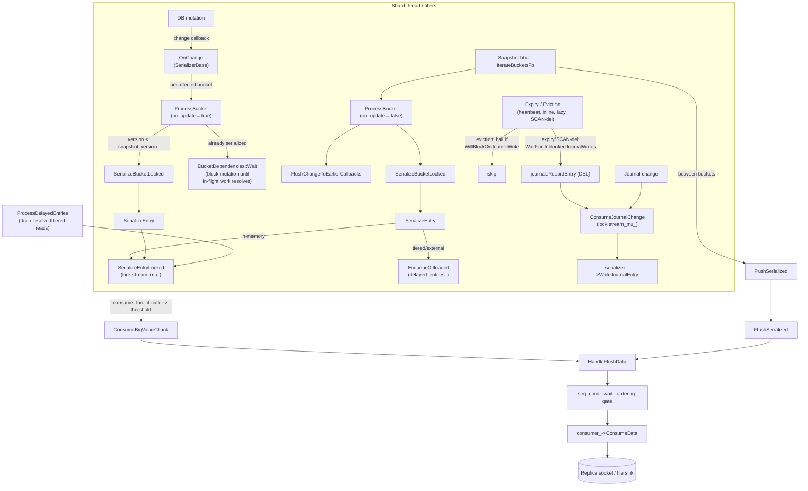
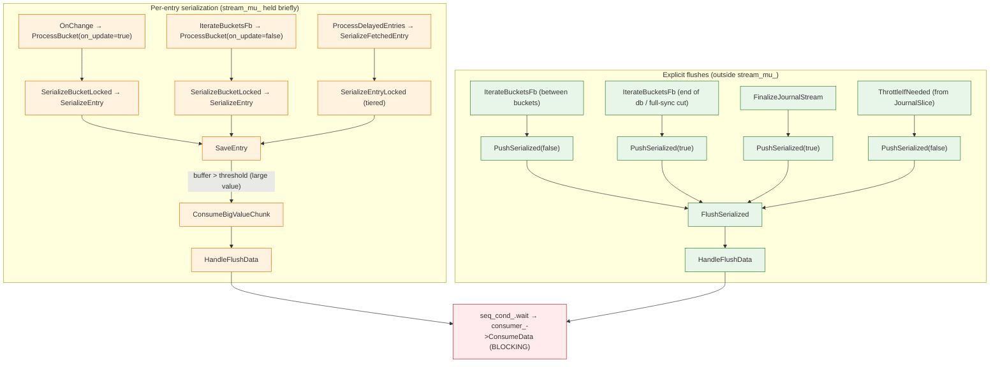

# Shard Serialization

This document describes how Dragonfly serializes a single shard's data. It covers the
point-in-time (PIT) snapshot mechanism, its correctness guarantees, and the machinery used to
coordinate concurrent mutations with the serialization process.

## Overview

Shard serialization is used for three purposes:

1. **Backups (RDB / DFS save)** — produces a consistent point-in-time snapshot.
2. **Replication (full sync)** — serializes baseline data and then streams journal changes.
3. **Slot migration** — `RestoreStreamer` serializes a subset of slots and streams changes.

All three share the same base class, **`SerializerBase`**, which owns the bucket traversal
coordination, point-in-time isolation via DashTable bucket versioning, the change-listener
callback, delayed (tiered) entry handling, and per-bucket dependency tracking. Concrete
subclasses implement only how a single bucket/entry is turned into bytes:

| Subclass | Location | Output format | Use case |
|----------|----------|---------------|----------|
| `SliceSnapshot` | `src/server/snapshot.{h,cc}` | RDB (`RdbSerializer`) | Backups + replication full sync |
| `RestoreStreamer` | `src/server/journal/streamer.h` | `RESTORE` commands (`CmdSerializer`) | Cluster slot migration |

> **Historical note.** Earlier revisions of this document described a `--point_in_time_snapshot`
> flag that toggled between a "PIT" mode and a "non-PIT" (eventual consistency) mode, the latter
> using an `OnMoved` callback and cursor-based `IsPositionSerialized` tracking. **That flag and
> the non-PIT mode no longer exist.** All snapshots now use bucket versioning. DashTable item
> displacement is handled for every snapshot through `CVCUponInsert` (see
> [Inserts and Item Displacement](#inserts-and-item-displacement)). The only remaining trace of
> "eventual consistency" is the `eventually_consistent_` flag, which now gates a *journal-omit
> optimization* rather than a separate serialization mode (see
> [Journal-Omit Optimization](#journal-omit-optimization)).

## Core Types

| Type | Location | Role |
|------|----------|------|
| `SerializerBase` | `src/server/serializer_base.h` | Shared base: traversal coordination, PIT isolation, change listener |
| `SliceSnapshot` | `src/server/snapshot.h` | RDB serialization of a shard |
| `RestoreStreamer` | `src/server/journal/streamer.h` | `RESTORE`-command serialization for slot migration |
| `RdbSerializer` | `src/server/rdb_save.h` | Serializes entries into RDB-format buffers |
| `SnapshotDataConsumerInterface` | `src/server/snapshot.h` | Downstream sink interface (socket or file) |
| `DbSlice::ChangeConsumerInterface` | `src/server/db_slice.h` | Change-listener interface implemented by `SerializerBase` |
| `BucketDependencies` | `src/server/serializer_base.h` | Per-bucket dependency counter for in-flight async work |
| `DelayedEntryHandler` | `src/server/serializer_base.h` | Owns delayed tiered entries, keyed by bucket |
| `ThreadLocalMutex` | `src/server/synchronization.h` | Fiber-aware mutex guarding the serializer buffer (`stream_mu_`) |
| `ChangeReq` | `src/server/table.h` | `PrimeTable::BucketSet` — the set of buckets about to be mutated |
| `BucketIdentity` | `src/server/serializer_base.h` | `uintptr_t` bucket address, stable bucket key |

## Data Flow Overview



## Point-in-Time Snapshot via Bucket Versioning

### Bucket Versioning

Dragonfly's `DashTable` ([dashtable.md](dashtable.md)) maintains a version counter per physical
bucket. The snapshot serializes all buckets with version `< snapshot_version_`.

- `snapshot_version_` is assigned in `DbSlice::RegisterOnChange` (= `NextVersion()`), when the
  `SerializerBase` registers itself as a change listener at `Start`.
- `ProcessBucket` stamps the bucket version to `snapshot_version_` *before* calling
  `SerializeBucketLocked`, ensuring each physical bucket is serialized exactly once.
- Mutations bump bucket versions, so a bucket mutated after the snapshot started has version
  `>= snapshot_version_` and is skipped by the traversal.
- Buckets not yet traversed but about to be mutated require **serialize-before-mutate**,
  enforced by the change-listener callback `OnChange` (see below).

### Ordering Invariant

> For any key, the replica must receive the baseline value **strictly before** any journal entry
> that mutates that key.

Two terms for journal changes:

- **Self-contained**: the journal entry fully determines the resulting logical state and can be
  replayed without the prior value (for example `SET`, `DEL`).
- **Baseline-dependent**: the journal entry describes a mutation of an existing value and requires
  the baseline state to be reconstructed first (for example `HSET`, `LPUSH`).

For **transaction-driven mutations** the invariant holds because:

1. `OnChange` runs before the mutation commits and serializes the affected buckets if needed.
2. The mutation, and its subsequent journal emission (`RecordJournal` → `ConsumeJournalChange`),
   run **after** `OnChange` returns, on the same fiber. So the baseline is serialized first.

Several code paths emit journal entries **without** going through `OnChange` — these are the
expiry/eviction/SCAN-delete deletions. They are handled separately; see
[Journal Ordering for Non-Transaction Deletes](#journal-ordering-for-non-transaction-deletes).

## The Change-Listener Path: `OnChange`

`SerializerBase` implements `DbSlice::ChangeConsumerInterface::OnChange`. The `DbSlice`
invokes it (via `CallChangeCallbacks`) right before a set of buckets is mutated, passing a
`ChangeReq` — which is simply a `PrimeTable::BucketSet`, the set of physical buckets the
mutation will touch.

```
OnChange(db_index, req)             // req is a PrimeTable::BucketSet
  for each bucket it in req.buckets():
    ProcessBucket(db_index, it, /*on_update=*/true)
```

`OnChange` always calls `ProcessBucket` for every affected bucket — even already-serialized ones —
so that any in-flight asynchronous serialization of those buckets is allowed to finish before the
mutation proceeds (see `BucketDependencies::Wait`).

### Inserts and Item Displacement

When inserting a new key, `DbSlice` computes the set of buckets the insert may touch — including
buckets into which existing items would be **displaced** by DashTable splitting/rehashing — using
`PrimeTable::CVCUponInsert(key)` (`src/core/dash.h`). That bucket set is passed to the change
callbacks before the insert commits:

```
// db_slice.cc, insert path
for (bool consistent = false; !consistent;) {
  auto bucket_set = db.prime.CVCUponInsert(key);
  if (omit_journal = IsOmittableWrite(cntx, bucket_set); omit_journal)
    break;                                  // see Journal-Omit Optimization
  CallChangeCallbacks(cntx.db_index, bucket_set);   // -> OnChange -> ProcessBucket
  consistent = (bucket_set == db.prime.CVCUponInsert(key));  // re-check; finite
}
```

This single mechanism replaces the separate `OnMoved` callback that older designs used for
"non-PIT" mode: an item that would jump across the traversal cursor is part of the affected
bucket set and is therefore serialized before the insert via `OnChange`.

## Traversal and Bucket Processing

### Traversal Fiber: `IterateBucketsFb`

```
IterateBucketsFb(send_full_sync_cut)         // snapshot.cc
  accumulate stats_.keys_total over all dbs
  for each database:
    while cursor not exhausted:
      cursor = pt->TraverseBuckets(cursor,
                   it -> ProcessBucket(db_index, it, /*on_update=*/false),
                   /*include empty buckets=*/true)
      PushSerialized(false)                  // explicit flush between buckets
      yield if background mode, or if CPU time > ~15us
    ProcessDelayedEntries(force=true, ...)   // drain outstanding tiered reads
    PushSerialized(true)                     // force-flush after each database
  if send_full_sync_cut:                     // replication only
    serializer_->SendFullSyncCut()
    PushSerialized(true)
```

### `ProcessBucket` (shared, both traversal and `OnChange`)

```
ProcessBucket(db_index, it, on_update):      // serializer_base.cc
  // Stale / already-serialized bucket:
  if it.is_done() || it.GetVersion() >= snapshot_version_:
    buckets_skipped++
    if it.GetVersion() < snapshot_version_:        // empty bucket: mark visited
      it.SetVersion(snapshot_version_)
    if tiered enabled && on_update:                // flush this bucket's delayed entries
      ProcessDelayedEntries(force=false, it.bucket_address(), cntx)
    BucketDependencies::Wait(it.bucket_address())  // block until in-flight work resolves
    return false

  // Traversal flow only: let earlier-registered snapshots serialize this bucket first.
  if !on_update:
    db_slice_->FlushChangeToEarlierCallbacks(db_index, it, snapshot_version_)
  if it.GetVersion() >= snapshot_version_:         // re-check (callbacks can preempt)
    return ProcessBucket(db_index, it, on_update)

  it.SetVersion(snapshot_version_)                 // stamp BEFORE serializing
  BucketDependencies::Increment(it.bucket_address())
  keys_serialized += SerializeBucketLocked(db_index, it, on_update)
  buckets_serialized++; buckets_on_change += on_update
  BucketDependencies::Decrement(it.bucket_address())

  if tiered enabled:
    ProcessDelayedEntries(force=false, on_update ? it.bucket_address() : 0, cntx)
  return true
```

The version check is the key PIT optimization: buckets already serialized by `OnChange` (or a
previous traversal visit) are skipped.

`FlushChangeToEarlierCallbacks` (`db_slice.cc`) exists because multiple snapshots can be
registered at once (e.g. a backup overlapping a replica full sync). When the current snapshot's
traversal reaches a bucket and is about to stamp it with `snapshot_version_`, any
earlier-registered snapshot (lower version) that has not yet serialized this bucket must do so
first — otherwise the version stamp would cause the earlier snapshot's traversal/callbacks to skip
it and miss the bucket entirely.

### `SerializeBucketLocked` and `SerializeEntry`

`SerializeBucketLocked` (implemented per subclass) iterates the occupied slots of a physical
bucket and calls the shared `SerializerBase::SerializeEntry` for each. The base sets the sanity
flag `serialize_bucket_running_` for the duration.

`SerializeEntry` (in `serializer_base.cc`) dispatches based on value location:

```
SerializeEntry(bucket, db_index, pk, pv):
  if pv is external && cool:           // cool tiered: recurse on the in-memory cool copy
    return SerializeEntry(bucket, db_index, pk, pv.GetCool().record->value)
  expire = pk.GetExpireTime(); mc_flags = ...
  if pv is external:                   // on-disk tiered: defer
    EnqueueOffloaded(bucket, db_index, key, pv, expire, mc_flags)
  else:                                // in-memory: serialize now
    lock_guard(stream_mu_)
    SerializeEntryLocked(db_index, pk, pv, expire, mc_flags)
```

`SerializeEntryLocked` (per subclass) is where the actual format-specific write happens — for
`SliceSnapshot` it calls `serializer_->SaveEntry(...)`, which may exceed the flush threshold and
trigger a mid-entry chunk flush (see [Flushing and Backpressure](#flushing-and-backpressure)).

> **Lock scope.** `stream_mu_` is taken **per entry** inside `SerializeEntry`, not held across an
> entire bucket (PR #7150 reduced the mutex scope). The buffer is therefore only locked while a
> single entry is being written or a chunk flushed.

## Delayed Serialization of Tiered Entries

Tiered (on-disk, external) string values are not read synchronously. `SerializeEntry` calls
`DelayedEntryHandler::EnqueueOffloaded`, which:

1. Issues an async tiered read (`ReadTieredString`) returning a `Future`.
2. Increments the bucket's dependency count (`BucketDependencies::Increment`).
3. Stores a `TieredDelayedEntry` in `delayed_entries_`, a
   **`std::multimap<BucketIdentity, unique_ptr<TieredDelayedEntry>>`** keyed by the originating
   bucket.

`ProcessDelayedEntries(force, flush_bucket, cntx)` drains entries:

- If `flush_bucket` is set, all entries for that bucket are extracted and serialized.
- Otherwise, entries whose futures are already resolved are serialized (or **all** entries if
  `force` is true, or if the queue exceeds `kMaxDelayedEntries == 512`).
- Each drained entry is serialized via `SerializeFetchedEntry` (which takes `stream_mu_` and calls
  `SerializeEntryLocked`), then its bucket dependency is decremented.

Because delayed entries are **keyed by bucket** and hold a `BucketDependencies` reference, a bucket
is not considered free of in-flight work until all its tiered reads have been serialized. This is
what makes the ordering invariant hold for tiered values: a mutation or deletion of a tiered key
is blocked (via `BucketDependencies::Wait` / `WaitForUnblockedJournalWrites`) until the key's
delayed baseline has been emitted.

> Both `SliceSnapshot` and `RestoreStreamer` use this same per-bucket `DelayedEntryHandler`. (An
> earlier design had `SliceSnapshot` use a global deque and `RestoreStreamer` a separate keyed
> map; they are now unified, fixing the ordering hazard tracked in PR #6824.)

## `BucketDependencies` — Per-Bucket In-Flight Work

`BucketDependencies` (`serializer_base.cc`) tracks asynchronous work that must complete before a
bucket can be considered fully serialized. Each tracked bucket holds a `shared_ptr<LocalLatch>`
whose lock count equals its outstanding dependencies (big-value chunk streaming, tiered reads).

```cpp
void Increment(BucketIdentity);   // counter->lock()
void Decrement(BucketIdentity);   // counter->unlock(); erase if zero; notify if map empty
void Wait(BucketIdentity) const;  // block until this bucket's dependencies resolve
void WaitEmpty() const;           // block until NO bucket has dependencies
bool HasAny() const;              // any bucket currently has dependencies?
```

`SerializerBase` exposes these to the `DbSlice` through the change-consumer interface:

- `IsAnyBucketBlocked()` → `BucketDependencies::HasAny()`
- `WaitForNoBucketBlocked()` → `BucketDependencies::WaitEmpty()`

This is the mechanism that makes mutations and deletions wait for in-progress (possibly
preempting) bucket serialization, replacing the older single `db_slice_->GetLatch()` /
`serialization_latch_`.

## Journal Path

### `ConsumeJournalChange`

```
ConsumeJournalChange(item):                  // snapshot.cc
  lock_guard(stream_mu_)
  LOG_IF(DFATAL, serialize_bucket_running_)  // interleaving not yet supported
  serializer_->WriteJournalEntry(item.journal_item.data)
  ++stats_.jounal_changes
```

Active only when streaming the journal (replication / migration). It acquires `stream_mu_` so the
journal write cannot interleave with an in-progress entry serialization that shares the same
`serializer_` buffer. It only appends to the buffer; flushing happens later via `ThrottleIfNeeded`
→ `PushSerialized(false)`, called by `JournalSlice` after the journal callback returns.

The `DFATAL` guard asserts that a journal write never lands in the middle of a bucket
serialization. This holds because the bucket being serialized has an outstanding
`BucketDependencies` entry, and the deletion/journal paths that could race are gated on it (next
section). The guard's comment notes it can be removed once the wire format supports interleaved
(tagged) chunks for journal vs bucket streams.

### Journal Ordering for Non-Transaction Deletes

Not every journal entry goes through `OnChange`. Expiry, eviction, and SCAN-based deletion call
`journal::RecordEntry` / `RecordDelete` directly:

| Source | Journal command | Trigger |
|--------|----------------|---------|
| `ExpireIfNeeded` (`db_slice.cc`) | `DEL` | Lazy expiry on lookup, active sweep (`DeleteExpiredStep`), heartbeat eviction |
| `PrimeEvictionPolicy::Evict` / `GarbageCollect` (`db_slice.cc`) | `DEL` | Inline eviction/GC when a bucket overflows on insert |
| `generic_family.cc` (SCAN-based deletion) | `DEL` | `RecordDelete` after `DbSlice::Del` |
| `dflycmd.cc`, `replica.cc`, `cluster_family.cc` | `PING` / `DFLYCLUSTER` | Control signals |

These bypass `OnChange`, so their baseline-before-journal ordering is enforced differently — via
the `BucketDependencies` state surfaced as `WillBlockOnJournalWrite()`:

- **Eviction & GC bail out.** `PrimeEvictionPolicy::Evict` and `GarbageCollect` return early
  (delete nothing) if `db_slice_->WillBlockOnJournalWrite()` is true — i.e. while any bucket is
  mid-serialization. So an inline eviction can never emit a `DEL` for a key whose baseline is
  partially written.
- **Expiry & SCAN-delete wait.** These paths call `DbSlice::WaitForUnblockedJournalWrites()`
  before deleting, which blocks until `WaitForNoBucketBlocked()` reports no bucket has
  outstanding dependencies.

```cpp
bool DbSlice::WillBlockOnJournalWrite() const {           // db_slice.cc
  return ranges::any_of(change_cb_, &ChangeConsumerInterface::IsAnyBucketBlocked);
}
void DbSlice::WaitForUnblockedJournalWrites() const {
  std::lock_guard lk{change_cb_latch_};
  while (WillBlockOnJournalWrite())
    ranges::for_each(change_cb_, &ChangeConsumerInterface::WaitForNoBucketBlocked);
}
```

This is the implemented replacement for the "deferred deletion queue" that older designs
proposed: rather than queueing a `DEL` and replaying it after the bucket completes, the deleter
waits for (or skips, for best-effort eviction) the in-flight serialization.

## Tagged Chunks

When a single value is large enough to be flushed across multiple scheduler turns, its chunks must
be distinguishable on the wire. The **tagged-chunk** wire format wraps such split entries so the
receiver can reassemble them.

- Enabled master-side via the `--serialization_tagged_chunks` flag, propagated to the serializer
  with `RdbSerializer::SetTagEntries(...)` in `SliceSnapshot::Start`.
- `RdbSerializer::PushToConsumerIfNeeded` calls `mem_buf_controller_.MarkEntrySplit()` on a
  `kFlushMidEntry` flush so the chunk is tagged; single-chunk entries are emitted unchanged (no
  overhead).
- The loader detects tagged chunks by the flag bit and reassembles transparently.

This format is currently used to allow a *single* large value to be split. The serializer buffer
is still **shared** between bucket serialization and journal entries (one `serializer_` per
`SliceSnapshot`); interleaving independent bucket and journal streams over tagged chunks is not
yet implemented (see [Remaining Work](#remaining-work)).

## Journal-Omit Optimization

For replica full sync, a write to a bucket the traversal **has not yet reached** is redundant: the
traversal will serialize the post-mutation value anyway. In that case Dragonfly can skip *both* the
serialize-before-mutate callback *and* the journal entry ("skip both").

`DbSlice::IsOmittableWrite` decides this:

```cpp
// db_slice.cc — omit a journal write when:
// 1. the command supports mutation hints and uses a single key (is_omittable_operation)
// 2. there is exactly one change consumer that is eventually_consistent_ (a replica full sync)
// 3. there is exactly one journal callback
// 4. the snapshot has not reached the bucket yet (max bucket version < snapshot_version_)
bool DbSlice::IsOmittableWrite(const Context& cntx, const ChangeReq& req) {
  if (!journal_omit_redundant_writes_) return false;
  if (cntx.is_omittable_operation && change_cb_.size() == 1) {
    uint64_t max_version = std::ranges::max(req.buckets(), {}, gv).GetVersion();
    auto* cb = change_cb_.front();
    return cb->eventually_consistent_ && max_version < cb->snapshot_version_ &&
           journal::GetCallbackCount() == 1;
  }
  return false;
}
```

When this returns true, the insert/update path skips `CallChangeCallbacks`/`PreUpdateBlocking`
(no serialize-before-mutate) and sets `omitted_journal` so the journal write is suppressed. This
is the only surviving role of the `eventually_consistent_` flag.

- Controlled by `--journal_omit_redundant_writes` (default: true).
- `is_omittable_operation` is currently set only by self-contained single-key writes
  (e.g. `SET` in `string_family.cc`). Baseline-dependent commands are not yet eligible.

## Flushing and Backpressure

### `HandleFlushData(std::string data)` — Common Blocking Sink

All serialized data ultimately flows through `HandleFlushData` (`snapshot.cc`):

1. If `stream_mu_.is_locked()`, increments `stats_.flushed_under_lock` (observability).
2. Assigns a monotonically increasing record ID (`rec_id_++`).
3. Optionally yields (background mode).
4. **Blocks** on `seq_cond_.wait` until `id == last_pushed_id_ + 1` (sequential ordering gate).
5. **Blocks** on `consumer_->ConsumeData(data, base_cntx_)` (downstream write).
6. Updates `last_pushed_id_`, notifies waiters via `seq_cond_.notify_all()`.
7. In non-background mode, sleeps up to 2ms proportional to CPU spent, to throttle.

### `ConsumeBigValueChunk(std::string data)`

The serializer's `consume_fun_` callback, bound in `Start`. On a mid-entry flush it checks for
cancellation/error, then forwards to `HandleFlushData` and bumps
`ServerState::stats.big_value_preemptions`.

### `FlushSerialized()`

Calls `serializer_->Flush(kFlushEndEntry)` to extract (and optionally compress) the buffer, then
passes the result to `HandleFlushData`.

### `PushSerialized(bool force)`

Skips if `!force` and `serializer_->SerializedLen() < kMinBlobSize` (8KB). Otherwise calls
`FlushSerialized()` to drain the serializer buffer. Returns whether it pushed.

### `RdbSerializer::PushToConsumerIfNeeded(FlushState flush_state)`

```cpp
std::error_code RdbSerializer::PushToConsumerIfNeeded(FlushState flush_state) {
  if (!consume_fun_ || SerializedLen() <= flush_threshold_)
    return {};
  if (flush_state == FlushState::kFlushMidEntry)
    mem_buf_controller_.MarkEntrySplit();           // tagged-chunk boundary
  string blob = Flush(flush_state);
  const auto id = mem_buf_controller_.SaveStateBeforeConsume();
  std::error_code ec = consume_fun_(std::move(blob));  // synchronous; may preempt
  mem_buf_controller_.RestoreStateAfterConsume(id);
  return ec;
}
```

Fires only when `consume_fun_` is set **and** the buffer exceeds `flush_threshold_`
(= `serialization_max_chunk_size`, when chunked flushing is allowed). For `SliceSnapshot` the
callback is `ConsumeBigValueChunk`.

## Locking and Synchronization

### `stream_mu_` (ThreadLocalMutex)

A `ThreadLocalMutex` (`src/server/synchronization.cc`) declared in `SerializerBase`. It guards the
shared `serializer_` buffer so two fibers cannot write to it concurrently, and so a journal write
cannot land mid-entry. It is taken **per entry** in `SerializeEntry`/`SerializeFetchedEntry` and
around the journal write in `ConsumeJournalChange`.

**Important:** `ThreadLocalMutex::lock()`/`unlock()` are **no-ops** when
`serialization_max_chunk_size == 0`. The mutex provides real mutual exclusion only when big-value
chunked flushing is enabled. When disabled, serialization never preempts mid-bucket and
correctness relies on cooperative scheduling.

| Path | Mode | Takes `stream_mu_` | Notes |
|------|------|--------------------|-------|
| `SerializeEntry` → `SerializeEntryLocked` | both | per entry | in-memory values |
| `SerializeFetchedEntry` | both | per delayed entry | tiered values |
| `ConsumeJournalChange` | replication/migration | per journal entry | DFATAL if mid-bucket |

### `BucketDependencies` (per-bucket `LocalLatch`)

Tracks in-flight async serialization per bucket (see
[`BucketDependencies`](#bucketdependencies--per-bucket-in-flight-work)). Replaces the old
shard-wide `GetLatch()` / `serialization_latch_`. Mutations and non-transaction deletes wait on it
before touching a bucket.

### `change_cb_latch_` (LocalLatch in `DbSlice`)

A non-preempting latch guarding the `change_cb_` consumer list. Held during `CallChangeCallbacks`,
`FlushChangeToEarlierCallbacks`, and `WaitForUnblockedJournalWrites` so the consumer set cannot
change underneath an iteration.

### `seq_cond_` (CondVarAny)

Condition variable in `HandleFlushData` ensuring records reach the consumer in `rec_id_` order. If
fiber A has `id=5` and fiber B `id=6`, B waits until A pushes and advances `last_pushed_id_` to 5.
Needed because fibers wake in arbitrary order and reordering flushed chunks would corrupt the wire
protocol.

## Code Paths That Reach `HandleFlushData`



`ConsumeJournalChange` does **not** reach `HandleFlushData` — it only appends to the serializer
buffer; the flush happens later from `ThrottleIfNeeded`/`PushSerialized`.

## Remaining Work

Much of what earlier revisions of this document listed as a roadmap is now implemented: bucket
completion tracking (`BucketDependencies` + versioning), per-bucket delayed tiered entries, the
tagged-chunk wire format, and the journal-omit optimization for self-contained single-key writes.
The following items remain open:

1. **Separate serializer per producer + interleaved tagged streams.** Bucket serialization and
   journal entries still share one `serializer_` buffer, and `ConsumeJournalChange` still asserts
   (`DFATAL`) that it never runs mid-bucket. Giving journal and bucket serialization independent
   serializers — and reassembling their interleaved tagged chunks on the consumer — would let the
   journal write without waiting on bucket serialization.

2. **Narrow / remove `stream_mu_`.** Once buffer exclusivity is provided by per-producer
   serializers, `stream_mu_` would no longer be needed for buffer exclusivity and could be
   narrowed or removed.

3. **Bandwidth-based pacing of the snapshot loop.** Backups and full sync can saturate outgoing
   network bandwidth, starving foreground client traffic. The only throughput-shaping the snapshot
   loop does today is **CPU-based**: in non-background mode `HandleFlushData` sleeps up to 2ms
   proportional to the CPU cycles just spent serializing/compressing, and background mode yields to
   lower-priority fibers. The remaining brake is consumer write backpressure (`ConsumeData`
   blocking on a full socket), which only engages once the link is *already* saturated. None of
   these caps the **bytes/sec** the snapshot emits.

   Add an explicit outgoing-bandwidth limiter: track bytes pushed over a rolling window (e.g. a
   token-bucket refilled at a configurable `--snapshot_max_bytes_per_sec` rate) and inject sleeps
   at the flush point (`HandleFlushData` / `PushSerialized`) to keep emission under the cap.
   Considerations:
   - **Per-shard vs. global budget.** Each shard runs its own snapshot fiber, so total egress is
     the sum across shards. The configured cap must be divided across shards (or coordinated via a
     shared shard-set rate limiter) rather than applied per-fiber.
   - **Compose with existing pacing,** not replace it: keep the CPU-proportional sleep and
     consumer backpressure; the bandwidth limiter is an additional upper bound.
   - **Account post-compression bytes** (what actually hits the wire), measured where the chunk is
     handed to `ConsumeData`.
   - Interaction with background mode and with the `seq_cond_` ordering gate (the sleep must not be
     held while blocking other producers behind the ordering gate).

4. **Broaden journal-omit eligibility.** `is_omittable_operation` is currently set only for
   self-contained single-key writes (e.g. `SET`). Extending "skip both" to a wider, individually
   validated set of self-contained commands — and eventually to baseline-dependent commands whose
   post-mutation value the traversal will capture — would further reduce full-sync journal traffic.
