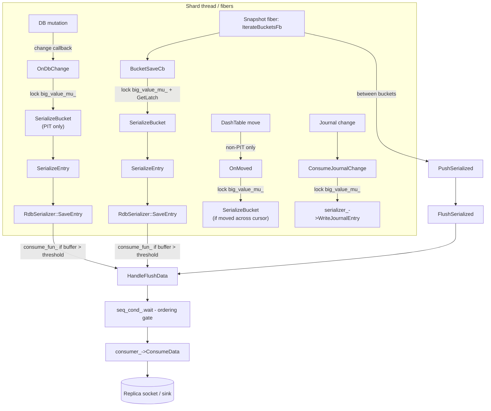
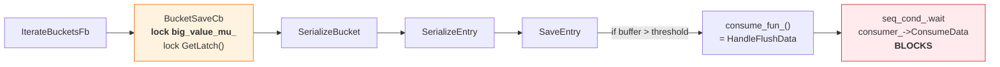
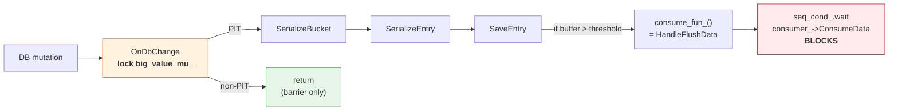
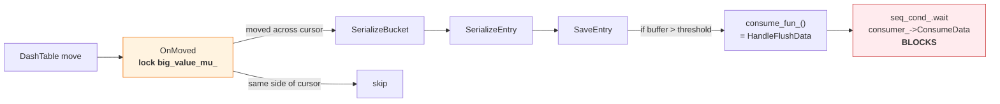
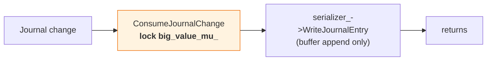
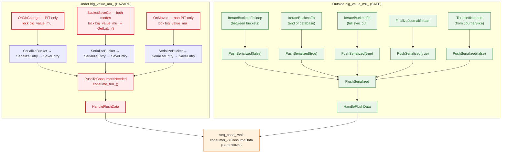

# Shard Serialization

This document describes how Dragonfly serializes a single shard's data via `SliceSnapshot`. It
covers both point-in-time (PIT) and non-PIT serialization modes, their correctness guarantees,
and the mechanisms used to coordinate concurrent mutations with the serialization process.

## Overview

Shard serialization is used for two purposes:

1. **Backups (RDB save)** — Must produce a consistent point-in-time snapshot. Always uses PIT mode.
2. **Replication (full sync)** — Serializes baseline data and then streams journal changes. Can
   use either PIT or non-PIT mode, controlled by the `--point_in_time_snapshot` flag (default: true).

Both modes share the same traversal infrastructure (`IterateBucketsFb` → `BucketSaveCb` →
`SerializeBucket` → `SerializeEntry`) and the same flushing/backpressure machinery
(`HandleFlushData` → `consumer_->ConsumeData`). They differ in **how they handle concurrent
mutations** during the traversal.

| | PIT mode | Non-PIT mode |
|---|----------|-------------|
| Flag | `use_snapshot_version_ == true` | `use_snapshot_version_ == false` |
| Used for | Backups and replication | Replication only |
| Consistency | Exact point-in-time snapshot | Eventual consistency (baseline + journal) |
| `OnDbChange` | Serializes bucket before mutation | Barrier only (no serialization) |
| `OnMoved` | Not registered | Handles DashTable item reshuffling |
| Bucket versioning | Yes — skip already-serialized buckets | No — serialize every bucket visited |
| Throughput | Lower (mutation path does serialization work) | Higher (mutation path only acquires mutex) |

## Core Types

| Type | Location | Role |
|------|----------|------|
| `SliceSnapshot` | `src/server/snapshot.h` | Orchestrates shard serialization |
| `RdbSerializer` | `src/server/rdb_save.h` | Serializes entries into RDB-format buffers |
| `SnapshotDataConsumerInterface` | `src/server/snapshot.h` | Downstream sink interface |
| `RdbSaver::Impl` | `src/server/rdb_save.cc` | Consumer impl: writes to socket or channel |
| `ThreadLocalMutex` | `src/server/synchronization.h` | Fiber-aware mutex for atomicity barrier |
| `ChangeReq` | `src/server/table.h` | Describes a table mutation (update or insert) |

## Data Flow Overview



## PIT Mode (Point-in-Time Snapshot)

PIT mode captures an exact snapshot of the shard at the logical moment `snapshot_version_` was
assigned. It is the default for both backups and replication.

### Bucket Versioning

Dragonfly's `DashTable` ([dashtable.md](dashtable.md)) maintains a version counter per physical
bucket. The snapshot must serialize all buckets with version `< snapshot_version_`.

- `SerializeBucket` sets the bucket version to `snapshot_version_`, ensuring each bucket is
  serialized exactly once.
- Mutations bump bucket versions, so buckets mutated after the snapshot started will have
  version `>= snapshot_version_` and are skipped by the traversal.
- Buckets not yet traversed but about to be mutated require **serialize-before-mutate**,
  enforced by `OnDbChange()`.

### Ordering Invariant

> For any key, the replica must receive the baseline value **strictly before** any journal entry
> that mutates that key.

This is guaranteed because:
1. `OnDbChange` runs before the mutation commits and serializes the bucket if needed.
2. `ConsumeJournalChange` acquires `big_value_mu_` as a barrier, so journal entries cannot be
   written while a bucket is being serialized.

### Mutation Path: `OnDbChange` (PIT)

```
OnDbChange(db_index, req)
  lock(big_value_mu_)
  if req is update (existing bucket):
    bit = *req.update()
    if !bit.is_done() && bit.GetVersion() < snapshot_version_:
      -> SerializeBucket(db_index, *bit)
  else (insert, new key):
    key = get<string_view>(req.change)
    -> table->CVCUponInsert(snapshot_version_, key, callback)
         callback(bucket_iterator):
           -> SerializeBucket(db_index, it)
  unlock(big_value_mu_)
```

For updates, `ChangeReq::update()` returns a `PrimeTable::bucket_iterator`. If the bucket has not
been serialized yet (version `< snapshot_version_`), it is serialized now.

For inserts, `CVCUponInsert` (`src/core/dash.h`) simulates the insert to identify which buckets'
versions would change, and serializes each one with version `< snapshot_version_` via the callback.

### Traversal Path: `BucketSaveCb` (PIT)

```
BucketSaveCb(db_index, bucket_iterator)
  lock(big_value_mu_)
  if bucket version >= snapshot_version_:
    skip (already serialized by OnDbChange or a previous visit)
  FlushChangeToEarlierCallbacks(...)
  lock(*db_slice_->GetLatch())
  -> SerializeBucket(db_index, bucket_iterator)
       set bucket version = snapshot_version_
       for each occupied slot:
         -> SerializeEntry -> SaveEntry -> PushToConsumerIfNeeded
```

The version check is the key optimization: buckets already serialized by `OnDbChange` are skipped.

## Non-PIT Mode (Eventual Consistency)

Non-PIT mode is available **only for replication** (`stream_journal == true`) and is enabled by
setting `--point_in_time_snapshot=false`. It improves server throughput during full sync by
eliminating serialization work from the mutation path.

### Design Rationale

A replica does not need an exact point-in-time snapshot. It needs to reach eventual consistency:
after the full sync baseline is delivered and the journal stream catches up, the replica's state
must match the master's current state. This weaker guarantee allows the snapshot to be "fuzzy" —
it may include some mutations that happened after the snapshot started and miss others, as long as
the journal stream fills in the gaps.

### How It Differs from PIT

**`OnDbChange` does no serialization.** In non-PIT mode, the `if (use_snapshot_version_)` block
is skipped entirely. `OnDbChange` only acquires `big_value_mu_` and returns immediately. This
serves as a **barrier** — it prevents mutations from modifying a bucket while it is being
serialized by the traversal fiber — but it does not serialize anything itself.

**No bucket version tracking.** `SerializeBucket` does not set the bucket version. `BucketSaveCb`
does not check or skip based on version. Every bucket visited by the traversal is serialized
unconditionally.

**`OnMoved` handles DashTable reshuffling.** When items are inserted into DashTable, existing items
may be moved between buckets (due to hash table splitting/merging). In PIT mode this is handled by
`OnDbChange` + bucket versioning. In non-PIT mode, since `OnDbChange` does no serialization, a
separate `OnMoved` callback is needed to catch items that "jump" across the traversal cursor:

```
OnMoved(db_index, items)
  lock(big_value_mu_)
  for each (source_cursor, dest_cursor) in items:
    if IsPositionSerialized(dest_cursor) && !IsPositionSerialized(source_cursor):
      -> SerializeBucket(db_index, CursorToBucketIt(dest))
```

An item needs re-serialization when it moves **from** a not-yet-visited bucket **to** an
already-visited bucket. Without this, the item would be missed entirely: the traversal already
passed the destination, and the source bucket still has the item removed.

### `IsPositionSerialized` — Cursor-Based Position Tracking

```cpp
bool IsPositionSerialized(DbIndex id, PrimeTable::Cursor cursor) {
  uint8_t depth = db_slice_->GetTables(id).first->depth();
  return id < snapshot_db_index_ ||
         (id == snapshot_db_index_ &&
          (cursor.bucket_id() < snapshot_cursor_.bucket_id() ||
           (cursor.bucket_id() == snapshot_cursor_.bucket_id() &&
            cursor.segment_id(depth) < snapshot_cursor_.segment_id(depth))));
}
```

Compares a cursor position against the current traversal position (`snapshot_cursor_`,
`snapshot_db_index_`). A position is "serialized" if it is behind the cursor — i.e., the
traversal has already visited it.

### Traversal Path: `BucketSaveCb` (Non-PIT)

```
BucketSaveCb(db_index, bucket_iterator)
  lock(big_value_mu_)
  // no version check — serialize every bucket unconditionally
  lock(*db_slice_->GetLatch())
  -> SerializeBucket(db_index, bucket_iterator)
       // no version update
       for each occupied slot:
         -> SerializeEntry -> SaveEntry -> PushToConsumerIfNeeded
```

### Correctness in Non-PIT Mode

Non-PIT mode guarantees:
- Every key that existed when the traversal started and was not deleted before being visited will
  be serialized at least once (by the traversal or by `OnMoved`).
- Keys inserted after the traversal started will appear in the journal stream.
- Keys may be serialized in a state newer than the snapshot start (since mutations are not blocked
  by `OnDbChange` serialization, only by the mutex barrier).
- The journal stream, combined with the baseline, produces an eventually consistent replica.

What it does **not** guarantee:
- Point-in-time consistency. The serialized baseline is a "fuzzy" view spanning the traversal
  duration.

## Shared Infrastructure

The following sections apply to both PIT and non-PIT modes.

### Traversal: `IterateBucketsFb`

```
IterateBucketsFb(send_full_sync_cut)
  for each database:
    for each logical bucket via PrimeTable::TraverseBuckets():
      -> BucketSaveCb(db_index, bucket_iterator)
      PushSerialized(false)  // explicit flush between buckets
      yield if CPU time > ~15us
    PushSerialized(true)     // force-flush after each database
  if send_full_sync_cut:
    serializer_->SendFullSyncCut()
    PushSerialized(true)
```

### Serialization: `SerializeBucket` and `SerializeEntry`

`SerializeBucket` iterates all occupied slots in a physical bucket and calls `SerializeEntry` for
each. `SerializeEntry` looks up expiry and memcache flags, then calls
`serializer_->SaveEntry(pk, pv, expire_time, mc_flags, db_index)`.

### Journal Path: `ConsumeJournalChange`

```
ConsumeJournalChange(item)
  lock(big_value_mu_)
  serializer_->WriteJournalEntry(item.journal_item.data)
  unlock(big_value_mu_)
```

Active in both modes when `stream_journal == true`. Acquires `big_value_mu_` to ensure journal
entries are not interleaved with bucket serialization. Does **not** flush data — only appends to
the serializer buffer. Flushing happens later via `ThrottleIfNeeded` → `PushSerialized(false)`,
called from `JournalSlice` after the journal callback returns.

### Flushing and Backpressure

#### `HandleFlushData(std::string data)` — Common Blocking Sink

All serialized data ultimately flows through `HandleFlushData`:

1. Assigns monotonically increasing record ID (`rec_id_++`).
2. Optionally yields (background mode).
3. **Blocks** on `seq_cond_.wait` until `id == last_pushed_id_ + 1` (sequential ordering).
4. **Blocks** on `consumer_->ConsumeData(data, cntx_)` (downstream write).
5. Updates `last_pushed_id_`, notifies waiters via `seq_cond_.notify_all()`.
6. Optionally sleeps to throttle CPU (non-background mode, up to 2ms proportional to CPU spent).

#### `FlushSerialized(RdbSerializer* serializer)`

Calls `serializer->Flush(kFlushEndEntry)` to extract and optionally compress the buffer, then
passes the result to `HandleFlushData`. Uses the main `serializer_` if no argument is given.

#### `PushSerialized(bool force)`

Skips if `!force` and `serializer_->SerializedLen() < kMinBlobSize` (8KB). Otherwise calls
`FlushSerialized()` to drain the main serializer buffer.

#### `RdbSerializer::PushToConsumerIfNeeded(FlushState flush_state)`

```cpp
void RdbSerializer::PushToConsumerIfNeeded(SerializerBase::FlushState flush_state) {
  if (consume_fun_ && SerializedLen() > flush_threshold_) {
    string blob = Flush(flush_state);
    consume_fun_(std::move(blob));  // synchronous!
  }
}
```

Only fires when `consume_fun_` is set **and** the buffer exceeds `flush_threshold_`. When it
fires, it **synchronously** invokes the callback, which for `SliceSnapshot` is `HandleFlushData`.

## All Code Paths That Acquire `big_value_mu_`

Currently there are **five** call sites in `snapshot.cc` that lock `big_value_mu_`. The diagrams
below show the complete call chain from lock acquisition to potential blocking points.

### Path 1: `BucketSaveCb` (traversal fiber, both modes)



### Path 2: `OnDbChange` (mutation fiber, PIT only)



### Path 3: `OnMoved` (non-PIT only)



### Path 4: `ConsumeJournalChange` (journal callback, both modes)



This path does **not** reach `HandleFlushData`. It only appends to the serializer buffer.

## All Code Paths That Reach `HandleFlushData`



## Locking and Synchronization

### `big_value_mu_` (ThreadLocalMutex)

A `ThreadLocalMutex` (`src/server/synchronization.cc`) serving as the primary synchronization
barrier.

**Important:** `ThreadLocalMutex::lock()` and `unlock()` are **no-ops** when
`serialization_max_chunk_size == 0`. This means `big_value_mu_` only provides actual
synchronization when big-value streaming is enabled. When it is disabled, all `lock_guard`
calls on this mutex are effectively free, and the system relies on cooperative scheduling
(no preemption during serialization) for correctness.

Its role differs by mode:

**PIT mode:** Prevents mutations from modifying a bucket while it is being serialized, and
prevents journal entries from being written during bucket serialization. This enforces both
serialize-before-mutate and the ordering invariant.

**Non-PIT mode:** Prevents mutations from modifying a bucket while `BucketSaveCb` is serializing
it (data consistency within a single bucket). Also serves as a barrier for `ConsumeJournalChange`
and `OnMoved`.

| Path | Mode | Lock held | Additional locks |
|------|------|-----------|-----------------|
| `BucketSaveCb` | Both | `big_value_mu_` | `GetLatch()` |
| `OnDbChange` | Both | `big_value_mu_` | none |
| `OnMoved` | Non-PIT | `big_value_mu_` | none |
| `ConsumeJournalChange` | Both | `big_value_mu_` | none |

### `GetLatch()` (LocalLatch)

Acquired by `BucketSaveCb` in addition to `big_value_mu_`. This is a non-preempting latch
(`src/server/synchronization.h`) that increments a blocking counter, preventing `Heartbeat()`
from running if `SerializeBucket` preempts (e.g., during large value serialization).

### `seq_cond_` (CondVarAny)

Condition variable used in `HandleFlushData` to ensure records are pushed to the consumer
in sequential order of their `rec_id_`. If fiber A has `id=5` and fiber B has `id=6`, B waits
until A finishes pushing and updates `last_pushed_id_` to 5.

## Hazard Analysis

### Blocking Under `big_value_mu_`

When `consume_fun_` is enabled, `SaveEntry` can synchronously invoke `HandleFlushData` while
`big_value_mu_` is held. `HandleFlushData` blocks in two places:

1. **`seq_cond_.wait`** — Waiting for earlier records to be pushed first.
2. **`consumer_->ConsumeData`** — Downstream backpressure (socket write, channel full).

Since `big_value_mu_` is held by the caller, this stalls all other users of the mutex: the
traversal fiber, the mutation path, journal writes, and `OnMoved`.

`ThreadLocalMutex` is fiber-aware (yields on contention rather than deadlocking), so this
manifests as a **shard-wide stall** rather than a deadlock.

This hazard applies to **both modes** (it can be triggered from `BucketSaveCb` in either mode,
from `OnDbChange` in PIT mode, and from `OnMoved` in non-PIT mode).

### When the Hazard Triggers

`PushToConsumerIfNeeded` only fires when both:
- `consume_fun_` is set (requires `SnapshotFlush::kAllow` passed to `Start()` **and**
  `serialization_max_chunk_size > 0`).
- `SerializedLen() > flush_threshold_` (enough data accumulated in the serializer buffer).

### CPU-Heavy Serialization

Even without I/O blocking, serializing large containers (listpack, quicklist, string maps) under
`big_value_mu_` can consume a large CPU time slice, increasing tail latency for other fibers on
the shard thread. In PIT mode this happens on both the traversal and mutation paths; in non-PIT
mode it happens only on the traversal path (and rarely in `OnMoved`).

## Open Questions and Potential Improvements

The overarching goal is to **reduce fragility and complexity** of the current design while
preserving two hard constraints:
- **Backpressure must be maintained.** A slow consumer must slow down the producer; we cannot
  buffer unboundedly.
- **Bounded serialization memory.** The intermediate buffers used during serialization must not
  grow proportionally to the dataset size.

### 1. Can we order journal updates without `big_value_mu_`?

Today `ConsumeJournalChange` acquires `big_value_mu_` to prevent journal entries from interleaving
with bucket serialization. The ordering invariant is at the **key** level: for any key K, the
replica must see K's baseline value before any journal entry that mutates K.

The journal operates at the command/key level — it knows nothing about buckets. The concern is:

1. The traversal fiber (`BucketSaveCb`) is mid-way through serializing a bucket that contains
   key K.
2. Concurrently, a mutation on key K fires `OnDbChange` (which is a no-op since the bucket is
   already being serialized / already versioned) followed by `ConsumeJournalChange`.
3. Without the mutex, the journal entry for K could be appended to the serializer buffer
   **before** the traversal finishes writing K's baseline value from the same bucket.

The mutex prevents this by blocking `ConsumeJournalChange` until `SerializeBucket` completes.

Possible approaches to decouple journal ordering from `big_value_mu_`:

- **Separate journal serializer with sequence-number ordering.** Use a distinct `RdbSerializer`
  for journal entries so they don't share a buffer with bucket data. Assign journal entries
  `rec_id_` values via `HandleFlushData`. As long as a journal entry's `rec_id_` is assigned
  after the `rec_id_` of the bucket containing the affected key, the existing ordering gate
  (`seq_cond_`) ensures correct delivery order. The challenge is knowing *when* it is safe to
  assign the journal entry's `rec_id_` — the journal entry is per-key but the serializer
  produces records per-bucket.
- **Rely on callback ordering within a transaction.** `OnDbChange` and `ConsumeJournalChange`
  for the same transaction run sequentially on the shard thread. The race is only with the
  traversal fiber. If bucket serialization were made non-preemptible (or if the journal entry
  were deferred until the current bucket completes), the mutex would be unnecessary for this
  purpose.

### 2. Can we serialize big values without holding `big_value_mu_`?

Today the entire `SerializeBucket` call (which may iterate many entries, including large
containers) runs under `big_value_mu_`. For large values, `SaveEntry` can trigger `consume_fun_`
which blocks in `HandleFlushData` — all while holding the mutex.

The fundamental issue is that `big_value_mu_` protects two things simultaneously:
1. **Bucket atomicity** — the bucket must not be mutated while we iterate its entries.
2. **Serializer buffer exclusivity** — the shared `serializer_` must not be written to by
   multiple fibers concurrently.

Naive approaches like "copy then serialize outside the lock" or "serialize into a separate buffer
under the lock" don't solve the core problem: a single large value (e.g., a 1GB set) can produce
gigabytes of serialized data. Buffering it all before flushing violates the bounded-memory
constraint; flushing it synchronously under the lock is the current hazard.

#### Proposed: Chunked Serialization with Interleaved Channel

The key insight is that the serializer already supports mid-entry flushing (`kFlushMidEntry`) —
large containers are serialized element-by-element, with `PushToConsumerIfNeeded` called between
elements. The problem is that today these flushes go through `consume_fun_` → `HandleFlushData`
→ `consumer_->ConsumeData` synchronously, blocking under the lock.

Instead, we can extend the wire format to support **tagged chunks** that can be interleaved in
the output channel:

1. **Tag each chunk with a stream ID.** When serializing a large value, each mid-entry flush
   produces a chunk tagged with a stream identifier (e.g., a monotonic counter). The consumer
   knows that all chunks with the same stream ID form a contiguous byte sequence and must be
   concatenated before decoding.

2. **Each tagged chunk is serialized atomically but can be interleaved with other chunks.**
   The mutex is held only for the duration of producing one chunk (a bounded amount of data,
   e.g., one element or a few KB of serialized output). Between chunks, the lock is released,
   allowing other producers (journal entries, traversal, other mutations) to append their own
   chunks to the channel. The channel carries interleaved chunks from different streams — the
   consumer reassembles each stream by its tag.

3. **Backpressure happens between chunks, outside the lock.** After releasing the mutex and
   before acquiring it for the next chunk, the serializer can block on downstream backpressure
   (bounded channel, slow socket). This is safe because the lock is not held. The memory used
   for serialization is bounded by the chunk size, not by the total value size.

4. **Journal entries are single-chunk streams.** For now we assume a journal entry is small enough
to be produced as one atomic chunk with its own stream tag, interleaved freely with bucket data chunks.

**Compatibility.** This requires a wire format extension — the replica must understand chunk
tags. This could be gated behind a `DflyVersion` check, falling back to the current behavior
for older replicas. The RDB save path (which doesn't interleave) would not need chunking.

```
Current flow (under big_value_mu_):
  SaveEntry → PushToConsumerIfNeeded → consume_fun_ → HandleFlushData → BLOCKS

Proposed flow:
  SaveEntry → PushToConsumerIfNeeded → enqueue tagged chunk → returns immediately
  ...
  [flush fiber, outside lock] → dequeue chunk → HandleFlushData → consumer_->ConsumeData
```

### 3. What are the other blockers to removing `big_value_mu_`?

All snapshot operations run on the **same shard thread** using cooperative (fiber-based)
scheduling. Fibers only preempt at explicit yield points — there is no OS-level preemption.
This means "concurrent" really means "interleaved at preemption points".

The mutex is needed today primarily because serialization **can** preempt — either via
`consume_fun_` → `HandleFlushData` (which blocks on downstream I/O) or via explicit yields.
When the serializer preempts mid-bucket, another fiber (mutation callback, journal callback)
can run and access the same shared state. If we eliminate preemption during serialization
(e.g., via the chunked approach above where the lock is held only for non-preempting atomic
chunks), most of the mutex's roles become unnecessary:

- **Traversal vs. mutation atomicity (PIT mode).** `OnDbChange` and `BucketSaveCb` both call
  `SerializeBucket`, but in PIT mode bucket versioning already provides logical mutual exclusion
  — only one can "win" the version check and actually serialize. The mutex is needed today
  because `SerializeBucket` can preempt mid-iteration (via `consume_fun_`), allowing the other
  fiber to run and see a partially-iterated bucket. With chunked serialization that does not
  preempt under the lock, the version check alone is sufficient to prevent double-serialization,
  and bucket contents remain stable throughout the non-preempting chunk.

- **Traversal vs. mutation atomicity (non-PIT mode).** `OnDbChange` is barrier-only and
  `OnMoved` does serialize, but both are triggered from the mutation fiber. Since serialization
  in `BucketSaveCb` runs on the traversal fiber, they can only interleave at preemption points.
  If `SerializeBucket` does not preempt, `OnMoved` cannot run mid-iteration, and the cursor
  position (`snapshot_cursor_`) is stable throughout.

- **Shared serializer buffer.** Multiple paths write to the same `serializer_` instance, but
  since they are all on the same thread, actual concurrent writes only happen if one path
  preempts mid-write and another runs. Without preemption during buffer writes, no corruption
  is possible. With chunked serialization (separate serializer per chunk, or non-preempting
  writes), this is naturally satisfied.

- **`rec_id_` ordering can be eliminated.** The `rec_id_` + `seq_cond_` mechanism exists because
  today `HandleFlushData` preempts (on `seq_cond_.wait` and `consumer_->ConsumeData`), allowing
  another fiber to enter, get a later `rec_id_`, and potentially finish first — hence the need
  for an ordering gate. With chunked serialization, chunk production is non-preempting, so
  appending a chunk to a FIFO channel is atomic. The append order naturally reflects the correct
  logical order (baseline before journal, bucket entries in traversal order). A single drain
  fiber reads the channel in FIFO order and pushes to the consumer. No `rec_id_`, no
  `seq_cond_`, no ordering gate — just a simple producer-consumer channel.

**In summary:** `big_value_mu_` exists primarily to guard against re-entrancy caused by
preemption during serialization. If serialization chunks are made non-preempting (bounded CPU
work, no I/O, no blocking), the mutex can be replaced by simpler, more targeted mechanisms —
or potentially removed entirely, relying on cooperative scheduling guarantees and bucket
versioning for correctness.
