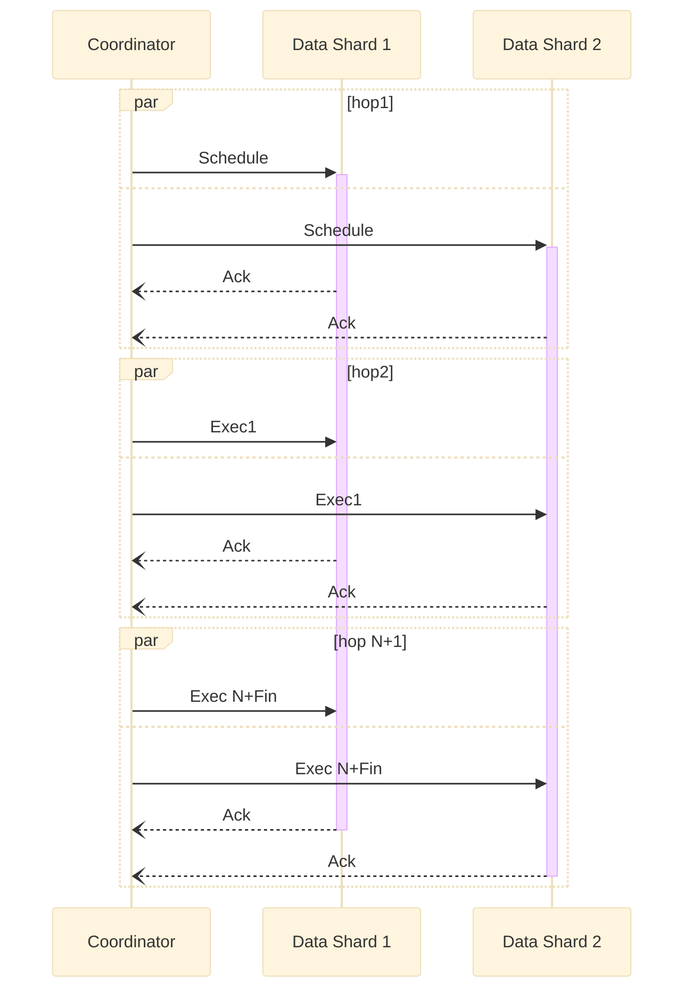

# Life of a transaction

This document describes how Dragonfly transactions provide atomicity and serializability for its multi-key and multi-command operations.

## Definitions

### Serializability

Serializability is an isolation level for database transactions. Serializability describes multiple transactions, where a transaction is usually composed of multiple operations on multiple objects.

Database can executed transactions in parallel (and the operations in parallel). Serializability guarantees the result is the same with, as if the transactions were executed one by one. i.e. to behave like executed in a serial order.

Serializability doesn’t guarantee the resulting serial order respects recency. I.e. the serial order can be different from the order in which transactions were actually executed. E.g. Tx1 begins earlier than Tx2, but the result behaves as if Tx2 executed before Tx1. That is also to say, to satisfy the same Serializability, there can be more than one possible execution schedulings.

### Strict Serializability

Strict serializability means that operations appear to have occurred in some order, consistent with the real-time ordering of those operations; e.g. if operation A completes before operation B begins, then A should appear to precede B in the serialization order.

Strict serializability implies atomicity meaning, a transaction’s sub-operations do not appear to interleave with sub-operations from other transactions. It also implies serializability
by definition (appear in some order...).

Note that simple, single-key operations in Dragonfly are already strictly serializable because in a shared-nothing architecture each shard-thread performs operations on its keys sequentially.
The complexity rises when we need to provide strict-serializability (aka serializability and linearizability) for operations spawning multiple keys.

## Transactions high level overview
Transactions in Dragonfly are orchestrated by an abstract entity, called coordination layer.
In reality, a client connection instance takes on itself the role of a coordinator: it coordinates a transaction every time it drives a redis or memcached command to completion. The algorithm behind Dragonfly transactions is based on the [VLL paper](https://www.cs.umd.edu/~abadi/papers/vldbj-vll.pdf).

Every step within a coordinator is done sequentially. Therefore, it's easier to describe the flow using a sequence diagram. Below is a sequence diagram of a generic transaction consisting of multiple execution steps. In this diagram, the operation it executes touches keys in two different shards: `Shard1` and `Shard2`.



The shared-nothing architecture of Dragonfly does not allow accessing each shard data directly from a coordinator fiber. Instead, the coordinator sends messages to the shards and instructs them what to do at each step. Every time, the coordinator sends a message, it blocks until it gets an answer. We call such interaction a *message hop* or a *hop* in short.

The flow consists of two different phases: *scheduling* a transaction, and *executing* it. The execution phase may consist of one or more hops, depending on the complexity of the operation we model.

*Note, that only the coordinator fiber is blocked. Its thread can still execute other fibers - like processing requests on other connections or handling operations for the shard it owns. This is the advantage of adopting fibers - they allow us to separate the execution context from OS threads.*

## Scheduling a transaction

The transaction initiates with a scheduling hop, during which the coordinator sends to each shard the keys that shards handle. The coordinator sends messages to multiple shards asynchronously but it waits until all shards ack and confirm that the scheduling succeeded before it proceeds to the next steps.

When the scheduling message is processed by a data shard, it adds the transaction to its local transaction queue (tx-queue). In order to provide serializability, i.e. to make sure that all shards order their scheduled transactions in the same order, Dragonfly maintains a global sequence counter that is used to induce a total order for all its transactions.

This global counter is shared by all coordinator entities and is represented by an atomic integer. *This counter may be a source of contention - it breaks the shared nothing model, after all. However, in practice, we have not observed a significant impact on Dragonfly performance due to other optimizations we added. These will be detailed in the [Optimization](#optimizations) section below.

Transactions in tx-queue in each shard are arranged by their sequence counter.

As shown in the snippet below, a shard thread may receive transactions in a different sequence, so a transaction with a smaller id can be added to the tx-queue after a transaction with a larger id. If the scheduling algorithm running on the data shard, can not reorder the last added transaction, it fails the scheduling request. In that case, the coordinator reverts the scheduling operation by removing the tx from the shards, and retries the whole hop again by allocating a new sequence number. In reality the fail-rate of a scheduling attempt is low and the retries are rare (subject to contention on the keys). Note, inconsistent reordering happens when two coordinators try to schedule multi-shard transactions concurrently:

```
C1: enqueue msg to Shard1 to schedule T1
C2: enqueue msg to Shard1 to schedule T2  # enqueued earlier than C1

C1: enqueue msg to Shard2 to schedule T1
C2: enqueue msg to Shard2 to schedule T2 # enqueued later than C1

shard1: pull T2, add it to TxQueue, pull T1, add it to TxQueue
shard2: pull T1, add it to TxQueue, pull T2, add it to TxQueue

TxQueue1: T2, T1  # wrong order
TxQueue2: T1, T2
```


Once the transaction is added to the tx-queue, the shard also marks the tx-keys using the *intent* locks. Those locks do not block the flow of the underlying operation but merely express the intent to touch or modify the key. In reality, they are represented by a map: `lock:str->counter`. If `lock[key] == 2` it means the tx-queue has 2 pending transactions that plan to modify `key`. These intent locks are used for optimizations detailed below and are not required to implement the naive version of VLL algorithm.

Once the scheduling hops converges, it means that the transaction entered the execution phase, in which it never rollbacks, or retries. Once it's been scheduled, VLL guarantees the progress of subsequent execution operations while providing strict-serializability guarantees.

It's important to note that a scheduled transaction does not hold exclusivity on its keys. There could be other transactions that still mutate the keys it touches - these transactions were scheduled earlier and have not finished running yet, or even have not even started running.

## Executing a transaction

Once the transaction is scheduled, the coordinator starts sending the execution messages. We break each command to one or more micro-ops and each operation corresponds to a single message hop.

For example, "MSET" corresponds to a single micro-op "mset" that has the same semantics, but runs in parallel on all the involved shards.

However, "RENAME" requires two micro-ops: fetching the data from two keys, and then the second hop - deleting/writing a key (depending whether the key is a source or a destination).

Once a coordinator sends the micro-op request to all the shards, it waits for an answer. Only when all shards executed the micro-op and return the result, the coordinator is unblocked and it can proceed to the next hop. The coordinator is allowed to process the intermediary responses from the previous hops in order to define the next execution request.

When a coordinator sends an execution request to data shards, it also specifies whether
this execution is the last hop for that command. This is necessary, so that shards could do clean-up operations when running the last execution request: unlocking the keys and removing the transaction from the tx-queue.

The shards always execute transactions at the head of the tx-queue. When the last execution hop for that transaction is executed the transaction is removed from the queue and the next one can be executed. This way we maintain the ordering guarantees specified by the scheduling order of the transactions and we maintain
the serializability of operations across multiple shards.

## Multi-op transactions (Redis transactions)

Redis transactions (MULTI/EXEC sequences) and commands produced by Lua scripts are modelled as consecutive commands within a Dragonfly transaction. In order to avoid ambiguity with terms, we call a Redis transaction - a multi-transaction in Dragonfly.

The multi feature of the transactional framework allows running consecutive commands without rescheduling the transaction for each command as if they are part of one single transaction. This feature is transparent to the commands itself, so no changes are required for them to be used in a multi-transaction.

There are three modes called "multi modes" in which a multi transaction can be executed, each with its own benefits and drawbacks.

__1. Global mode__

The transaction is equivalent to a global transaction with multiple hops. It is scheduled globally and the commands are executed as a series of consequitive hops. This mode is required for global commands (like MOVE) and for accessing undeclared keys in Lua scripts. Otherwise, it should be avoided, because it prevents Dragonfly from running concurrently and thus greatly decreases throughput.

__2. Lock ahead mode__

The transaction is equivalent to a regular transaction with multiple hops. It is scheduled on all keys used by the commands in the transaction block, or Lua script, and the commands are executed as a series of consecutive hops.

__3. Non atomic mode__

All commands are executed as separate transactions making the multi-transaction not atomic. It vastly improves the throughput with contended keys, as locks are acquired only for single commands. This mode is useful for Lua scripts without atomicity requirements.

## Multi-op command squashing

There are two fundamental problems to executing a series of consecutive commands on Dragonfly:
* each command invocation requires an expensive hop
* executing commands sequentially makes no use of our multi-threaded architecture

Luckily we can make one important observation about command sequences. Given a sequence of commands _where each command needs to access only a single shard_, we can conclude that as long as they are part of one atomic transaction:
* each command needs to preserve its order only relative to other commands accessing the same shard
* commands accessing different shards can run in parallel

The basic idea behind command squashing is identifying consecutive series of single-shard commands and separating them by shards, while maintaing their relative order withing each shard. Once the commands are separated, we can execute a single hop on all relevant shards. Within each shard the hop callback will execute one by one only those commands, that assigned to its respective shard. Because all commands are already placed on their relevant threads, no further hops are required and all command callbacks are executed inline.

Reviewing our initial problems, command squashing:
* Allows executing many commands with only one hop
* Allows executing commands in pararllel

## Optimizations
Out of order transactions - TBD

## Blocking commands (BLPOP)

Redis has a rich api with around 200 commands. Few of those commands provide blocking semantics, which allow using Redis as publisher/subscriber broker.

Redis (when running as a single node) is famously single threaded, and all its operations are strictly serializable. In order to build a multi-threaded memory store with the equivalent semantics as Redis, we had to design an algorithm that can parallelize potentially blocking operations and still provide strict serializability guarantees. This section focuses mainly on how to solve this challenge for BLPOP (BRPOP) command since it involves coordinating multiple keys and is considered the more complicated case. Other blocking commands can benefit from the same principles.


### BLPOP spec

BLPOP key1 key2 key3 0

*BLPOP is a blocking list pop primitive. It is the blocking version of LPOP because it blocks the client connection when there are no elements to pop from any of the given lists. An element is popped from the head of the first list that is non-empty, with the given keys being checked in the order that they are given.*

### Non-blocking behavior of BLPOP
When BLPOP is called, if at least one of the specified keys contains a non-empty list, an element is popped from the head of the list and returned to the caller together with the key it was popped from. Keys are checked in the order that they are given. Let's say that the key1 doesn't exist and key2 and key3 hold non-empty lists. Therefore, in the example above, BLPOP returns the element from list2.

### Blocking behavior
If none of the specified keys exist, BLPOP blocks the connection until another client performs a LPUSH or RPUSH operation against one of the keys. Once new data is present on one of the lists, the client returns with the name of the key unblocking it and the popped value.

### Ordering semantics
If a client tries to wait on multiple keys, but at least one key contains elements, the returned key / element pair is the first key from left to right that has one or more elements. In this case the client will not be blocked. So for instance, BLPOP key1 key2 key3 key4 0, assuming that both key2 and key4 are non-empty, will always return an element from key2.

If multiple clients are blocked for the same key, the first client to be served is the one that was waiting longer (the first that was blocked for the key). Once a client is unblocked it does not retain any priority, when it blocks again with the next call to BLPOP, it will be served according to the queue order of clients already waiting for the same key.

When a client is blocking on multiple keys at the same time, and elements are becoming available at the same time in multiple keys (because of a transaction), the client will be unblocked with the first key on the left that received data via push operation (assuming it has enough elements to serve our client, as there could be earlier clients waiting for this key as well).

### BLPOP and transactions
If multiple elements are pushed either via a transaction or via variadic arguments of LPUSH command then BLPOP is waked after that transaction or command completely finished. Specifically, when a client performs
`LPUSH listkey a b c`, then `BLPOP listkey 0` will pop `c`, because `lpush` pushes first `a`, then `b` and then `c` which will be the first one on the left.

If a client executes a transaction that first pushes into a list and then pops from it atomically, then another client blocked on `BLPOP` won’t pop anything, because it waits for the transaction to finish. When BLPOP itself is run in a transaction its blocking behavior is disabled and it returns the “timed-out” response if there is no element to pop.

### Complexity of implementing BLPOP in Dragonfly
The ordering semantics of BLPOP assume total order of the underlying operations. BLPOP must “observe” multiple keys simultaneously in order to determine which one is non-empty in left-to-right order. If there are no keys with items, BLPOP blocks, waits, and “observes” which key is being filled first.

For the single-threaded Redis the order is determined by following the natural execution of operations inside the main execution thread.  However, for a multi-threaded, shared-nothing execution, there is no concept of total order or a global synchronized timeline. For non-blockign scenario, "observing" keys is atomic because we lock the keys when executing a command in Dragonfly.

However with blocking scenario for BLPOP, we do not have a built-in mechanism to determine which key was filled earlier - since, as stated, the concept of total order does not exist for multiple shards.

### Interesing examples to consider:

**Ex1:**
```
client1: blpop X, Y  // blocks
client2: lpush X A
client3: exist X Y
```

Client3 should always return 0.

**Ex2:**

```
client1: BLPOP X Y Z
client2: RPUSH X A
client3: RPUSH X B;  RPUSH Y B
```

**Ex3:**

```
client1: BLPOP X Y Z
client2: RPUSH Z C
client3: RPUSH X A
client4: RPUSH X B; RPUSH Y B
```

### BLPOP Ramblings
There are two cases of how a key can appear and wake a blocking `BLPOP`:

a. with lpush/rpush/rename commands.
b. via multi-transaction.

`(a)` is actually easy to reason about, because those commands operate on a single key and single key operations are strictly serializable in shared-nothing architecture.

With `(b)` we need to consider the case where we have "BLPOP X Y 0" and then a multi-transaction fills both `y` and `x` using multiple "lpush" commands. Luckily, a multi-transaction in Dragonfly introduces a global barrier across all its shards, and it does not allow any other transactions to run as long as it does not finish. So the blocking "blpop" won't be awaken until the multi-transaction finishes its run. By that time the state of the keys will be well defined and "blpop" will be able to choose the first non empty key to pop from.


## Background reading:

### Strict Serializability
Here is a [very nice diagram](https://jepsen.io/consistency) showing how various consistency models relate.

Single node Redis is strictly serializable because all its operation are executed sequentially
and atomically in a single thread.

More formally: following the definition from https://jepsen.io/consistency/models/strict-serializable - due to the single threaded design of Redis, its transactions are executed in a global order, which is consistent with the main thread clock, hence it’s strictly serializable.

Serializability is a global property that given a transaction log, there is an order with which transactions are consistent (the log order is not relevant).

Example of serializable but not linearizable transaction: https://gist.github.com/pbailis/8279494

More material to read:
* [Fauna Serializability vs Linearizability](https://fauna.com/blog/serializability-vs-strict-serializability-the-dirty-secret-of-database-isolation-levels)
* [Jepsen consistency diagrams](https://jepsen.io/consistency)
* [Strict Serializability definition](https://jepsen.io/consistency/models/strict-serializable)
* [Example of serializable but not linearizable schedule](https://gist.github.com/pbailis/8279494)
* [Atomic clocks and distributed databases](https://www.cockroachlabs.com/blog/living-without-atomic-clocks/)
* [Another cockroach article about consistency](https://www.cockroachlabs.com/blog/consistency-model/)
* [Abadi blog](http://dbmsmusings.blogspot.com/)
* [Peter Beilis blog](http://www.bailis.org/blog) (both wrote lots of material on the subject)
