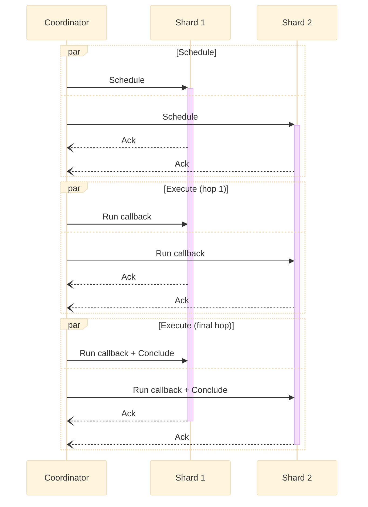
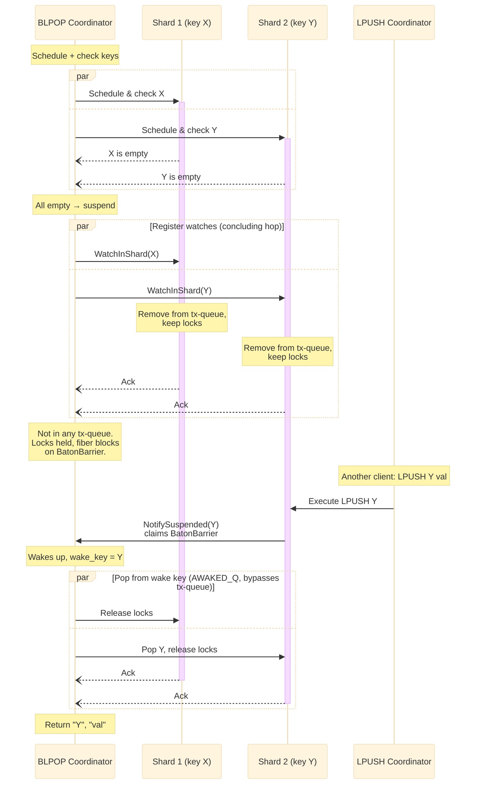

# Dragonfly Transaction Model

This document describes how Dragonfly provides atomicity and strict serializability for its multi-key and multi-command operations. The transaction algorithm is based on the [Very Lightweight Locking (VLL) paper](https://www.cs.umd.edu/~abadi/papers/vldbj-vll.pdf), adapted for Dragonfly's shared-nothing, fiber-based architecture.

## Table of Contents

1. [Background: Consistency Guarantees](#background-consistency-guarantees)
2. [Architecture Overview](#architecture-overview)
3. [Core Concepts](#core-concepts)
4. [Scheduling a Transaction](#scheduling-a-transaction)
5. [Executing a Transaction](#executing-a-transaction)
6. [Optimizations](#optimizations)
7. [Multi-op Transactions (MULTI/EXEC, Lua)](#multi-op-transactions-multiexec-lua)
8. [Command Squashing](#command-squashing)
9. [Blocking Commands (BLPOP)](#blocking-commands-blpop)
10. [Further Reading](#further-reading)

---

## Background: Consistency Guarantees

**Serializability** guarantees that the result of executing transactions in parallel is equivalent to *some* serial order of those transactions. It does not require that the serial order matches real-time ordering: transaction T1 can start before T2 but appear after T2 in the equivalent serial schedule.

**Strict serializability** (serializability + linearizability) additionally requires that the equivalent serial order respects real-time precedence: if T1 completes before T2 begins, T1 must appear before T2 in the serial order. It also implies atomicity: a transaction's sub-operations never interleave with those of another transaction.

Single-key operations in Dragonfly are trivially strictly serializable because in the shared-nothing architecture each shard thread processes its keys sequentially. The challenge is providing strict serializability for operations that span multiple keys across different shards.

---

## Architecture Overview

In Dragonfly, a client connection fiber acts as the **coordinator** for each command it executes. The coordinator does not access shard data directly. Instead, it sends asynchronous messages to the relevant shard threads and waits for their responses. We call each such round-trip a **hop**.


```mermaid
%%{init: {'theme':'base'}}%%
sequenceDiagram
    participant C as Coordinator
    participant S1 as Shard 1
    participant S2 as Shard 2

    par Schedule
    C->>+S1: Schedule
    and
    C->>+S2: Schedule
    S1--)C: Ack
    S2--)C: Ack
    end

    par Execute (hop 1)
    C->>S1: Run callback
    and
    C->>S2: Run callback
    S1--)C: Ack
    S2--)C: Ack
    end

    par Execute (final hop)
    C->>S1: Run callback + Conclude
    and
    C->>S2: Run callback + Conclude
    S1--)-C: Ack
    S2--)-C: Ack
    end
```

A transaction proceeds in two phases:

1. **Scheduling** - The coordinator reserves a slot for the transaction in each shard's transaction queue (tx-queue) and acquires intent locks on the relevant keys.
2. **Execution** - The coordinator dispatches one or more hop callbacks. Each hop runs in parallel across the involved shards. On the final hop, shards release locks and remove the transaction from the tx-queue.

Only the coordinator *fiber* blocks while waiting for shard responses. Its underlying OS thread continues running other fibers (other client connections, shard operations), so a blocked coordinator does not stall the system.

---

## Core Concepts

### Global Sequence Counter (TxId)

Dragonfly maintains a global atomic counter (`op_seq`) that can assign each transaction a monotonically increasing ID (`TxId`). This TxId establishes a **total order** across transactions that need it: every shard orders its tx-queue by TxId, so all shards agree on the same logical execution order.

However, **the majority of transactions never allocate a TxId**. Most Redis workloads consist of single-key or single-shard commands. When such a transaction runs on an uncontended key, it takes the optimistic fast path: the callback executes inline during scheduling, locks are acquired and released immediately, and the transaction never enters the tx-queue. Since there is no queue insertion, there is no need for a TxId. The global counter is only incremented when a transaction actually needs ordering — multi-shard transactions, or single-shard transactions that encounter contention and must be enqueued. This keeps the atomic counter, which is a point of contention in an otherwise shared-nothing architecture, off the critical path for the common case.

### Transaction Queue (tx-queue)

Each shard maintains a `TxQueue`, a circular doubly-linked list ordered by TxId. The tx-queue determines the execution order on that shard: transactions run in TxId order. A transaction is inserted into the tx-queue during scheduling and removed after its final execution hop.

### Intent Locks

Each shard maintains a `LockTable` that maps key fingerprints (`LockFp`) to `IntentLock` counters. An `IntentLock` has two counters: one for SHARED intent and one for EXCLUSIVE intent. When a transaction is scheduled on a shard, it increments the appropriate counter for each of its keys.

Intent locks do **not** block the scheduling flow. They record how many pending transactions intend to read or write a key. For example, if `lock[fp(key)]` has an exclusive count of 2, two transactions in the tx-queue plan to modify that key.

Intent locks serve two purposes:
- **Out-of-order optimization**: A transaction can safely execute ahead of its queue position if it holds the lock and the lock is uncontended.
- **Contention detection**: `IntentLock::IsContended()` reports whether a key has conflicting intent (multiple exclusive, or mixed shared/exclusive), which determines whether out-of-order execution is safe.

### Key Fingerprints

Keys are hashed to `LockFp` (64-bit fingerprints) for lock table lookups. Fingerprints are computed from `LockTag` values, which determine lock granularity.

Fingerprint collisions do not affect correctness. If two unrelated keys happen to hash to the same `LockFp`, the lock table treats them as contended, which disables out-of-order execution for those transactions. The result is a fallback to the slower ordered-queue path — a performance penalty, not a correctness violation. With 64-bit fingerprints, such collisions are exceedingly rare in practice.

---

## Scheduling a Transaction

Scheduling acquires intent locks on the transaction's keys and, when ordering is needed, inserts the transaction into each shard's tx-queue. On the common fast path (single-shard, uncontended), the transaction completes during scheduling without ever entering the tx-queue.

### Single-shard uncontended path (the common case)

Most transactions target a single shard and operate on uncontended keys. These take a fast path that avoids the global counter and the tx-queue entirely:

1. The coordinator dispatches a scheduling message to the single target shard (via a per-shard MPSC queue for batching).
2. On the shard, `ScheduleInShard()` acquires intent locks on the transaction's keys.
3. If the keys are uncontended and the transaction is concluding (single hop), the callback executes **inline during scheduling** — the `OPTIMISTIC_EXECUTION` flag is set, locks are released immediately, and the function returns. No TxId is allocated, no tx-queue insertion occurs.
4. The coordinator is unblocked and the transaction is complete.

This is the dominant path. It requires no global synchronization, no queue management, and no cross-thread coordination beyond the single dispatch message.

### Multi-shard path

When a transaction spans multiple shards, it must be ordered relative to other multi-shard transactions:

1. The coordinator allocates a `TxId` from the global sequence counter.
2. It dispatches a scheduling message to each relevant shard.
3. On each shard, `ScheduleInShard()`:
   - Acquires intent locks on the transaction's keys via `DbSlice::Acquire()`.
   - Checks ordering: if the tx-queue is non-empty and the new TxId is smaller than the tail (a late arrival), the shard attempts to insert it in order. If the transaction's keys are contended with a conflicting later transaction, scheduling fails.
   - On success, inserts the transaction into the tx-queue and records its position.
4. The coordinator waits for all shards to acknowledge.
5. If any shard fails scheduling (ordering conflict), the coordinator reverts all shards and retries with a new TxId.

### Single-shard contended path

When a single-shard transaction encounters contention (keys are locked by another transaction), the optimistic execution cannot proceed. In this case, the transaction falls back to the multi-shard-like path: it allocates a TxId (deferred until this point), inserts into the tx-queue, and waits for its turn.

### Scheduling failures and retries

The failure/retry scenario arises from message ordering non-determinism in multi-shard scheduling:

```
Coordinator C1 schedules T1 (TxId=5), C2 schedules T2 (TxId=6).
Messages arrive:
  Shard 1: T2 first, then T1   -> queue: [T1, T2] (reordered by TxId, OK if uncontended)
  Shard 2: T1 first, then T2   -> queue: [T1, T2]
```

If T1 and T2 contend on the same keys, the late-arriving T1 on Shard 1 cannot be safely inserted before an already-positioned T2. In that case, scheduling fails and is retried with a fresh TxId. In practice, retries are rare because most transactions touch disjoint keys.

### Lock modes

A transaction's lock mode is determined by its command:
- **SHARED** for read-only commands (GET, MGET, EXISTS, etc.)
- **EXCLUSIVE** for write commands (SET, DEL, etc.)

Multiple SHARED locks can coexist. EXCLUSIVE locks conflict with any other lock.

---

## Executing a Transaction

Once scheduled, a transaction never rolls back or retries. VLL guarantees forward progress: the transaction will eventually reach the head of the tx-queue on every shard, at which point it can execute.

### Hop execution

For each hop, the coordinator:

1. Arms all active shards by setting `PerShardData::is_armed = true`.
2. Submits a `PollExecution` callback to each shard.
3. Waits on `run_barrier_` (a blocking counter) until all shards complete.

On each shard, `PollExecution` checks whether the transaction is at the head of the tx-queue (or can run out of order). If so, it calls `RunInShard()`, which:

1. Executes the hop callback (`cb_ptr_`).
2. If this is the final hop (the coordinator set COORD_CONCLUDING):
   - Releases intent locks via `DbSlice::Release()`.
   - Removes the transaction from the tx-queue.
3. Decrements `run_barrier_` to signal completion.

### Examples

**MSET key1 val1 key2 val2** (keys on different shards): One scheduling hop + one execution hop. The execution callback writes each key on its respective shard in parallel.

**RENAME src dst** (keys potentially on different shards): One scheduling hop + two execution hops. Hop 1 reads `src` and `dst` from their shards. The coordinator processes intermediate results. Hop 2 deletes `src` and writes `dst`.

---

## Optimizations

### Single-shard fast path

As described in [Scheduling a Transaction](#scheduling-a-transaction), single-shard transactions on uncontended keys bypass the global sequence counter, the tx-queue, and the separate execution phase entirely. The callback runs inline during scheduling. This is the most important optimization in the system: it means the vast majority of real-world commands execute with minimal overhead — a single message to the target shard, an inline callback, and done.

### Out-of-order execution

The basic VLL algorithm processes transactions strictly in tx-queue order. The VLL paper addresses this limitation with Selective Contention Analysis (SCA), which scans the queue for blocked transactions whose locks have become available and unblocks them ahead of turn.

Dragonfly implements a similar idea using intent locks: a transaction can execute **out of order** (ahead of earlier transactions in the queue) if its keys are uncontended. Specifically, during scheduling, if the shard lock is free and all key locks are acquired without conflict, the `OUT_OF_ORDER` flag is set. This allows the transaction to run immediately without waiting for all preceding transactions to complete.

Out-of-order execution is safe because it only happens when there is no conflict with any other pending transaction on the same keys. If a key's `IntentLock` is contended (another transaction holds a conflicting intent), the transaction must wait for its turn at the head of the queue.

### Inline execution

When a coordinator fiber happens to run on the same thread as its target shard, Dragonfly can skip the message dispatch entirely and call `ScheduleInShard()` and `PollExecution()` directly on the coordinator fiber. This is called **inline execution** (`CanRunInlined()`). It avoids the overhead of posting to the shard's message queue, which is significant for high-throughput single-shard workloads.

However, inline execution introduces a subtle correctness constraint. Normally, all shard callbacks run on the shard's dedicated queue fiber, which processes them sequentially. This provides a natural guarantee: a transaction callback that is running has exclusive access to the shard until it yields. With inlining, a callback runs on the *coordinator* fiber instead. If that callback preempts (e.g., by performing I/O or calling a suspendable operation), the shard queue fiber can pick up another transaction and start executing on the same keys in parallel — violating atomicity.

The core issue is that intent locks only track *intent*, not actual execution. When an inlined transaction suspends mid-callback, the shard queue fiber has no way to know that a callback is already in progress — it only sees that the locks are acquired, and since the inlined transaction may hold the `OUT_OF_ORDER` flag, another transaction on uncontended keys could proceed, or the queue could advance.

For this reason, `CanRunInlined()` is gated on the absence of suspension points:

- **Journal callbacks disabled**: When replication is active, journal callbacks (`JournalSlice::AddLogRecord`) iterate over registered listeners and may preempt. `AllowInlineScheduling()` returns false if `journal::HasRegisteredCallbacks()` is true.
- **No DbSlice change callbacks**: `DbSlice::HasRegisteredCallbacks()` must be false, as these callbacks can also preempt.
- **Not during LOADING state**: During full sync, `RdbLoader` is not transaction-aware, so inlined transactions could interleave with it.
- **Not global**: Global transactions change the inlining rules themselves, so they always run on the shard queue fiber.

> [!NOTE]
> This has been a recurring source of design bugs: the assumption that shard callbacks are atomic holds for the normal queue-fiber path, but breaks when an inlined callback preempts. Any new feature that adds preemption points to shard callbacks must either disable inlining or ensure the callback remains non-suspendable.

### Global transactions

Commands that must access all shards (FLUSHDB, FLUSHALL, MOVE, SAVE, etc.) run as **global transactions**. A global transaction acquires the shard-level lock (not individual key locks) on every shard, preventing any other transaction from executing until it completes. Global transactions should be avoided in hot paths because they serialize all shard activity.

---

## Multi-op Transactions (MULTI/EXEC, Lua)

Redis transactions (MULTI/EXEC sequences) and Lua scripts execute as a series of commands within a single Dragonfly transaction. We call these **multi-transactions**.

A multi-transaction schedules once and then runs multiple commands as consecutive hops, without rescheduling for each command. Individual commands within the transaction are unaware that they are part of a multi-transaction - the framework handles it transparently.

The flow is:
```
trans->StartMulti_<Mode>()
for each (cmd, args):
    trans->MultiSwitchCmd(cmd)   // set new command
    trans->InitByArgs(args)      // re-initialize for new arguments
    cmd->Invoke(trans)           // execute
trans->UnlockMulti()
```

### Multi modes

**1. Global mode** - Acquires the shard-level lock on all shards. Required for global commands (MOVE, FLUSHDB) and Lua scripts that access undeclared keys. Blocks all concurrent transactions across all shards, so it should be avoided when possible.

**2. Lock-ahead mode** - Pre-locks all keys declared by the transaction (e.g., keys from MULTI/EXEC or declared Lua script keys). Commands run as consecutive hops with locks held throughout. Other transactions touching different keys can still run concurrently.

**3. Non-atomic mode** - Each command schedules and executes independently, as if pipelined. No atomicity guarantee across commands. Useful for Lua scripts that explicitly opt out of atomicity, since it avoids holding locks across the entire sequence.

---

## Command Squashing

Executing commands one-by-one in a multi-transaction has two problems:
- Each command requires an expensive cross-thread hop.
- Sequential execution underutilizes the multi-threaded architecture.

**Command squashing** addresses both. Given a consecutive sequence of single-shard commands within an atomic multi-transaction, the framework partitions them by target shard, preserving per-shard order, and executes all shards in a single parallel hop.

Consider a MULTI/EXEC block with six single-shard commands. Without squashing, each runs as a separate hop — six sequential round-trips. With squashing, they are grouped by shard and dispatched in one hop:

```
   MULTI/EXEC block (6 commands)          Squashed execution (1 hop)
  ─────────────────────────────          ────────────────────────────

  1. SET  user:1  Alice  → Shard 1       ┌─── Shard 1 (stub tx) ───┐
  2. SET  user:2  Bob    → Shard 2       │ 1. SET user:1 Alice      │
  3. INCR counter:1      → Shard 1       │ 3. INCR counter:1        │
  4. SET  user:3  Carol  → Shard 3       │ 6. GET user:1            │
  5. INCR counter:2      → Shard 2       └────────────────────────  ┘
  6. GET  user:1         → Shard 1
                                         ┌─── Shard 2 (stub tx) ───┐
  Without squashing:                     │ 2. SET user:2 Bob        │
  6 sequential hops                      │ 5. INCR counter:2        │
                                         └──────────────────────────┘
  With squashing:
  1 parallel hop                         ┌─── Shard 3 (stub tx) ───┐
                                         │ 4. SET user:3 Carol      │
                                         └──────────────────────────┘

                                         All three shards run in parallel.
                                         Per-shard order is preserved.
```

Each shard receives a "stub" transaction (`SQUASHED_STUB` role) that provides the standard transaction interface to individual commands without performing real scheduling. The parent transaction (`SQUASHER` role) coordinates the single hop across all shards. Within each shard, the hop callback executes that shard's commands inline, one by one.

---

## Blocking Commands (BLPOP)

Commands like BLPOP, BRPOP, and BLMOVE block the client connection until data becomes available. These are the most complex transaction type because they must "observe" multiple keys across shards simultaneously while maintaining strict serializability.

### How blocking works

The following diagram shows `BLPOP X Y 0` where key X is on Shard 1 and key Y is on Shard 2, and a second client later pushes to Y:


```mermaid
%%{init: {'theme':'base'}}%%
sequenceDiagram
    participant C1 as BLPOP Coordinator
    participant S1 as Shard 1 (key X)
    participant S2 as Shard 2 (key Y)
    participant C2 as LPUSH Coordinator

    Note over C1: Schedule + check keys
    par
    C1->>+S1: Schedule & check X
    and
    C1->>+S2: Schedule & check Y
    S1--)C1: X is empty
    S2--)C1: Y is empty
    end

    Note over C1: All empty → suspend
    par Register watches (concluding hop)
    C1->>S1: WatchInShard(X)
    and
    C1->>S2: WatchInShard(Y)
    Note over S1: Remove from tx-queue,<br/>keep locks
    Note over S2: Remove from tx-queue,<br/>keep locks
    S1--)C1: Ack
    S2--)C1: Ack
    end
    Note over C1: Not in any tx-queue.<br/>Locks held, fiber blocks<br/>on BatonBarrier.

    Note over C2: Another client: LPUSH Y val
    C2->>S2: Execute LPUSH Y

    S2->>C1: NotifySuspended(Y)<br/>claims BatonBarrier
    Note over C1: Wakes up, wake_key = Y

    par Pop from wake key (AWAKED_Q, bypasses tx-queue)
    C1->>S1: Release locks
    and
    C1->>S2: Pop Y, release locks
    S1--)-C1: Ack
    S2--)-C1: Ack
    end
    Note over C1: Return "Y", "val"
```

Step by step:

1. BLPOP schedules normally and checks its keys across shards. If any key is non-empty, it pops and returns immediately (not shown above).
2. If all keys are empty, the transaction executes a concluding hop to register watches on its keys via `BlockingController`. This hop removes the transaction from the tx-queue, but **keeps locks held** (the `became_suspended` path in `RunInShard`). The coordinator fiber then blocks on a `BatonBarrier`. At this point the transaction is not in any tx-queue — it only holds intent locks on its keys.
3. When a mutating command (LPUSH, RPUSH, etc.) modifies a watched key, the shard calls `NotifySuspended()`. The first notification to successfully claim the `BatonBarrier` wins, recording the wake key.
4. The coordinator wakes up and re-executes its callback to pop from the wake key. Awakened transactions run with the `AWAKED_Q` flag, which gives them highest priority in `PollExecution` — they bypass the tx-queue entirely. Locks are released on this final hop.
5. If the timeout expires before any notification, `ExpireBlocking()` cleans up instead: releases locks and unregisters watches from `BlockingController`.

### Key design constraints

- The suspended transaction holds its locks throughout the blocking period, preventing interleaving with other transactions on the same keys.
- BLPOP within a MULTI/EXEC block disables blocking behavior and returns immediately (with a timeout response if no data is available).
- When a multi-transaction pushes to multiple keys atomically, BLPOP is only woken after the entire multi-transaction completes.

---

## Further Reading

- [VLL: a lock manager redesign for main memory database systems](https://www.cs.umd.edu/~abadi/papers/vldbj-vll.pdf) - The paper Dragonfly's transaction model is based on.
- [Jepsen consistency models](https://jepsen.io/consistency) - Diagram of consistency model relationships.
- [Strict Serializability](https://jepsen.io/consistency/models/strict-serializable) - Formal definition.
- [Serializability vs Strict Serializability](https://fauna.com/blog/serializability-vs-strict-serializability-the-dirty-secret-of-database-isolation-levels)
