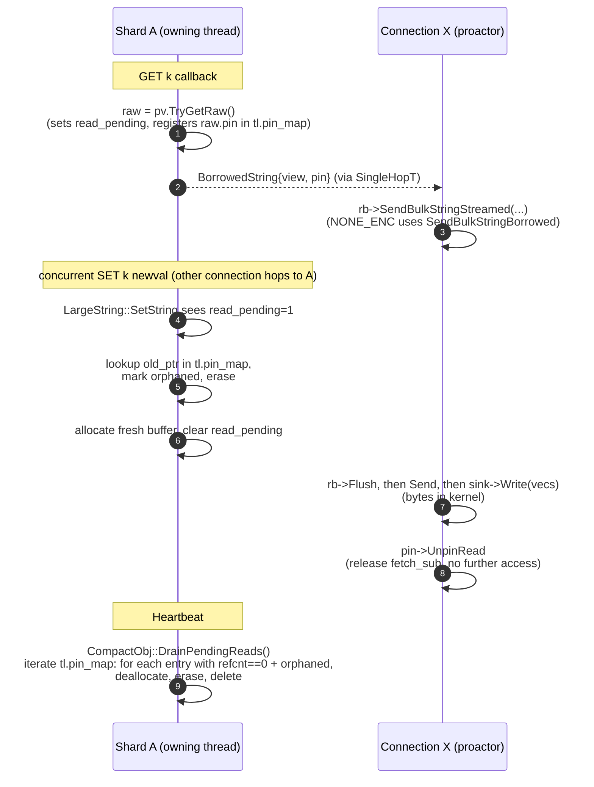

# Zero-Copy GET for Large Strings

A `GET` on a large string value in Dragonfly transports the user-visible
bytes from the shard's `CompactObj` storage to the client socket without
materializing the string anywhere in between. The shard does not allocate
a `std::string`; the reply builder does not buffer the full payload.

The borrowed pointer survives concurrent mutations of the same key via a
Copy-on-Write mechanism: a writer that races a reader installs a fresh
allocation on the `CompactObj` and leaves the old buffer owned by a
refcount-bearing pin, which is freed on the buffer's owning shard once
the last reader is done with it.

## What's covered

- `LARGE_STR_TAG` (or `detail::LargeString`) values (heap-allocated, >> 1024 bytes).
- Encodings `NONE_ENC`, `ASCII1_ENC`, `ASCII2_ENC`. Huffman-encoded can be added later
  if we prove their value.
- `EXTERNAL_TAG` (tiered) values require an asynchronous disk fetch and are out of scope.

Currently, `GET` is the only command that uses this path. Mutating reads
(`GETDEL`, `GETEX`, `GETSET`) and multi-key reads (`MGET`) keep the
materializing `pv.ToString()` path. Can be fixed later.

## Threading model
Dragonfly's shared-nothing design pins each shard to a single proactor
thread with a thread-local mimalloc heap. A connection is bound to one
proactor; `GET` for a foreign key hops to the owning shard via
`SingleHopT(cb)`, then resumes on the connection's proactor for reply
construction. The socket write itself is fiber-synchronous but may
yield the fiber while waiting on the kernel — other commands on the
same shard can run during that window. While mimalloc support cross thread frees,
the design routes all deallocations back to the
buffer's owning shard so we could track memory usage consistently.

## Building blocks

### `detail::LargeString`

The 16-byte storage for non-inline raw strings in `CompactObj`:

```cpp
struct LargeString {
  void* ptr;                   // mimalloc allocation on owning shard
  uint64_t sz : 56;            // current length in bytes
  uint64_t read_pending : 1;   // at least one outstanding read pin
  uint64_t reserved : 7;
};
```

`read_pending` is set when one or more readers hold a borrowed view
into `ptr`. While the bit is set, `LargeString::SetString` and
`LargeString::Free` do not deallocate `ptr` directly; they look it up
in the thread-local pin registry described below and hand the buffer
off to the matching `PendingRead` entry (which becomes the sole owner
of the buffer until the last reader unpins).

`LargeString::DefragIfNeeded` returns false (no defrag) while
`read_pending` is set — a reallocation would invalidate outstanding
borrowed views.

`LargeString::AppendString` mutates in place and would corrupt pinned
readers; it `CHECK`s `!IsReadPending()`. The only caller is
`rdb_load`, which never produces values that have been pinned.


### `CompactObj::TryGetRaw`

Returns a borrowed view of the underlying `LargeString` along with the
metadata needed to decode it:

```cpp
struct RawBorrow {
  std::string_view encoded;     // bytes as stored
  size_t decoded_size;          // user-visible byte count
  uint8_t encoding;             // NONE / ASCII1 / ASCII2
  detail::PendingRead* pin;     // registered read pin
};
std::optional<RawBorrow> CompactObj::TryGetRaw() const;
```

For `NONE_ENC` the view is the user-visible bytes
(`encoded.size() == decoded_size`). For `ASCII1`/`ASCII2` the view is
the packed source and `decoded_size` is computed from the packed
length and the first byte via the existing `StrEncoding::DecodedSize`.

`TryGetRaw` does two more things on a successful return: it stamps
the `LargeString`'s `read_pending` bit (via a controlled `const_cast`
— the bit is bookkeeping, not part of the logical value) and
registers a `PendingRead` in the thread-local pin map, returning
the pointer via `RawBorrow::pin`. Caller's only obligation is to
release the pin via `PendingRead::UnpinRead` once the reply is on
the wire.

### Pin registry

The registry lives in `compact_object`'s thread-local scope — the same
scope that already holds `local_mr`, the huffman tables, and the
small-string arena. It is not exposed beyond `detail::PendingRead` and
a handful of static methods on `CompactObj`; `EngineShard` only invokes
the periodic drain.

```cpp
namespace detail {
struct PendingRead {
  void* ptr;                     // buffer being tracked
  std::atomic<uint32_t> refcnt;  // active reader count
  bool orphaned;                 // writer detached from CompactObj

  // Decrement refcnt. After this returns, the caller must not touch
  // the pin again — the owning thread may reap it on the next drain.
  void UnpinRead();
};
}  // namespace detail

// Inside compact_object.cc, on the existing TL struct:
absl::flat_hash_map<void*, detail::PendingRead*> pin_map;
```

The map is single-threaded — only the owning thread mutates it. Other
threads touch only individual `PendingRead::refcnt` via `UnpinRead`.
There is no queue: `UnpinRead` is a single release-store `fetch_sub`,
and the owning thread reaps refcnt==0 entries by iterating the map.

Why no cross-thread queue: an earlier design pushed pins onto an MPSC
free list when refcnt hit zero, but that allowed the same pin to be
pushed twice if a new reader pinned the same buffer between the
unpin-to-zero and the drain. Map iteration avoids the race entirely
and costs O(N) per drain where N is the number of in-flight reads on
this thread — small in practice (one pin per active GET reply).

Public method surface:

- `CompactObj::TryGetRaw()` — owning thread. The entry point for
  callers. Returns a `RawBorrow` with view, metadata, and the
  already-registered pin (see above). Internally calls `PinRead`
  to insert a `PendingRead` into the thread-local map and stamps
  `read_pending`.
- `detail::PendingRead::UnpinRead()` — any thread, instance method.
  Single `fetch_sub` on `refcnt`. No queue push, no further pin
  access.
- `CompactObj::DrainPendingReads()` — owning thread, static. Iterates
  the map, observes each entry's `refcnt` under acquire ordering, and
  reaps zero-refcnt entries: frees the buffer if orphaned, then
  erases the map slot and deletes the entry. Called periodically
  from `EngineShard::Heartbeat`.
- `CompactObj::PinRead(ptr)` — owning thread, static. The primitive
  TryGetRaw is built on; exposed for tests and any future caller
  that needs to pin a known buffer pointer directly.

The orphan transition is a private detail of `LargeString::SetString`
and `LargeString::Free`: they look the ptr up in `tl.pin_map`, set
`entry->orphaned = true`, and erase from the map. No callback
indirection — all participants live in the same translation unit.

### Reply builder integration

`SinkReplyBuilder` is per-connection, lives on the connection's
proactor thread, and accumulates `iovec` entries via `WritePieces`
(copy into scratch) or `WriteRef` (push pointer only). `Send()` does a
synchronous `writev` and returns when the bytes are in the kernel.

The borrow path needs the source bytes to outlive the socket write
(which may suspend the fiber).

Implementation - TBD.

### Capture / replay (squashing, MULTI/EXEC)

`MultiCommandSquasher` runs commands against a `CapturingReplyBuilder`
that records replies into intermediate payloads, then replays them to
the real sink. Borrowed strings must survive this boundary without
materializing the full payload — both the borrowed (`NONE_ENC`) and
streamed (ASCII) paths must reach the wire with the same pin-managed
lifetime as the direct sink.

Implementation - TBD.

## End-to-end path

```cpp
// shard thread, GET callback
if (auto raw = pv.TryGetRaw()) {                  // optional<RawBorrow>
  // TryGetRaw sets read_pending and registers raw->pin as side effects.
  return BorrowedString{raw->encoded, raw->pin,
                        raw->decoded_size, raw->encoding};
}

// proactor thread, GetReplies::Send(BorrowedString)
if (bs.encoding == 0) {
  rb->SendBulkStringBorrowed(bs.encoded);          // iovec ref (no copy)
} else {
  rb->SendBulkStringStreamed(bs.encoded.data(), bs.decoded_size, bs.encoding);
}
// After the bytes hit the wire: bs.pin->UnpinRead().
```

The reply builder is responsible for releasing `bs.pin` once the
socket write that consumed the borrowed view has completed.
Implementation - TBD.

## Concurrency picture

A write racing a read on the same key. Shard A is the buffer's owning
thread; Connection X's proactor is the IO thread that produced the
GET reply. The mutating SET arrives via a second connection that
hops to Shard A in parallel with X's reply construction.



If no mutation occurs between borrow and unpin, the drain finds the
entry with `orphaned=false` and just removes the map slot; the
`CompactObj` continues to own the buffer through its normal lifecycle.

## Race conditions and safety

### Drain vs re-pin

If `UnpinRead` decrements an entry's `refcnt` to zero and another
reader's `PinRead` bumps it back to 1 before the next drain, the
drain's iteration observes `refcnt > 0` under acquire ordering and
skips the entry. The map slot continues to point at the same entry;
the new reader's eventual `UnpinRead` brings it back to zero and the
following drain cycle reaps it. No double-free.

### Post-drain mutation

The `LargeString::read_pending` bit can outlive the corresponding map
entry — after the last reader unpins and the drain has removed the
non-orphaned entry, the bit remains set on the `CompactObj`'s
`LargeString`. A subsequent mutation looks `ptr` up in `tl.pin_map`,
doesn't find it, and falls through to the normal deallocate.

This is safe because the "not found" outcome only happens when no
reader pinned the same address between the unpin-to-zero and the
mutation. If `tl.pin_map` doesn't contain `ptr` at mutation time,
every prior pin's `refcnt` is zero AND no new pin has executed —
nothing is reading `ptr`, and the deallocate is safe. The bit being
stale-set is harmless.

### Defrag

The defrag task would reallocate a `LargeString` buffer in place and
invalidate any outstanding borrowed views. `DefragIfNeeded` returns
false (no defrag) when `read_pending=1`. Once the pins clear, the
next defrag pass picks up the same value.

### Cross-thread free

A pin allocated on shard A but unpinned by a different IO thread is
reaped from A's `tl.pin_map` on A's next drain. The IO thread's only
access to the pin is the `fetch_sub` inside `UnpinRead`; once that
returns, the pin pointer is no longer referenced from the IO thread,
so A is free to delete the entry whenever the drain observes
`refcnt == 0`. The buffer is freed via
`CompactObj::memory_resource()->deallocate(...)` on A's thread —
mimalloc dispatches to A's heap, matching where the buffer was
allocated. The `PendingRead` entry itself is `new`'d and `delete`'d
on A's thread, so it lives on A's heap throughout.

### Capture / replay window

Captured payloads hold raw pointers into the borrowed source. The
source's lifetime is governed by the same `PendingRead` pin that the
originating `CmdGet` registered: the reply machinery (direct sink or
capture-then-replay) is responsible for not releasing the pin until
the bytes have reached the wire. Captured payloads therefore remain
valid through the entire squashing / `MULTI`-`EXEC` pipeline.

## What's out of scope

- **MGET.** `CollectKeys` today allocates a per-shard storage buffer
  and packs values into it. Zero-copy MGET would carry borrowed views
  per result instead.
- **Huffman-encoded large strings.** `TryGetRaw` returns `nullopt` for
  `HUFFMAN_ENC`. Huffman codes are variable-length so decoding without
  materialisation would require a stateful streaming decoder.
- **`EXTERNAL_TAG` (tiered) values.** Asynchronous disk fetch and
  materialization; outside the in-memory zero-copy story.
- **`SMALL_TAG` and inline values.** Already cheap to copy.

## Tag / flag / counter reference

| Symbol | Where | Meaning |
|---|---|---|
| `LARGE_STR_TAG` | `CompactObj::TagEnum` | Heap-allocated raw large string |
| `NONE_ENC` / `ASCII1_ENC` / `ASCII2_ENC` | `CompactObj::EncodingEnum` | Storage encoding |
| `read_pending` | `detail::LargeString` | One or more readers may be borrowing `ptr` |
| `--get_zero_copy` | `string_family.cc` flag | Master toggle for the borrow path |
| `borrowed_string_views_total` | `EngineShard::Stats` | Shard-side: borrow decisions taken |
| `borrowed_strings_sent_total` | `ServerState::Stats` | Reply-side: borrowed bulk strings sent (incl. via capture) |

## File map

| Concern | File |
|---|---|
| `read_pending` bit, `TryGetRaw`, `PendingRead`, pin registry, `PinRead` / `DrainPendingReads` | `src/core/compact_object.{h,cc}` |
| `Heartbeat` drain invocation | `src/server/engine_shard.{h,cc}` |
| Reply builder pin release, `WriteDecodedChunks`, `SendBulkStringStreamed` | `src/facade/reply_builder.{h,cc}` |
| Capture/replay overrides (borrowed + streamed) | `src/facade/reply_capture.{h,cc}`, `src/facade/reply_payload.h` |
| GET fast path (borrow + pin + dispatch) | `src/server/string_family.cc` |
| HTTP-API visitor materialization | `src/server/http_api.cc` |
| Tests | `src/server/string_family_test.cc` |
